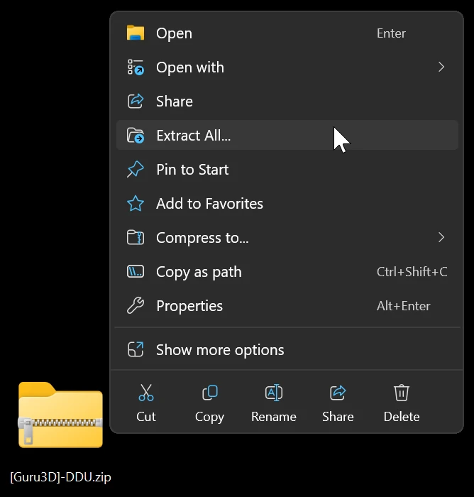
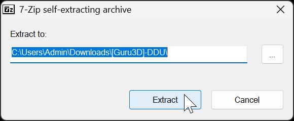

1. [Download DDU](https://www.guru3d.com/files-details/display-driver-uninstaller-download.html), from the green "Download Mirror section" (The EU/USA servers dont matter)

    

2. Right click and _extract_ the .zip file you just downloaded.

    

3. Double-click on the .exe in the newly extracted folder, then click "Extract" in the dialog.
A new folder containing `Display Driver Uninstaller.exe` will be created.

    

    > [!WARNING] Warning
    > Do _not_ move, modify, or delete any files associated with DDU

4. [**Boot in safe mode**](https://support.microsoft.com/en-us/help/12376/windows-10-start-your-pc-in-safe-mode) 

5. Open `Display Driver Uninstaller.exe` inside the newly created "DDU vX.X" subfolder from Step 3.

    > [!WARNING] Warning
    > Some applications are inaccessible from the downloads folder. So if you get an "File Inaccessible" error message in Safe mode, try moving the extracted folder in Normal boot to a more direct folder like directly in the C drive.

    
