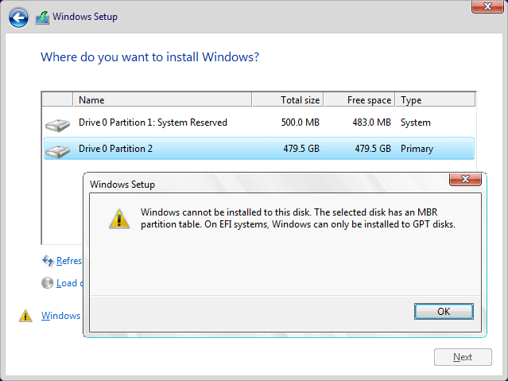
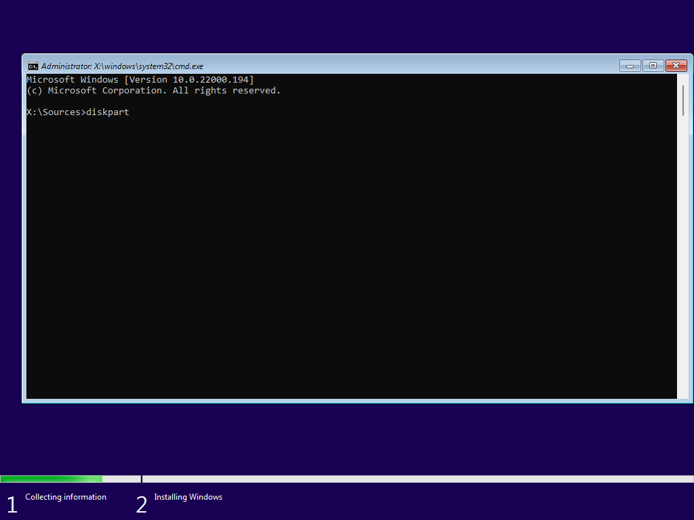
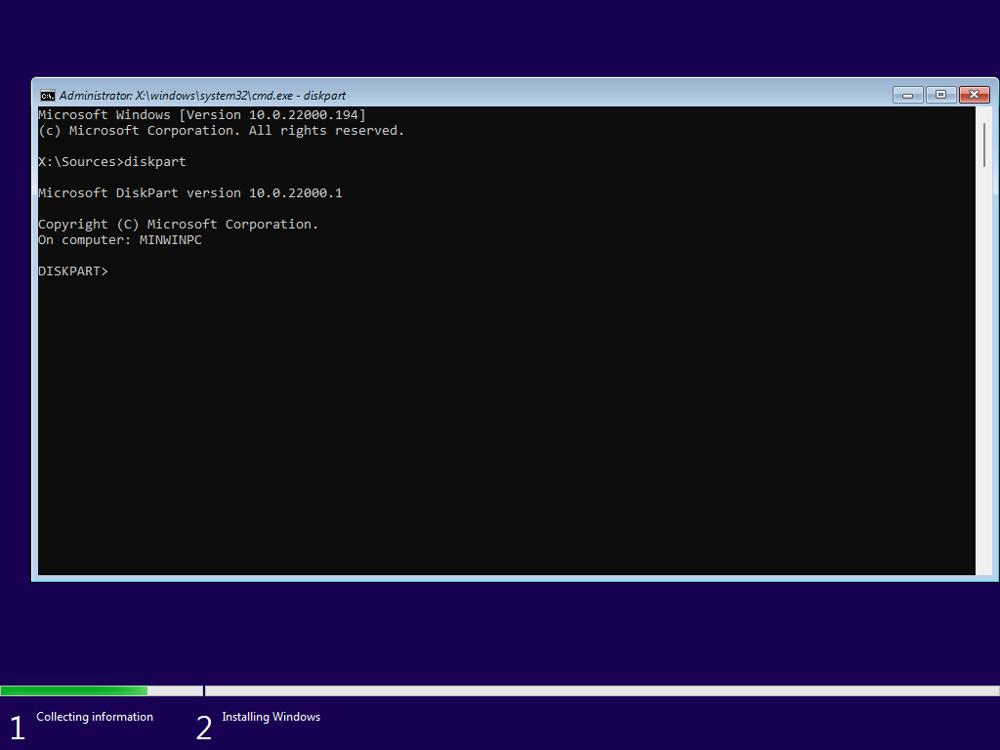
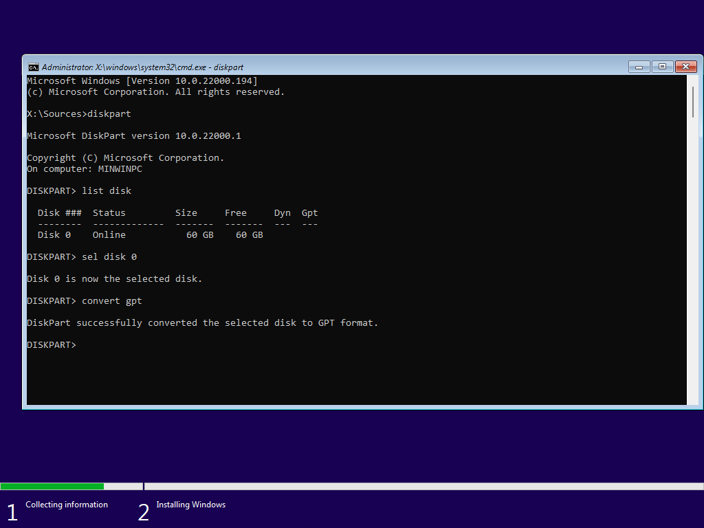
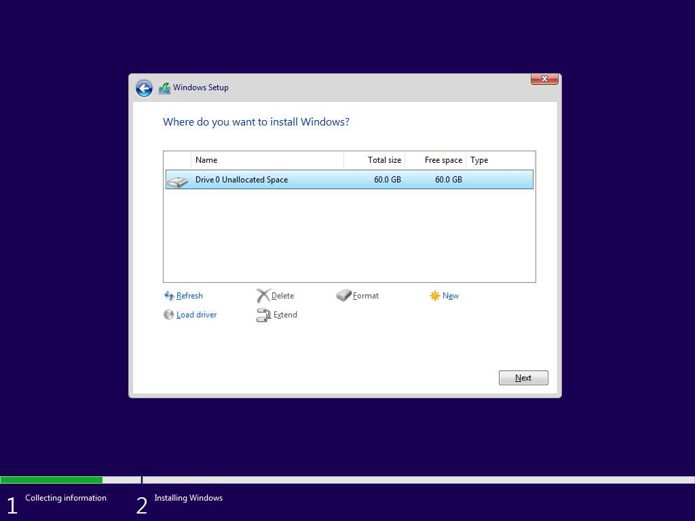

> [!IMPORTANT] Important
>  <details markdown="1">
>  <summary markdown=span>
>  Windows cannot be installed on this disk. The selected disk has an MBR partition table
>  </summary>
> 
>  If you receive an error about your disk being MBR like this:
> 
>  [](../../../assets/install-11/the-selected-disk-has-an-mbr-partition-table-01.png)
> 
>  then press `Shift+F10` to open CMD and follow below.
>  ```
>  diskpart
>  list disk
>  ```
> 
>  [](../../../assets/install-11/windows-11-2021-10-05-15-09-53.png)
> 
>  [](../../../assets/install-11/windows-11-2021-10-05-15-10-13.png)
> 
>  [](../../../assets/install-11/windows-11-2021-10-05-15-10-24.png)
> 
>  [](../../../assets/install-11/windows-11-2021-10-05-15-10-39.png)
> 
>  Make note of the disk you want to install to from the step above.
>  ```
>  sel disk #
>  convert gpt
>  clean
>  ```
> 
>  [](../../../assets/install-11/windows-11-2021-10-05-15-10-51.png)
>  [](../../../assets/install-11/windows-11-2021-10-05-15-11-01.png)
>  [](../../../assets/install-11/windows-11-2021-10-05-15-11-13.png)
> 
>  You can exit the CMD and click `next` again.
>  [](../../../assets/install-11/windows-11-2021-10-05-15-09-40.png)
> 
>  </details>
