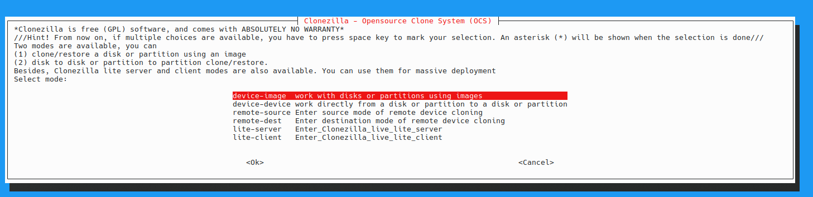

Clonezilla is best run from a bootable live media, so you will need to create a bootable USB or CD/DVD with [Clonezilla](https://clonezilla.org/clonezilla-live.php) to use it. Alternatively, you may utilize the rTS Debian live media created in [this guide](/live-sessions/linux-live-session) which already comes with Clonezilla pre-installed.

<details markdown='1'>
  <summary>Installing Clonezilla</summary>

**Debian / Ubuntu / Linux Mint**: 
```sh
sudo apt update && sudo apt install clonezilla
```

**Fedora / RHEL / CentOS / AlmaLinux**: Clonezilla is not available in the default repositories for these distros, so you will need to add the external repository:
```sh
sudo dnf install dnf-plugins-core
sudo dnf copr enable sergiomb/clonezilla
sudo dnf install clonezilla
```

**Arch / Manjaro / CachyOS**:
```sh
sudo pacman -Syu clonezilla
```

</details>

## Using Clonezilla
Run `sudo clonezilla` to launch the text-based menu. Choose "device-device" for direct disk/partition cloning (e.g., failing drive to healthy one) or "device-image" for imaging. 



It is recommended you select beginner mode if you have not used Clonezilla before, identify drives carefully with labels or lsblk, and use "-rescue" for bad sectors on failing drives. Images save to a mounted target directory; restore similarly.

### Identifying source and destination
Before running Clonezilla, you must know the correct device names for the source (failing drive) and destination (healthy drive or image file). Refer to our guide on [how to identify failing drives in Linux](/disks/data-recovery/identify-drives-linux) for detailed instructions on listing and identifying your drives.

## Limitations of Clonezilla and when to use other tools
The installed Clonezilla frontend cannot clone mounted or running system partitions reliably—unmount them first or use Live mode. Risk overwriting wrong drives; always verify source/target twice. 

> [!IMPORTANT] Important
> 
> For failing drives, expect partial reads; supplement with [ddrescue](/disks/data-recovery/gddrescue) if needed. Clonezilla is not suitable for network/PXE cloning (use [DRBL](https://drbl.org/)/[Clonezilla SE](https://clonezilla.org/clonezilla-SE/) for that).
