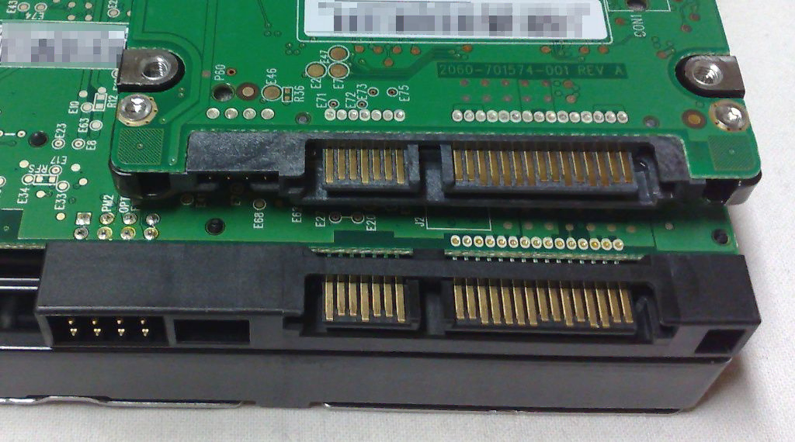
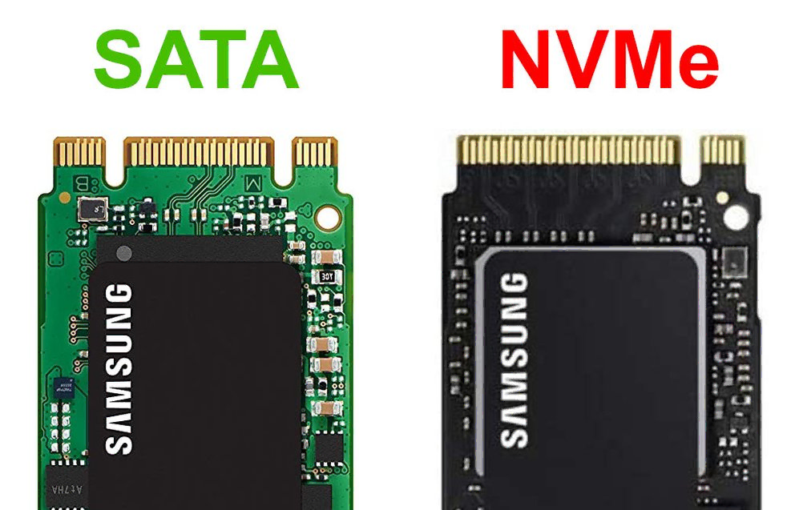
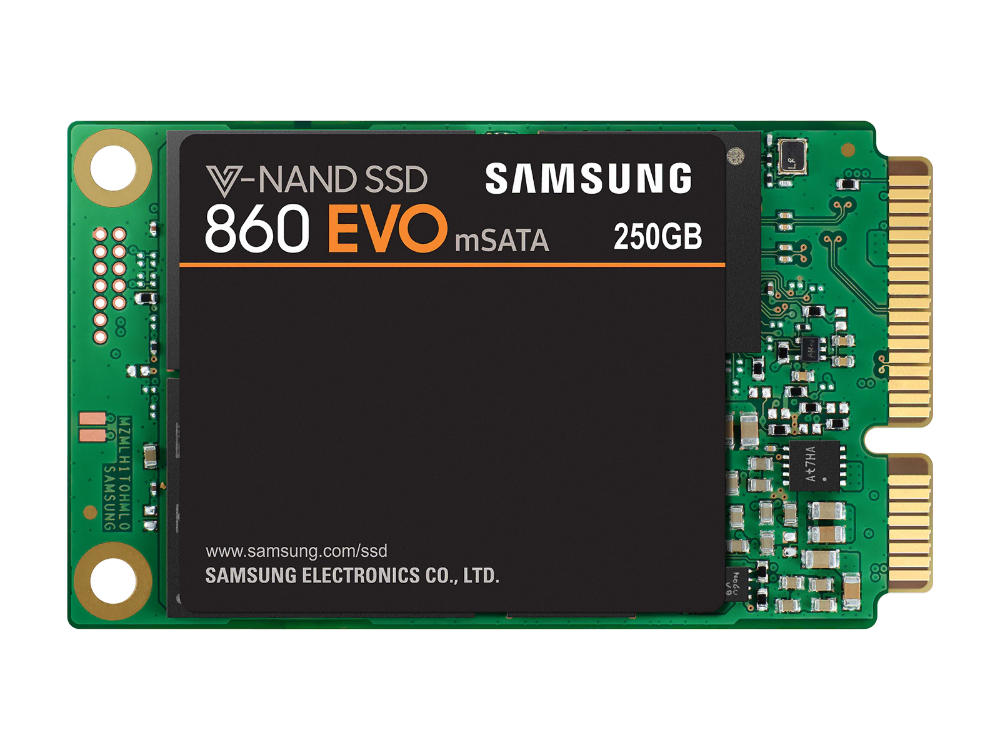

A quick way to recover data from a readable disk will be to remove it from the issue computer and use an adapter to plug it into a working computer so you can copy required data off. 

To do this you must first identify the port, and protocol used on your disk. To determine what type of disk you are using you may be able to look up your pre-built/laptop model number or follow the guide below. 

## SATA

SATA can be on a 2.5" or 3.5" disk. If you have the smaller 2.5" size you can use any USB-SATA adapter you find. If you have a desktop size 3.5" disk you will need to get a USB-SATA dock/adapter that has external power, USB power alone likely cannot make the drive function.

## M.2

M.2 can be tricky to understand. Using the basic image above you can attempt to determine if your disk is using the SATA protocol or the NVMe protocol. The easiest way to make this determination though will be to check a serial number that may be on the disk.

When it comes to adapting m.2 you must know the specific protocol used by your disk then get a USB adapter for that protocol.

## mSATA

You probably don't have an mSATA, this is an older pre m.2 disk.