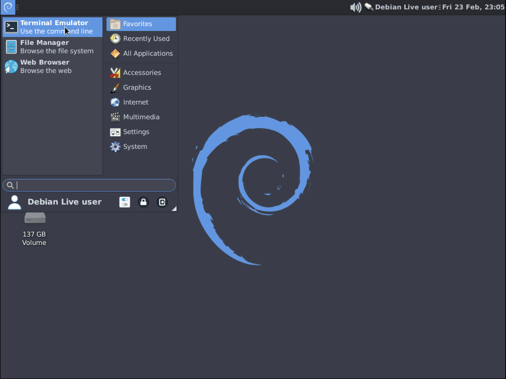
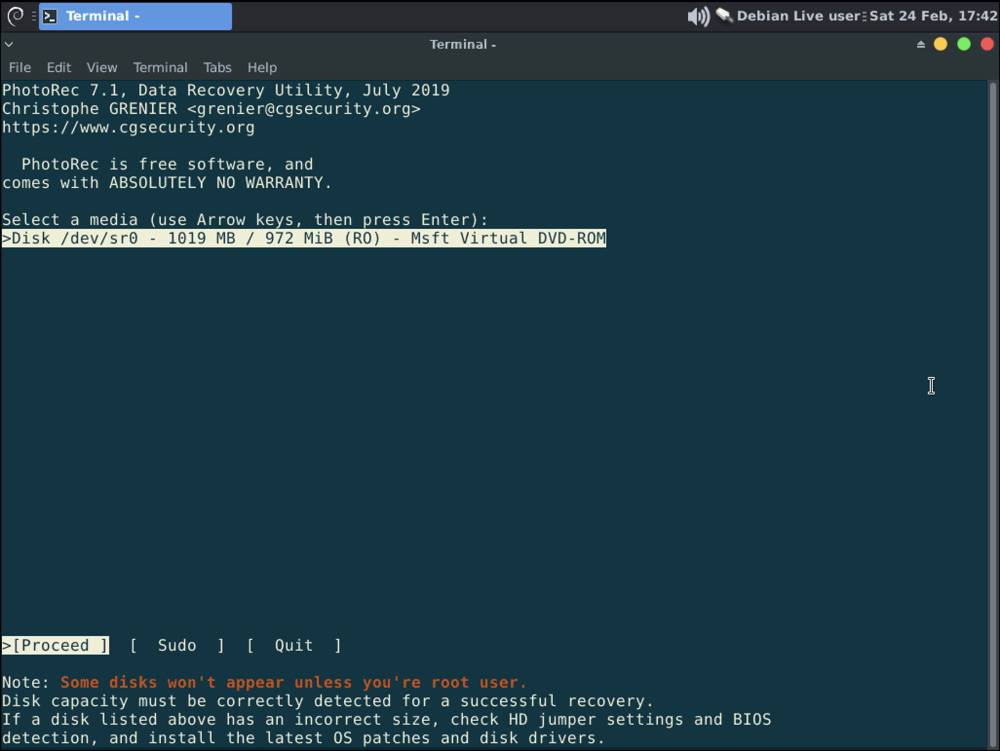
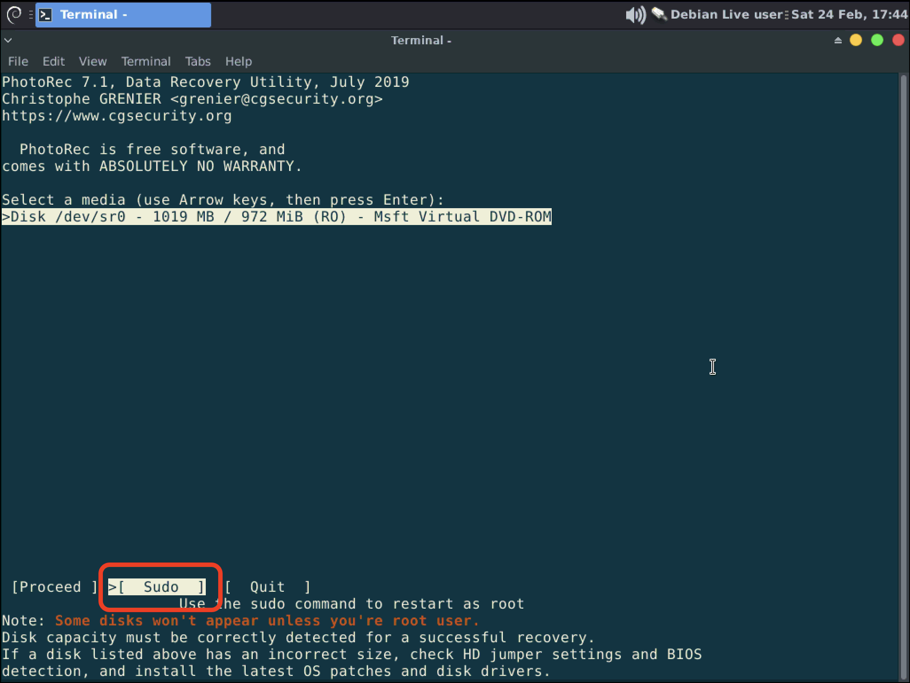
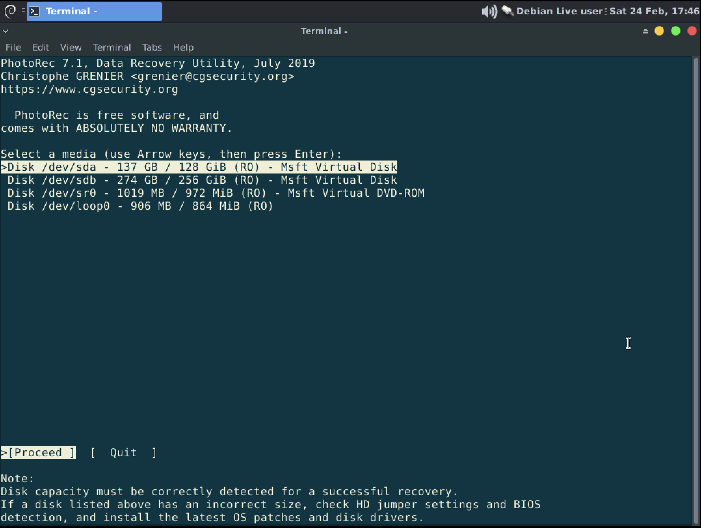
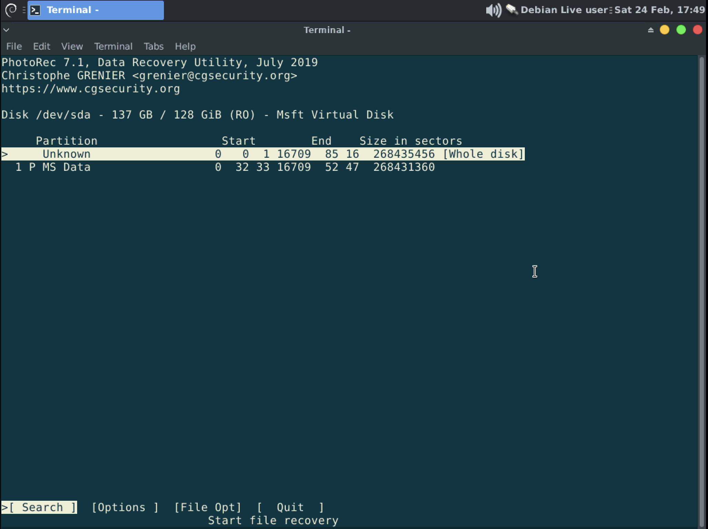
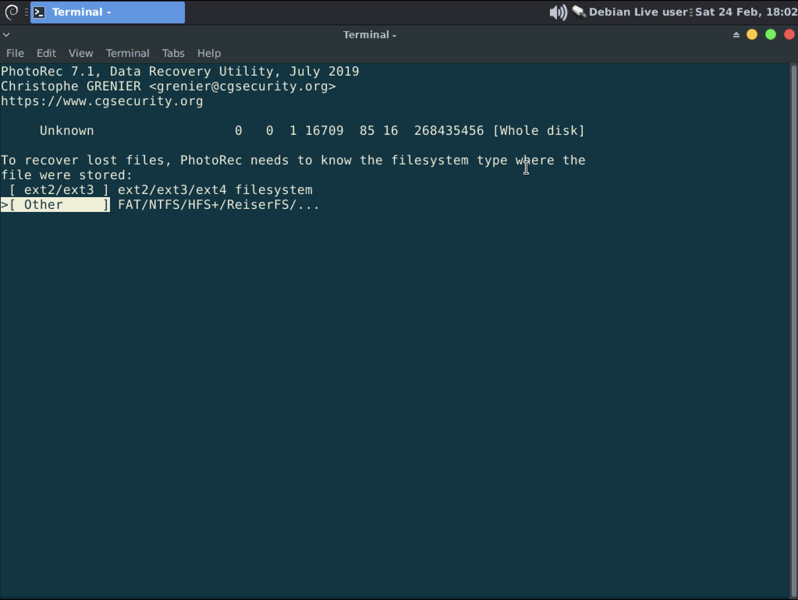
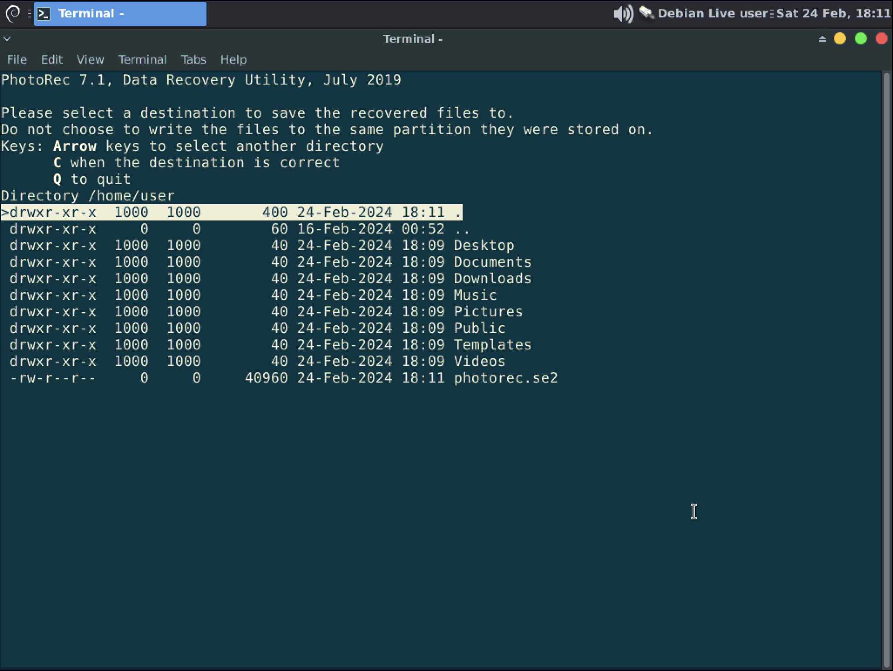
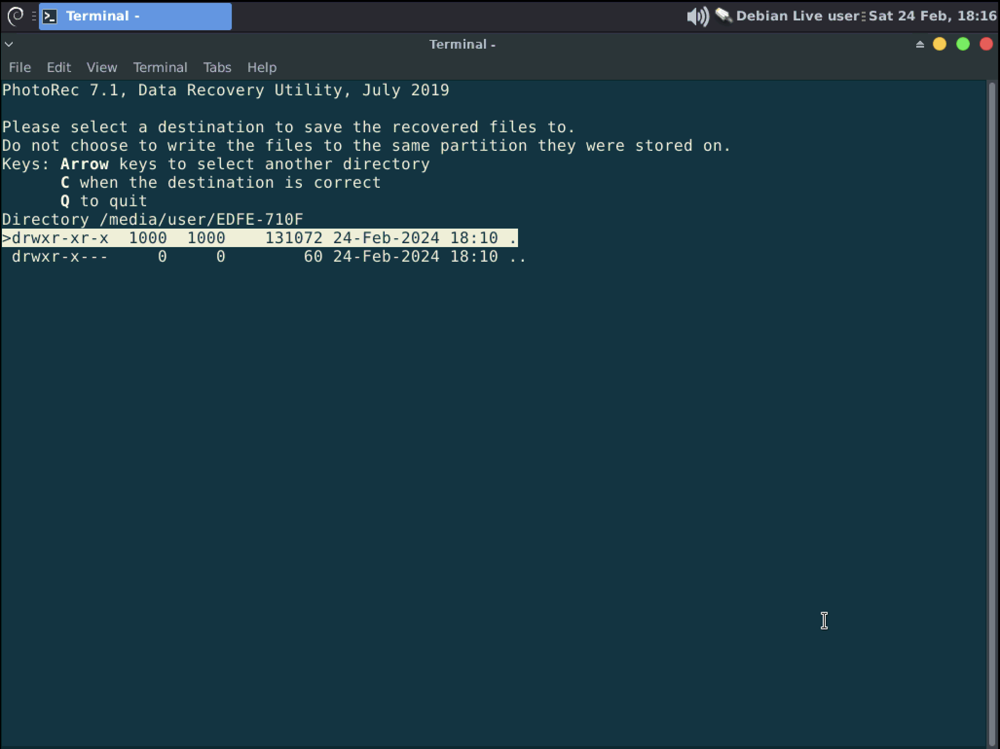
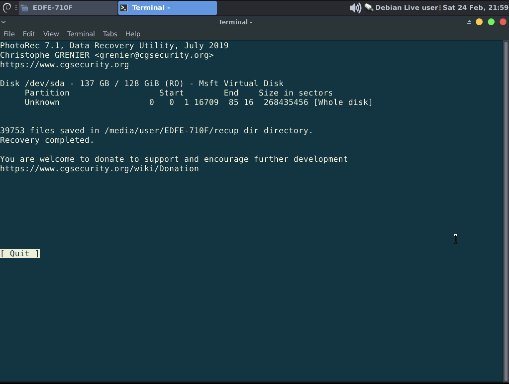

import UseLLCD from '../../../../_includes/embeds/use-linux-live-session.md';

<UseLLCD />

import DataRecoveryWarning from '../../../../_includes/embeds/data-recovery-warning.md';

<DataRecoveryWarning />

This guide was written using a Windows 11 host that has a 128GB C:\ drive and a 256GB D:\ drive called "Game_Data".

## Mount a second disk to recover files to
You will need a second disk to recover files to, preferably a clean external drive formatted as ExFat for compatibility and to avoid further issues.

Any secondary disks, or external disks, should appear in the File Explorer where you can double click on them to mount. The secondary drive will need to be mounted so we can use it in step 7.

## Using Photorec
1. From the Live media desktop click the application menu in the top left and open "Terminal Emulator"

    

2. In the terminal type "photorec" to start the application.

    

3. When Photorec opens you will see a list of disks, most likely you will only see your USB though. Use the arrow keys to highlight and select "Sudo" with Enter to load more disks.

    
    
4. You should now see all possible disks. You will use the Up and Down arrows to select the disk you want to operate on then hit Enter to Proceed.

    > [!NOTE] Information
    > Select your disk based on it's size. If you have multiple disks of the same size removing the extra disks is the safest way to proceed.

    > [!WARNING] Warning
    > If you do not see your disk here then you should seek professional data recovery services.

    

5. Photorec will show you the known partitions on the disk. Use the arrow keys to move up and down then press Enter to continue.

    > [!NOTE] Information
    > **What partition do I choose?**
    > 
    > If you deleted a file or group of files accidentally, then you will want to select the specific partition that you deleted these files from.
    >
    > If you are trying to recover files from a disk that was wiped/deleted or over-written then you will hit the Up arrow to select "Whole disk" so that Photorec will search over the entire disk instead of only in the existing partition.

    

6. Select the partition scheme that will be searched. 

    > [!NOTE] Information
    > Some Linux systems may use ext2/ext3/ext4 but in most cases you are going to choose "Other" here by pressing Enter.

    

7. You now select where our files will be recovered to. Photorec opens to `/home/user` by default but we need to get to `/media/user`.
    - Press Left arrow twice to navigate to `/` then use the Down arrow to go to `Media` and hit Right arrow. Finish navigating to `user` and then the arbitrary folder name that denotes your mounted drive. In the example this directory is `/media/user/EDFE-710F`
    - Once you are in the directory, as seen in the second image, press "c" to start searching.

    

    > [!NOTE] Information
    > You can see the arbitrary file name in File Explorer if you navigate to your mounted disk from the side pane.

   

8. Photorec will now begin searching and printing out the number of files it found with elapsed time displayed as well as the estimate until finished.

    

9. When complete you will be told about the total number of files recovered and you can browse your secondary drive to review them all. You can close the terminal and shutdown your computer. Remove the USB then boot your computer again to your normal OS.

    