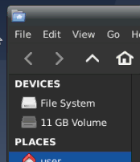
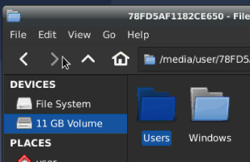

import LinuxInstallMedia from '../../../../_includes/embeds/create-linux-install-media.mdx';

<LinuxInstallMedia />

Open the File Manager from the applications menu, you should see your disk in the pane on the left. In the below image, it is the "11GB Volume"

Double click the desired disk and it should open in the file manager.

Once opened, you can drag and drop files to another disk that you mount into the system just like in Windows.