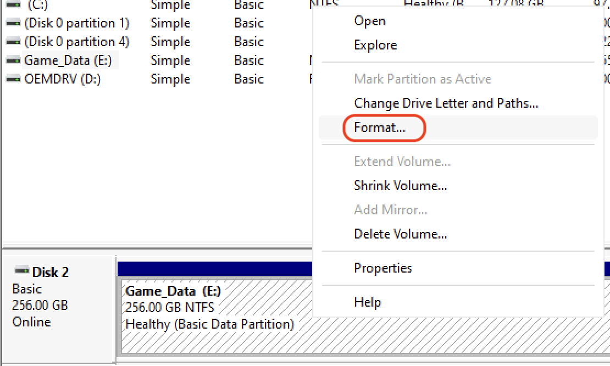
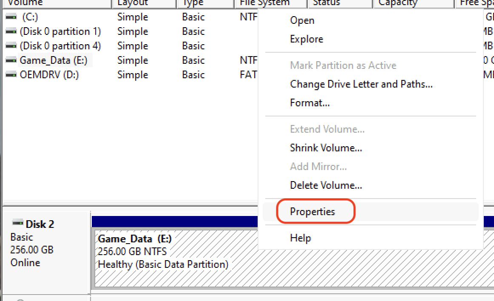
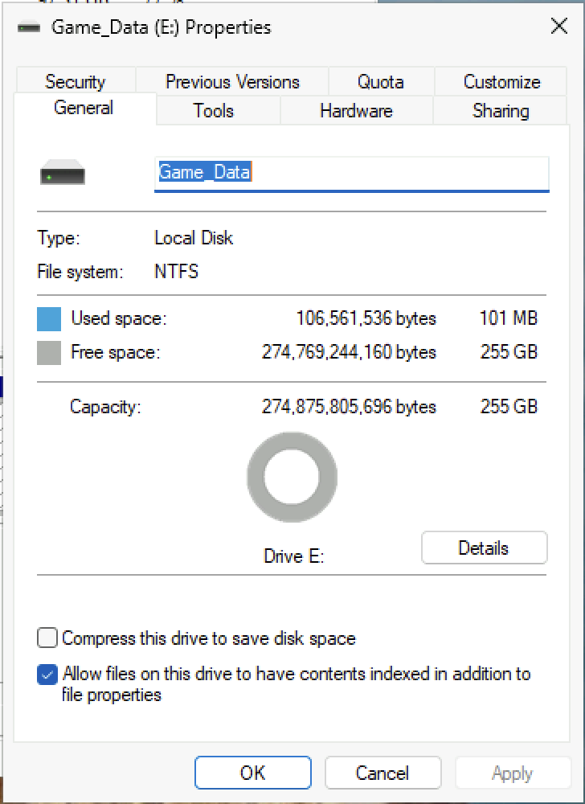
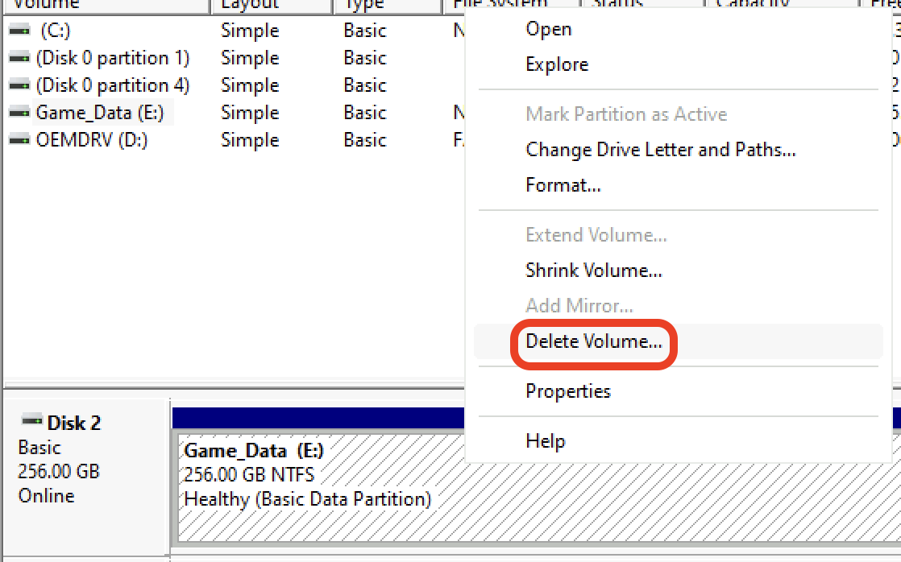

import DiskFormats from '../../../../_includes/embeds/disk-formats.md';

Disk Management is the native graphical utility in Windows for managing disks and partitions. You can open it by pressing Win+R and typing `diskmgmt.msc`.

Disk management can only be run from a installed copy of windows, and has limits on what partitions and disks can be edited. For a more robust solution, consider using [DiskPart](/disks/disk-management/diskpart) or [Gparted](/disks/disk-management/gparted).

## Initialize a new disk
A brand new disk must be initialized before it can be used.

> [!WARNING] Warning
> 
> You should not initialize a disk that already has data on it, your disk has lost data and you need to look into [Data Recovery](/disks/data-recovery/data-recovery)

### Initializing via Popup
1. The first time you open disk management with a brand new disk in a machine you will be presented with a pop up saying "You must initialize a disk before Logical Disk Management can access it."

    

2. On all modern systems you should choose "GPT (GUID Partition Table). Once you click "Next" you should be able to proceed with [Create a new partition](#create-a-new-partition).

### Manual Initialization
Sometimes you won't get this pop up and instead your disk will appear like below, you will need to manuall initialize this disk.

1. Right click the left panel of the disk and choose "Initialize"

    

2. On all modern systems you should choose "GPT (GUID Partition Table). Once you click "Next" you should be able to proceed with [Create a new partition](#create-a-new-partition).

## Create a new partition
New partitions can only be created from unallocated space.

1. Right click on the unallocated space and choose "New Simple Volume".

    

2. By default, the size will be the entire unallocated space. Most of the time, this is fine.

    

3. You can assign your new partition any drive letter you would like. However, assigning `A` or `B` may cause issues.

    

4. Set the filesystem to one of three options (there are 3 options, you may have less depending on your drive):

    <DiskFormats />

5. Set the label to what you want.

    

## Change drive letter
1. Right click on an existing partition and choose "Change Drive Letter and Paths...".
2. If the drive doesn't already have a letter, choose "Add..." on the open dialog. If it already has a letter, "Change...". To remove the drive letter, choose "Remove".  
    

## Change file system
> [!WARNING] Warning
> This is a destructive action, all data on the drive will be deleted.

1. Right click on an existing partition and choose "Format...".

    

2. Leaving allocation unit size at default and quick format selected will usually work.
3. Choose a filesystem:

    <DiskFormats />

    

4. Click "OK" to format the drive.

## Changing drive label
1. Right click on an existing partition and choose "Properties".

    

2. From this menu, you can change your drive label to anything you would like

    

## Deleting a partition
1. Right click on an existing partition and choose "Delete Volume..."

    

2. Click "Yes" to delete the partition. You will loose all data on this partition.
