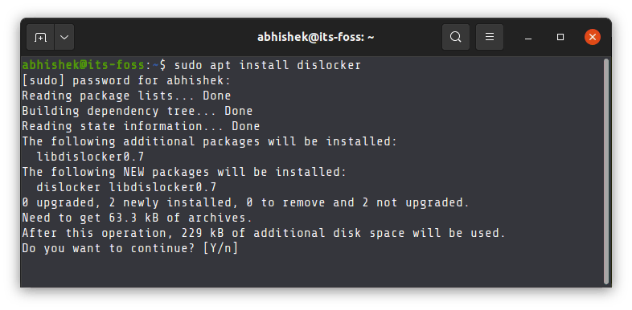
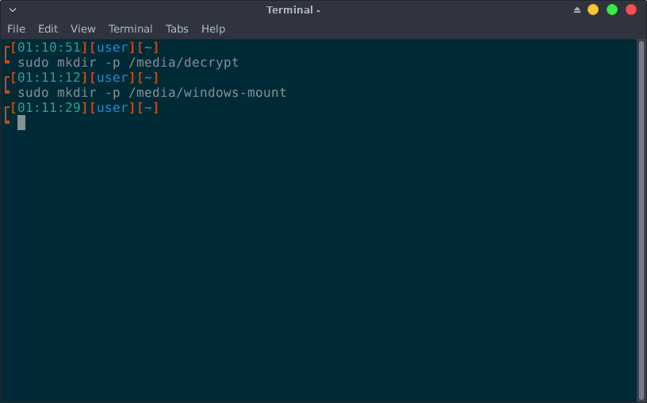
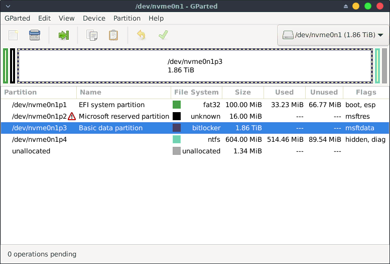
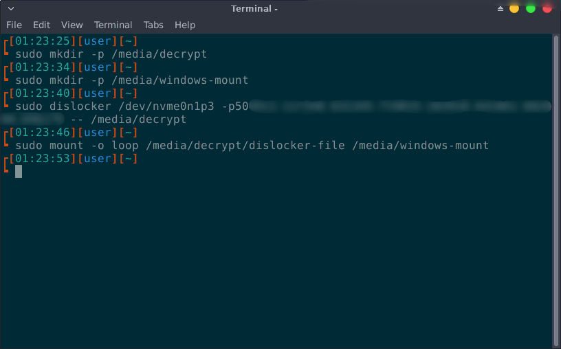
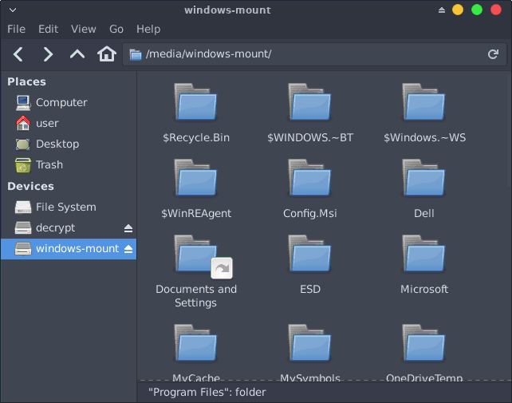

Dislocker process will work in two different parts. For the first pear we will decrypt the BitLocker encryption and give a file named dislocker-file. In the second part we will mount the partition we just created. 

To do this, you will need either the BitLocker password or the recovery password to decrypt the drive. If you need help finding your BitLocker key, follow [this guide](https://support.microsoft.com/en-us/windows/finding-your-bitlocker-recovery-key-in-windows-6b71ad27-0b89-ea08-f143-056f5ab347d6).


## Install Dislocker
The first step is to install Dislocker. If you are already using our [Linux Live session](/live-sessions/linux-live-session) you can skip this step, as it is included already. If your live session does not have it installed, you can use the following command to install dislocker for Ubuntu and Debian:
```
sudo apt install dislocker
```


## Create mount points
The next step is to create two mount points. The first mounting point is for where Dislocker will generate the dislocker-file and the other mounting point is where you will mount the dislocker-file as a loop device.
The naming of the mount directories can be anything because there is no naming restrictions.
Run these commands one by one:

```
sudo mkdir -p /media/decrypt
sudo mkdir -p /media/windows-mount
```



## Get the partition name
To decrypt the Windows partition we need to get the name of the partition. To get the name there is another program on the Linux Live session, GParted. We can use this tool to get the name of the partition we need.



*This is just an exmaple, your partition name will be different*

## Decrypt the partition and mount it
*If you have the BitLocker password*, use this command, replacing `<partition_name>` and `<password>` with your actual values.

```
sudo dislocker <partition_name> -u<password> -- /media/decrypt
```

*If you only have the recovery password*, use this command, replacing `<partition_name>` and `<password>` with your actual values.

```
sudo dislocker <partition_name> -p<recovery_password> -- /media/decrypt
```

*There are no spaces before the password.*

After decrypting the file, we mount it that way it is accessible. To do that we enter the following command:

```
sudo mount -o loop /media/decrypt/dislocker-file /media/windows-mount
```



The BitLocker encrypted Windows partition is now decrypted and mounted in Linux. You can now access it from file explorer.
  


## Troubleshooting tips
If you get an error for wrong fs type then need to include the file type.

```
mount: /media/windows-mount: wrong fs type, bad option, bad superblock on /dev/loop35, missing codepage or helper program, or other error.
```

For NTFS, use to mount:

```
sudo mount -t ntfs-3g -o loop /media/decrypt/dislocker-file /media/windows-mount
```

For exFAT, use to mount:

```
sudo mount -t exFAT-fuse -o loop /media/decrypt/dislocker-file /media/windows-mount
```

## Unmount the Windows partition
Once finished, you can unmount the partition from file manager. By either clicking the unmount symbol beside the partition name or entering each command one by one.

```
sudo umount /media/decrypt
sudo umount /media/windows-mount
```
