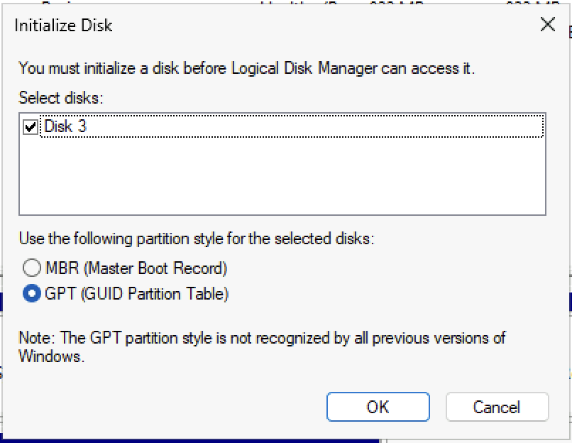
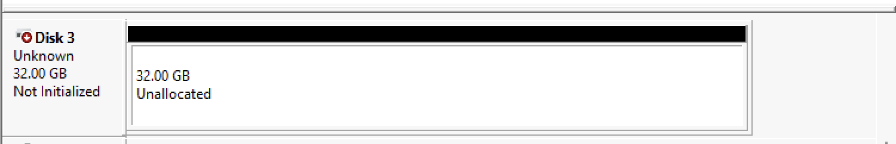
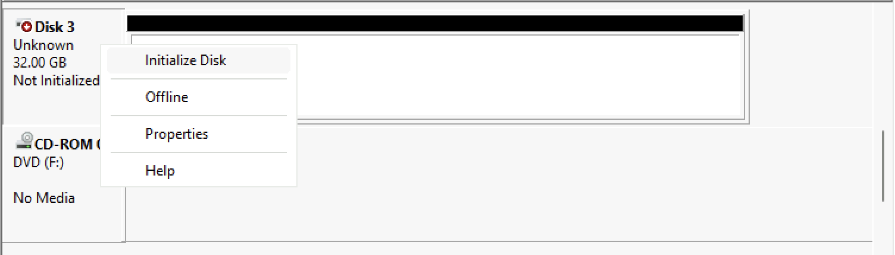
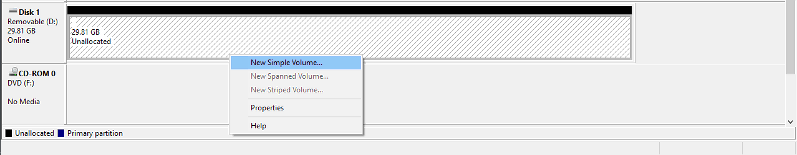
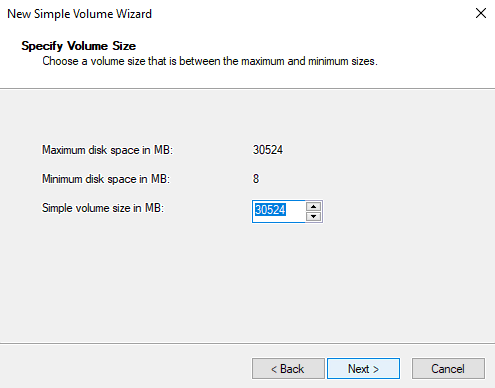
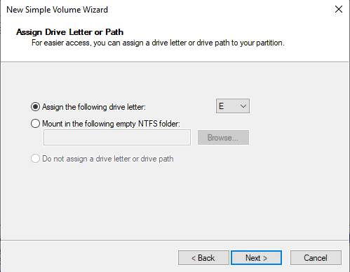
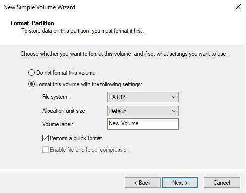
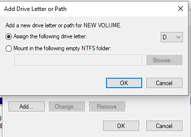
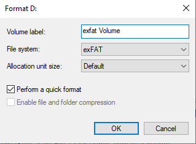
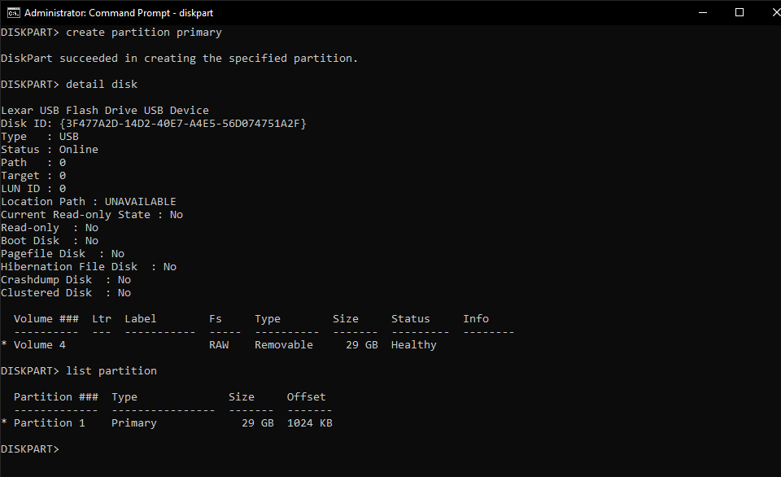

## Using Disk Management in Windows
You can open disk management by pressing Win+R and typing `diskmgmt.msc`.

Disk management can only be run from a installed copy of windows, and has limits on what partitions and disks can be edited. For a more robust solution, consider using DiskPart or gparted.

### Initialize a new disk
A brand new disk must be initialized before it can be used.

#### Initializing via Popup
1. The first time you open disk management with a brand new disk in a machine you will be presented with a pop up saying "You must initialize a disk before Logical Disk Management can access it."

    

2. On all modern systems you should choose "GPT (GUID Partition Table). Once you click "Next" you should be able to proceed with [Create a new partition](#create-a-new-partition).

#### Manual Initialization
Sometimes you won't get this pop up and instead your disk will appear like below, you will need to manuall initialize this disk.

1. Right click the left panel of the disk and choose "Initialize"

    

2. On all modern systems you should choose "GPT (GUID Partition Table). Once you click "Next" you should be able to proceed with [Create a new partition](#create-a-new-partition).

### Create a new partition
New partitions can only be created from unallocated space.

1. Right click on the unallocated space and choose "New Simple Volume".

    

2. By default, the size will be the entire unallocated space. Most of the time, this is fine.

    

3. You can assign your new partition any drive letter you would like. However, assigning `A` or `B` may cause issues.

    

4. Set the filesystem to one of three options (there are 3 options (you may have less depending on your drive):

    | FAT32 | Designed to be used with smaller USB drives 32GB or less in size. |
    | exFAT | Designed to be used with all USB drives. Can replace FAT32. |
    | NTFS | Designed to be used with hard drives and SSDs of all sizes, internal and external. |

    Set the label to what you want.
    

### Change drive letter
1. Right click on an existing partition and choose "Change Drive Letter and Paths...".
2. If the drive doesn't already have a letter, choose "Add..." on the open dialog. If it already has a letter, "Change...". To remove the drive letter, choose "Remove".  
    

### Change file system
> [!WARNING] Warning
> This is a destructive action, all data on the drive will be deleted.

1. Right click on an existing partition and choose "Format...".
2. Leaving allocation unit size at default and quick format selected will usually work.
3. Choose a filesystem:

    | FAT32 | Designed to be used with smaller USB drives 32GB or less in size. |
    | exFAT | Designed to be used with all USB drives. Can replace FAT32. |
    | NTFS | Designed to be used with hard drives and SSDs of all sizes, internal and external. |

4. Click "OK" to format the drive.

### Changing drive label
1. Right click on an existing partition and choose "Properties".
2. From this menu, you can change your drive label to anything you would like

### Deleting a partition
1. Right click on an existing partition and choose "Delete Volume..."
2. Click "Yes" to delete the partition. You will loose all data on this partition.

## Using Diskpart in Windows
Diskpart is a command line tool that doesn't have as many restrictions as disk manager. It is still limited when working on the `C:` drive, and not a good tool for partition manipulation. To use it on the `C:` drive, run it from run from the windows installer or from the [windows PE](/live-sessions/windows-live-session).

This guide will walk you through wiping a disk and creating a single empty partition using the entire drive. However, this will not securely erase your data, see [the wiping disks article](/disks/disk-wipe) to do that.

1. To open DiskPart, you will need an elevated command prompt. Just type `diskpart` and DiskPart will load.
2. To identify your disk, type `list disk`, then type `select disk X` where X is the disk number. (Choosing the wrong disk will cause data loss)

    

3. To wipe all partitions from your disk, type `clean`
4. For disk type and partition structure, most cases will want basic and GPT. If this disk needs to be read on older systems, use MBR instead of GPT. Run `convert basic` or `convert gpt` based on what you need.
5. To create the raw partition, run `create primary partition`. If you picked MBR, run `active` after creating the partition.
6. Run `detail disk` and `list partition` to ensure that your disk looks correct and you have both the partition and volume selected. You should have a star next to the volume and partition.

    If either the partition or volume is missing, type `exit`, reconnect your drive and start over.

    If the partition or volume isn't selected (you can tell by the star on the right), type `select partition X` or `select volume X`.

    

7. To format the partition, type `format fs=<filesystem>`. For what file system to use, reference the following:

    | FAT32 | Designed to be used with smaller USB drives 32GB or less in size. |
    | exFAT | Designed to be used with all USB drives. Can replace FAT32. |
    | NTFS | Designed to be used with hard drives and SSDs of all sizes, internal and external. |

    To add a label at this stage, add `label=<label>` to your command.

    If you are using NTFS and want to enable file compression, add `compress` to your format command.

    To significantly speed up the format time, add `quick`.

    A full format command will look something like `format fs=fat32 label=Drive quick`. This will do a quick format with a label of "Drive" and file system of FAT32.

8. To assign a drive letter to the new partition, run `assign letter=X` where X is the letter you choose.
9. Type `exit` to close DiskPart. Your drive is formatted.

## Using GParted in Linux
This is used via a Linux live environment. 

Gparted has the advantage of working on almost any disk, when in Windows you cannot operate extensively on your main `C:\` drive but Gparted is booted from its own media and not running on `C:\` so it does not have this restriction. 

Check the [Gparted guide here.](/disks/gparted)
