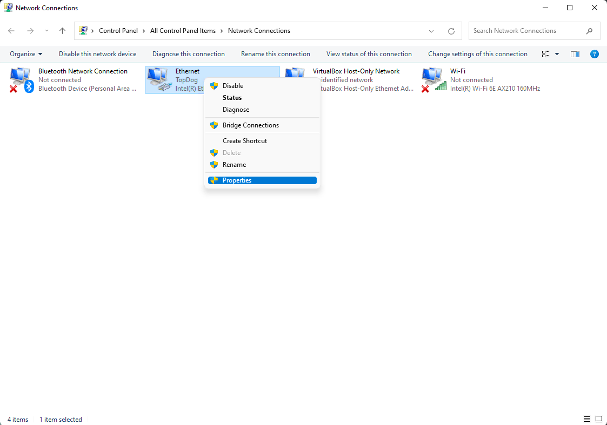
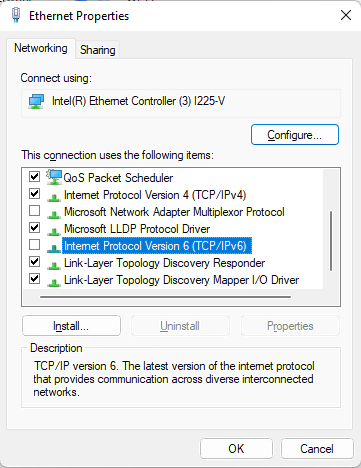

Turning off IPv6 can help troubleshoot internet issues.

1. Press Win + R to launch the run box

2. Type `ncpa.cpl` into the box, and hit Enter

    

3. Select the internet adapter that is currently in use, and right click and select properties

    

4. Uncheck the box for Internet Protocol Version 6 (TCP/IPv6)

    
 
5. Test to see if the issue continues. 

## Turning Off IPv6 (PowerShell)

1. Right click on the start menu and run PowerShell (Windows Terminal) as admin.

2. Enter this command: `Get-NetAdapter | ? {-not $_.Virtual -and $_.Status -eq "Up" } | foreach {Disable-NetAdapterBinding -InterfaceAlias $_.Name -ComponentID ms_tcpip6}`

3. Test to see if the issue continues.

## Turning IPv6 ON (PowerShell)

1. Right click on the start menu and run PowerShell (Windows Terminal) as admin.

2. Enter this command: `Get-NetAdapter | ? {-not $_.Virtual -and $_.Status -eq "Up" } | foreach {Enable-NetAdapterBinding -InterfaceAlias $_.Name -ComponentID ms_tcpip6}`
