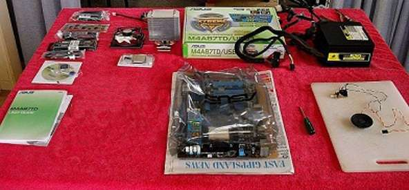
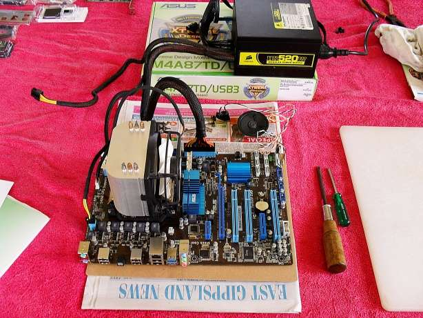
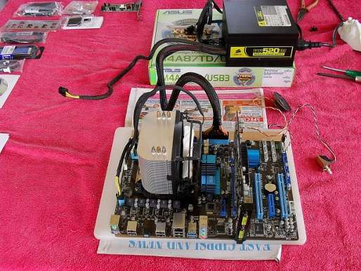

> This article is based off of [this What the Tech forum post by Lee.](https://forums.whatthetech.com/index.php?showtopic=120814)

## What is Breadboarding?

Known as an out of case install, **breadboarding** is a procedure where you test your computer outside of your case to ensure that the most basic components it has are working properly.

## Preparations

The usual safety-first rules apply here: 

**Stay grounded** and don't do this on a carpeted floor, because it creates static-electricity. A good idea is to wear an anti-static wrist-strap.

**Find and write down your motherboard's beep codes**, either from the manual or from the manufacturer's support site on the Internet. 

You will then need a small speaker salvaged from an old case or temporally removed from the one you're about to install in, although some motherboards have their own speaker built-in.

Next, you will need an on/off switch or failing that **a small screwdriver** can be used to short out the on/off pins where the switch normally connects to the motherboard. You short the pins to power on and you short the pins again to power off.

A single #2 Phillips head screwdriver would be ideal for this but the closest you have will be fine for a one-off build.

## Procedure

> [!WARNING] Warning
> It is very important that you remember to **power-off the motherboard** and switch-off and unplug the PSU after each component test. Do this before you remove or install anything.

Place the motherboard on a piece of cardboard along with everything else in the motherboard's box. 

Lee, the original writer of the forum post, used the kitchen table here covered with a large cotton towel as that is where most of you will assemble your new PC. The kitchen floor doesn't have carpet, so it's a good place to proceed.

### Installing CPU

> [!WARNING] Warning
> Remember to **turn off the power** between each of the following steps and make no changes unless the power is off.

Before installing the CPU, now is the time to inspect the board's CPU socket for any obvious damage or any tiny debris that might have fallen in at the factory during packaging. Also inspect the RAM and PCIe slots and pins. 

Install the CPU and Heatsink applying a thin coat of thermal paste between the two with the edge of a credit card. Connect the Heatsink fan wires to the correct board socket. Plug in the main 24 pin ATX 12volt power connector and the 4 or 8 pin EPS 12 volt power connector into the motherboard.

Plug-in and turn on the PSU's power and then the board's power. A board and CPU that works should now give you a RAM failure beep code. If the CPU is faulty, you may or may not get a CPU failure beep code (depending on the board's bios). If you do get a faulty CPU beep code, you have a faulty or incorrectly installed CPU.

If you get no codes and the Heatsink fan doesn't rotate (nothing works) and you have checked that your CPU is installed correctly, your motherboard, CPU and PSU all need proper testing to determine which one of them is *faulty*.

### Installing RAM

We are now going to test all of your RAM sticks and the motherboard's RAM slots.

If the board and CPU are working and you have heard the RAM error code, you are now ready to install the 1st. Stick of RAM into the board's No.1 RAM slot. 

If the RAM is OK, you should now hear a video card failure beep code. Remove that stick of RAM and insert your next stick into the same slot. Test all of your RAM in this working slot and then use one of them to test all other slots for the video card beep code.

### Installing GPU

With the power off, lift the motherboard and place it on a breadboard so you have the height needed to install the video card. 

The card's edge will sit over the edge of the board as shown in the photo. If the video card is good, you should now hear a single beep. Congratulations, that's your post beep.

After you have disconnected everything, it's time to start installing your new hardware into your case with the foreknowledge that everything works. 
