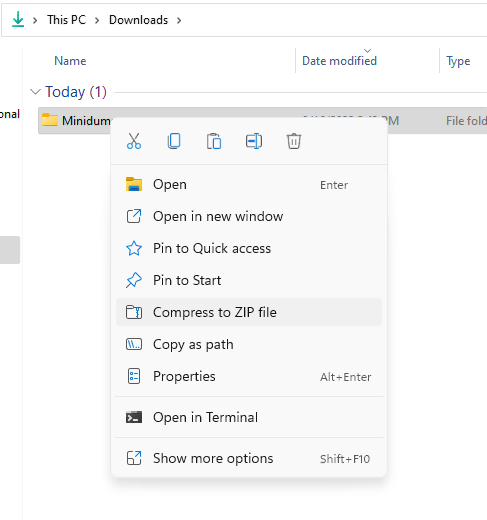

## What is a BSOD Dump?

Blue Screen of Death (BSOD) memory dumps contain information about your computer on the time when the BSOD took place.

BSOD dumps allow us to further analyze a BSOD and potentially find the issue.

## Finding the BSOD Dumps

1. Navigate to your Windows directory by opening the Run dialog (Win+R) and typing `%WINDIR%`. You can also do this from any folder by clicking in the navigation bar.

    
    

2. Find the folder named `Minidump` and open it to double check to see if you have any `.dmp` files.

3. If you have dump files, copy the entire folder (*not just the files in the folder*) to the Downloads folder. This will require administrator permissions.

    > [!WARNING] Warning
    > Ensure that you **copy** this folder. Do not attempt to move it entirely or you will receive permission errors.

4. Create a .zip file of the whole folder by right clicking the folder -> `Send to` -> `Compressed (zip) folder`

    

5.  Drop the .zip file into the chat for the tech support team to analyze.

## Access is Denied

If you are receiving an error that access is denied when opening the Windows Directory, your account does not have the permissions required to view system files. You will need to have access to an administrator account before we can help you further.

If you are receiving an Access is Denied error when creating the .zip file in step 4, you most likely did not copy the Minidump folder to the documents. Windows will not allow you to modify the Minidump folder inside the Windows directory. It must be copied elsewhere.

## No Minidump folder exists

In the event no Minidump folder is present in the Windows directory, it's likely that your system is not properly configured to create dump files in the event of a BSOD. Please follow the guide [here](https://www.tenforums.com/tutorials/5560-configure-windows-10-create-minidump-bsod.html) to properly configure your system.

## The Minidump folder is empty.

First, double check the dump configuration settings following the guide [here](https://www.tenforums.com/tutorials/5560-configure-windows-10-create-minidump-bsod.html). Provided your settings are correct, Windows failed to create a minidump. This can occur for a few reasons:

1. The failure was so sudden that windows did not have enough time to create a dump before the system shut down. In this case, your event viewer will have logged an Error 41 with partial information about the crash. You can open your Event Viewer through the start menu, or with the Run dialog (Win+R -> `eventvwr.exe`). The log will be under Windows Logs->System. The details tab (Not the general tab) may have partial error information in the form of a bugcheck code.

2. If no corresponding error 41 exists, or the error 41 recorded a bugcheck code of `0`, your pagefile was either corrupted or for some reason inaccessible at the time of the BSOD. This is indicative of Operating System corruption or drive failure. This can sometimes be corrected through [DISM or the System File Checker (SFC)](/guides/dism-sfc).

## The file will not upload to Discord.

If your file is stuck on `Processing...` when uploading it to Discord, you are attempting to upload a dump file directly from the Minidump folder. Depending on your account's permissions, Windows prevents this but does not provide any sort of notification. Please follow the steps above to copy and upload the entire Minidump folder rather than the individual dump files.

If you're curious, you can learn more about reading the dump files [here](/learning/bsod_guide)

## Unable to access windows desktop

If you are unable to access the windows desktop even after troubleshooting steps like booting into [Safe Mode](https://support.microsoft.com/en-us/windows/start-your-pc-in-safe-mode-in-windows-92c27cff-db89-8644-1ce4-b3e5e56fe234) you can try following our tutorial on [Live Linux USBs](https://rtech.support/docs/live-sessions/linux-live-session.html) to obtain and send us the dump files created by windows. However, please note that in most situations. If you are unable to enter the desktop environment you will be suggested to [re-install windows](https://rtech.support/windows).