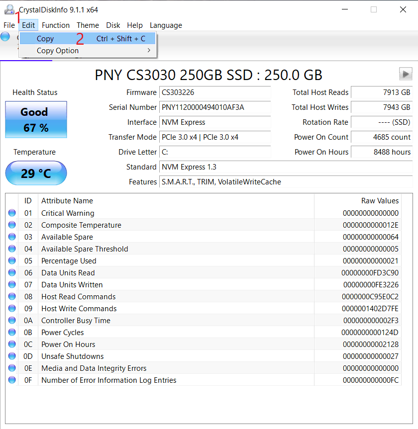

## What is CDI?

Crystal Disk Info (CDI) is a tool to check hard drive health.

It collects a drive's [S.M.A.R.T. data](docs/factoids/cdi#analyzing-smart-data-in-cdi) and creates a log for us to analyze.

## How to use CDI

1. Download and install [Crystal Disk Info](https://crystalmark.info/redirect.php?product=CrystalDiskInfoInstaller)

2. At the top of the program's window, copy the contents by going to `Edit -> Copy`

	

3. If you are being helped in Discord you can paste the content directly with Ctrl + V. If this was requested on the subreddit please put it on [Pastebin](https://pastebin.com) then supply the link in your comment.

## Analyzing SMART data in CDI

S.M.A.R.T. (Self-Monitoring, Analysis, and Reporting Technology) is a monitoring system included in drives (SSDs and HDDs), its primary function is to detect and report various indicators of a drive's reliability and health. 

> [!WARNING] Warning
> Important: Any app that uses SMART data to analyze drive health is just a diagnostic utility. **It cannot and should not be used to completely evaluate drive health** as there are many factors that won’t show up. However, it is a key component and produces a lot of useful information. Just know that drive can have perfectly fine SMART data and still fail _without any warning_.

When analyzing a drive's health, it may be best to look at the raw SMART values, which are usually [hexadecimal](https://en.wikipedia.org/wiki/Hexadecimal). 

If detailed SMART data is unavailable (as is the case with most NVMe drives, for instance), you can refer to other indicators such as a drive's health percentage. Although this is less reliable.

See our guide on [disk health](/disks/disk-health) for more information.
