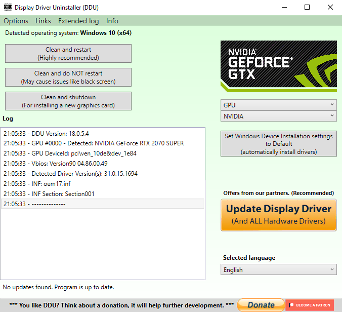

## What is DDU?
Display Driver Uninstaller is a program that can fully wipe display/audio drivers, to troubleshoot various issues.

> DDU does not erase any personal files. It only wipes the selected driver(s), and any associated info, such as display color profiles, settings, etc.

## Installing DDU
import InstallDDU from '../../../_includes/embeds/ddu_install.md';

<InstallDDU />

## Wiping Display Drivers

> [!WARNING] Warning
> 
> Make sure you are in [Safe Mode](https://support.microsoft.com/en-us/help/12376/windows-10-start-your-pc-in-safe-mode) for the following steps.

>Your Display Resolution Will decrease because Windows will revert to the failsafe "MsDisplayAdapter Driver"

### Laptops or integrated graphics

To wipe display drivers for laptops/devices with onboard graphics: Select the "GPU" device type from the drop-down list on the right. 

* Select the `Clean and do NOT restart` option for the first driver, _then_ the `Clean and restart` option for the second driver. Any GPU driver can be wiped first, the order is irrelevant.

### Desktops with a dedicated GPU
To wipe display drivers from a dedicated GPU: Select the "GPU" device type from the drop-down list on the right, select the GPU driver you wish to uninstall, and click `Clean and restart`

## Reinstalling Display Drivers
  
### Custom-built desktops
Go to the site of the GPU's manufacturer(s) ([NVIDIA](https://www.nvidia.com/Download/index.aspx), [AMD](https://www.amd.com/en/support), [Intel](https://www.intel.com/content/www/us/en/download-center/home.html)) and download the latest available display drivers.

### Laptops/pre-built desktops
Go to the model's support page on your manufacturer's site, and download the latest available display drivers.

> [!WARNING] Warning
> For devices with multiple GPUs, download both the integrated and dedicated GPU drivers. Install the integrated GPU drivers _first_, followed by the dedicated GPU drivers.
