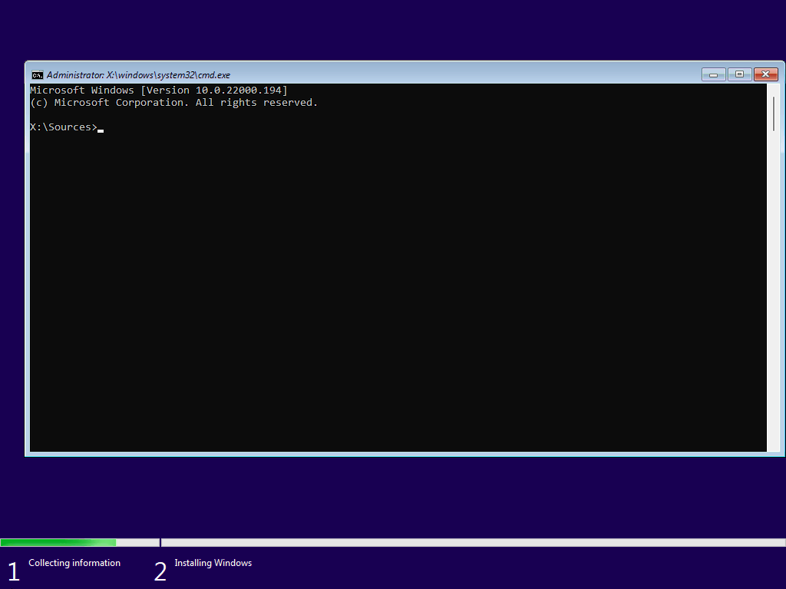
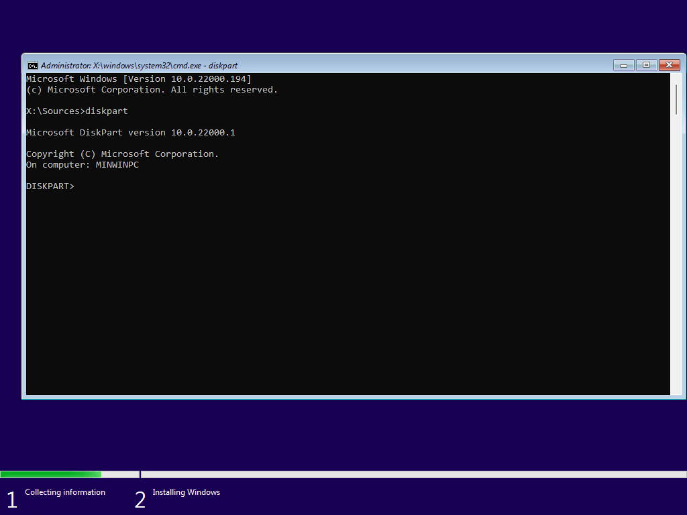
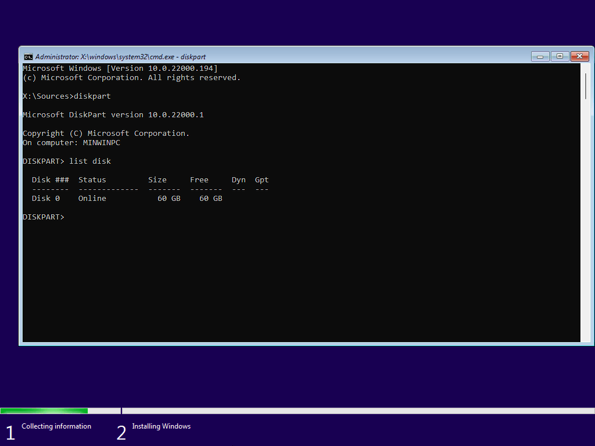

> [!CAUTION] Caution
> Note that cleaning the disk **will remove any data stored on it.**

Open Command Prompt or PowerShell as admin then follow the steps below.

```
diskpart
list disk
```








Make note of the disk you want to clean from the step above.

```
sel disk #
clean
```

Follow the below steps to you want to partition and format the drive. You will want to do this unless otherwise instructed.
```
create partition=primary
format quick fs=ntfs
assign letter=E
```

You can change the file type to a different one if so chooses, FAT32 or exFAT are examples. You can also change the letter to any letter that is *not in use*. 
