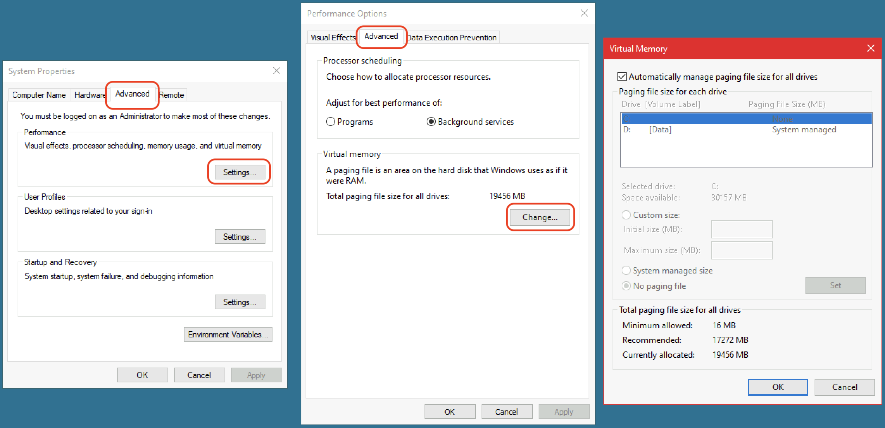

1. Press Win + R to open the Run dialog.
2. Type `sysdm.cpl` and press Enter.
3. Click the **Advanced** tab.
4. In the **Performance** section, click on **Settings**.
5. Go to the **Advanced** tab.
6. Under the **Virtual memory** section, click on **Change**.

