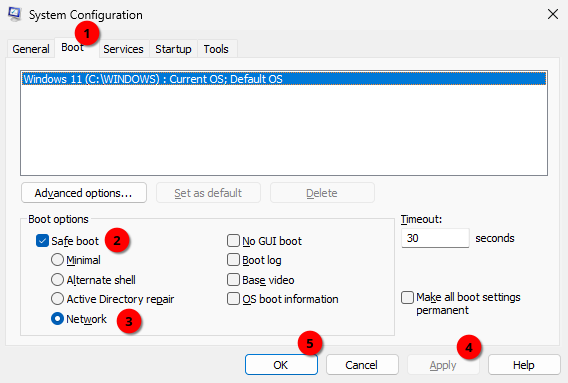
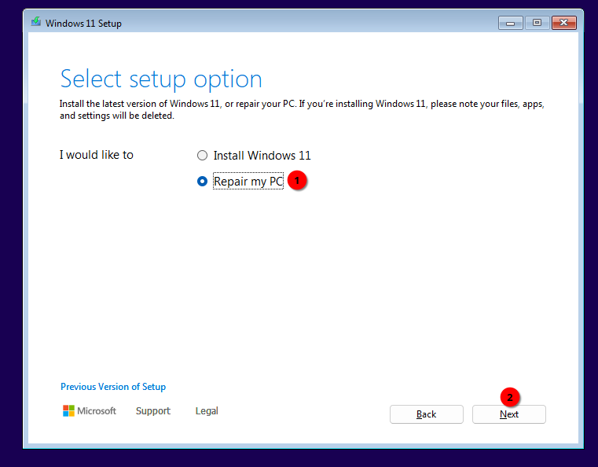

Windows has a troubleshooting mode called safe mode, where Windows will load only critical drivers and services necessary for proper function. It is especially useful when issues exist in normal mode or when uninstalling drivers used by Windows.
All non-critical drivers and services will not be loaded. For example, for graphics Windows will use a generic driver instead of one provided by vendor like Nvidia, AMD, Intel, etc. Services for gaming platforms, anti-cheats, peripheral controls, audio software won't run unless explicitly started.

Windows in safe mode will have a limited resolution, black background, and will display `Safe mode` text in corners as well as build version on top of the desktop.


 > [!NOTE] Information
 >
 > If Bitlocker is enabled on your PC, Windows may ask to enter BitLocker recovery key when booting into safe mode. If system drive is encrypted, it's necessary to enter the key. See [BitLocker wiki page](/disks/encryption/bitlocker/#finding-bitlocker-recovery-keys) for more information.

To boot Windows into safe mode, follow the below steps.

## Windows is bootable

Following methods will set boot into safe mode from a working Windows system. Start with a first method and, if a method fails, move to the next one.

   <details>
      <summary>Method 1: Using Windows Recovery Environment</summary>

1. Open Start menu, press and hold Shift key, and click Restart. If you are on the login screen, click power button, press and hold Shift key, and click Restart.


2. When Windows Recovery Environment shows with Choose an option, click Troubleshoot, then Advanced options, then Start-up Settings, then Restart. PC will reboot.
3. After reboot, Windows will present boot options. Press 5 on keyboard to start Windows in safe mode with networking.

   </details>
   <details>
      <summary>Method 2: Using msconfig</summary>

 > [!CAUTION] Caution
 >
 > Follow the steps exactly as stated unless guided by a staff member. Changing other settings in msconfig may cause Windows to fail to boot.

 > [!NOTE] Information
 >
 > After tasks in safe mode are done, make sure to follow exit safe mode steps below. Otherwise Windows will boot back into safe mode after rebooting.

1. Open Start menu, type msconfig and press Enter. A System Configuration window will open.
2. Select Boot tab, check Safe boot and select Network. Click Apply and OK. Click Restart on the following System Configuration dialog window. PC will reboot.


3. After reboot, Windows will boot into safe mode.
4. Once all required tasks in safe mode are done, follow Exit safe mode steps below.
   </details>
   <details>
      <summary>Method 3: Using command prompt</summary>

 > [!CAUTION] Caution
 >
 > Follow the steps exactly as stated unless guided by a staff member.
 > Double-check typed commands with the guide. A mistype may cause Windows to fail to boot.

 > [!NOTE] Information
 >
 > After tasks in safe mode are done, make sure to follow exit safe mode steps below. Otherwise Windows will boot back into safe mode after rebooting.

1. Open Start menu, type cmd, confirm that Command Prompt is selected and press at the same time Control, Shift and Enter. Alternatively, click Run as administrator. Confirm opening the app when prompted.

2. Type the following command and press Enter. Command will confirm successful operation once ran.
```
bcdedit /set {current} safemode Network
```
1. Close Command prompt and reboot the PC.

2. After reboot, Windows will boot into safe mode.
   </details>


## Windows fails to boot

It is possible to boot into safe mode from recovery environment when Windows doesnt boot properly. Use list below how to open recovery environment in different situations:

* Display shows **We couldn't repair your device automatically at this time** or **Couldn't connect to the network**:
   * Press **Enter** to open options.

* Display shows blue screen with **Recovery** or **Automatic repair**:
   * Click **Advanced options** or **See advanced repair options** button.

* PC repeatedly restarts during booting:
   * As soon as Windows boot animation (spinning circle) shows up, shut down your PC using any of the following methods:
       - Press reset button on PC case.
       - Press power button for 5 seconds. Power PC back on.
       - Switch off or unplug power from power supply. Power on the power supply and power PC back on.
       - If the PC is a laptop and has a removable battery, remove it. Plug battery back in and power it back on.
   * Repeat process at least 3 times until you see blue screen with **Recovery** or **Automatic repair**.
   * Click **Advanced options** or **See advanced repair options** button.

* Display shows **Your PC/Device needs to be repaired** or black screen with **Windows Boot Manager**:
   * A bootable USB with Windows installation media is required. See guide below.


Once **Advanced repair options** menu is displayed, click **Troubleshoot**, then **Advanced options**, then **Start-up Settings**, then **Restart**. After reboot, Windows will present boot options. Press **5** on keyboard to start Windows in safe mode with networking.

### Using bootable USB with Windows setup

You can use a bootable USB with a Windows setup to run Windows in safe mode. Follow the [Windows installation guide](/installations/install-11/) until you see Select setup option, then follow steps below:

1. Select Repair my PC and click Next. Select keyboard layout when prompted.


2. Click **Troubleshoot**, then Advanced options, then Command Prompt.

3. Type the following command and press Enter. Command will confirm successful operation once ran.
```
bcdedit /set {default} safeboot Network
```
1. Close Command prompt and reboot the PC.

2. After reboot, Windows will boot into safe mode.

3. Once all required tasks in safe mode are done, follow Exit safe mode steps below.


## Exit safe mode

If you entered safe mode using msconfig or command prompt method, you need to disable the safe mode before rebooting, otherwise Windows will boot back into safe mode.

To disable safe mode, use one of the following methods below.

<details>
   <summary>Method 1: Using msconfig</summary>

 > [!CAUTION] Caution
 >
 > Follow the steps exactly as stated unless guided by a staff member. Changing other settings in msconfig may cause Windows to fail to boot. 

1. Open Start menu, type msconfig and press Enter. A System Configuration window will open.

2. Select Boot tab, uncheck Safe boot, then click Apply and OK. Click Restart on the following System Configuration dialog window. PC will reboot.

3. After reboot, Windows will boot back into normal mode.

4. Once all required tasks in safe mode are done, follow Exit safe mode steps below.

</details>

<details>
   <summary>Method 2: Using command prompt</summary>

 > [!CAUTION] Caution
 >
 > Follow the steps exactly as stated unless stated otherwise by a staff member.
 > Double-check typed commands with the guide. A mistype may cause Windows to fail to boot.

1. Open Start menu, type cmd, confirm that Command Prompt is selected and press at the same time Control, Shift and Enter. Alternatively, click Run as administrator. Confirm opening the app when prompted.

2. Type the following command and press Enter. Command will confirm successful operation once ran.
```
bcdedit /deletevalue {current} safeboot
```
1. Close Command prompt and reboot the PC.

2. After reboot, Windows will boot back into normal mode.

3. Once all required tasks in safe mode are done, follow Exit safe mode steps below.
   
</details>

## External guides

- [Microsoft startup settings](https://support.microsoft.com/en-us/windows/windows-startup-settings-1af6ec8c-4d4a-4b23-adb7-e76eef0b847f)
- [Dell guide](https://www.dell.com/support/kbdoc/en-us/000124344/how-to-boot-to-safe-mode-in-windows-10) (works also for non-Dell PCs)