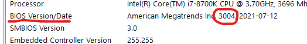
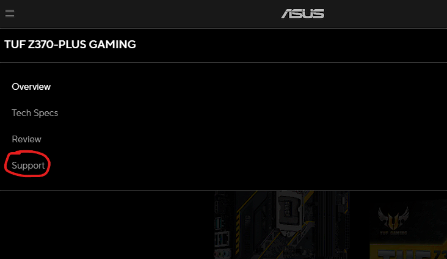
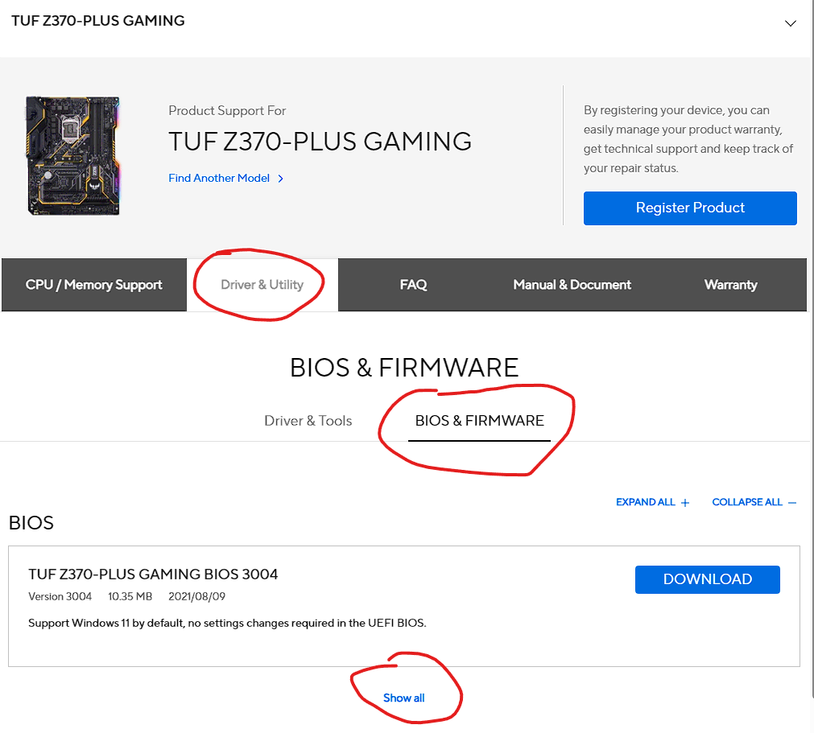
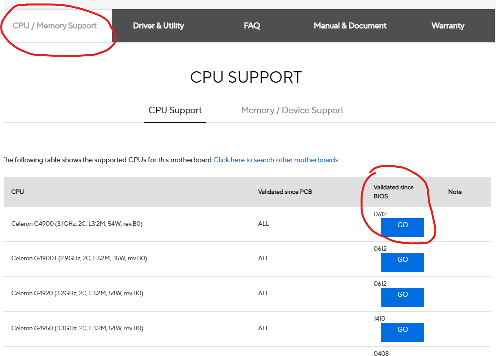

## What is BIOS? How do I update it?

BIOS stands for Basic Input Output System. It is the firmware of the motherboard that allows the control of inputs and outputs of the system, and is necessary to boot into any OS. It provides runtime services for operating systems and programs to perform hardware initialization during the boot process, so it is a necessary feature in any and all PCs.

> Sometimes BIOS can be referred to as UEFI instead. UEFI is the same as BIOS, but is a more modern standard, strictly speaking. Most of the time, what you actually be updating here is the UEFI, but both terms are used interchangeably. 

> For the purposes of this guide, we will refer to both as BIOS. For more advanced booting, if both the OS and your system support UEFI, it might be a better idea to install using UEFI mode (disabling CSM).

> CSM, or Compatibility Support Module, is a sub system in the BIOS which appears on the BIOS/UEFI options, and is used for OS that do not support UEFI, i.e. Legacy BIOS (Note that Windows 10 support both UEFI and legacy, but Windows 11 will only boot with UEFI). For more information, you can refer to here: https://en.wikipedia.org/wiki/UEFI and head to the CSM section.

Different BIOS versions support different CPUs, so if you are doing a CPU upgrade, a BIOS update may be necessary to ensure the CPU will work properly. Without it, the PC will not even boot.

> [!WARNING] Warning
> Not all CPUs need a BIOS update. Please check what BIOS version you are running, and what version is supported by the CPU, before doing the upgrade to ensure no problems will occur down the line. More information on this will be discussed below in `Common Issues and Information` under the `BIOS support for CPU` section.

> These steps are not always valid for all computers and laptops. While the following is true for most desktop models, some OEM or prebuilt systems, including laptops, may have a different way to update the BIOS, sometimes by installing an application from the manufacturer website. Please refer to the `For Laptops or OEM Prebuilts` section for this under `Common Issues and Information`.

BIOS updates generally does not improve performance (and even when it states it does, usually its to a minimal degree.) Most BIOS updates are generally recommended to fix specific hardware bugs or add compatibility for new devices (for example, CPU or RAM). Without these updates, specific devices may not be able to run.

> [!WARNING] Warning
> Manufacturers warn against updating BIOS unless you have a specific problem. If you are not doing an upgrade or do not have any issues, then it is best to leave the BIOS version as is, as it typically is a last resort for most troubleshooting, as updating the BIOS can be a risky process. A failure of flashing may result in a bricked motherboard.

Sometimes there are multiple ways to update the BIOS, all dependent on the motherboard and system you have set up. Please follow the general guide below to understand how to update the BIOS.

## 1. Checking which BIOS version you have before updating the BIOS
This is the most general step and is necessary for all methods. It is important to know what BIOS version you are running before updating, because some manufacturers may require you to **update the BIOS incrementally** (download the subsequent update to your version instead of downloading the latest one immediately). This is the most general and safe method to update BIOS.

There are multiple methods to check which BIOS version you are running. One method could be to going directly into BIOS and checking which version it has. Another method may be to open up MSConfig and checking the BIOS version there (to open up MSConfig, you can type it into the search bar and select the `System Information` application, or alternatively, follow the ms32info section in [Making a System Dossier](/guides/making-a-system-dossier)).

The BIOS version will be listed as shown:

## 2. Downloading the update file

You would need to download the BIOS update file from the manufacturer website directly. Different manufacturers style their website in different ways, so you may have to look around. To find the manufacturer website specific to your model of the motherboard/PC, you can type up "Manufacturer name" and "model" of the motherboard into a search engine. For example: `ASUS Z370 Plus Gaming motherboard` will yield the manufacturer website for this exact model.

Generally, the BIOS update files can typically be found in the `Support` section of the website, and from there, `Driver and Utility`. The images shown below are used as an example as to where they can be found, but the general idea of finding the download is still the same.

> The manufacturer manual for your system should list the steps to do the BIOS update more specifically. You can also type "Manufacturer name" and "model" of the motherboard and "BIOS update" to get a guide from the manufacturer directly. Do be aware not all motherboard manufacturers do this.

Once you downloaded the update file, you would need to move it to a USB. Ensure that the USB is:
- Formatted to FAT32
- Is empty (moved all data from the USB to someplace else)

For best results, the USB should only contain the update file and nothing else.

> [!WARNING] Warning
> Some BIOS versions will come with an application that can be called BIOS Renamer, or something similar. Before moving it to the USB, you will need to run these programs as listed on the manufacturer website to edit the BIOS file accordingly before use.

## 3. The different methods of updating the BIOS

With the update file on the USB, you can now commit to actually updating the BIOS. As mentioned beforehand, there are multiple methods to update the BIOS, the two most common are usually either updating the BIOS from the BIOS directly, or using the motherboard's onboard BIOS flashing option.

- ## Method 1: Updating the BIOS within the BIOS
    
    Different motherboards have different BIOS and therefore will operate in different ways. In this case, you may have to look for a "BIOS Update" option in the BIOS directly, which can either be found in the "general" view or even the "advanced view" (may be named differently due to different BIOS and different manufacturers). 
    
    For this, you can refer to the manual of your motherboard to understand how to navigate the BIOS menus properly to update the BIOS accordingly.

    > [!WARNING] Warning
    > The BIOS update option may not be called that directly, and can have a different name, such as EZ-Flash Utility (from ASUS) or Q-Flash (from Gigabyte). Different manufacturers will name their BIOS flashing utility differently.

- ## Method 2: Using the onboard BIOS flashing option

    Some motherboards will have the option to update the BIOS directly without even booting into the BIOS. This method of updating the BIOS will be called differently depending on the motherboard model (EZ-flash or Q-flash for example) For this, you will need to refer to your motherboard manual to exactly see how to utilize this option.

    
    The general idea to utilize this option will need you to turn on your PC, plugging in the USB to a dedicated port on the motherboard (refer to manual to exactly see where this port will be located), and pressing a dedicated button for BIOS flashing (again, refer to the manual to know where this button is located).

    Do note that this option is not available on all motherboards, so you will need to rely on the motherboard manual to reconfirm if you do even have this option of updating the BIOS. Otherwise, you may have to rely on Method 1 for a BIOS update.

    > [!WARNING] Warning
    > This method is especially important for updating a BIOS without a CPU, or have an unsupported CPU. So if you were to buy a motherboard whose BIOS version currently does not support the CPU, you may have to utilize this method to update it.

    > In the event you have a motherboard without this feature, and the BIOS version does not support the CPU you are trying to use, then you may have to go to a repair shop or ask a friend to borrow a CPU which the BIOS supports and updating the BIOS through that (or letting them do it for you), or doing an RMA for the board and buying a motherboard with a onboard BIOS flash feature or has a supported BIOS out of the box.

## For Laptops or OEM Prebuilts

Some prebuilt computers from OEMs, especially laptops, often will require a different method of updating the BIOS, sometimes via software that is provided by the manufacturer website. For these, you will need to consult the manual to reconfirm if this is the case, and search up the model of the prebuilt or laptop on the manufacturer website and download the according tool for the BIOS update.

Note that these may need a dedicated OS to update the BIOS, mostly Windows in this case, as the software they tend to use only work in Windows (they are windows executable files, `.exe`).

Examples of such prebuilts and laptops that may need this method are: Dell XPS and Vostro series Laptops, Microsoft Surface laptops, Acer Nitro desktops and laptops, HP laptops and desktops, etc.

## Computer is not booting after BIOS update

This may be caused by a failed flash of the BIOS. In this case, some motherboards offer a dedicated BIOS flashback method to utilize the previous version of the BIOS before updating it. Please refer to the manual of the motherboard to understand how to use this feature.

Another troubleshooting step may be to attempt a [CMOS reset](/factoids/cmos) and hoping this works. Sometimes a CMOS reset may be necessary after a BIOS update to ensure that the BIOS is in its default state to properly boot.

## BIOS support for CPU

As mentioned previously, some CPUs are only supported by a specific version of a BIOS or newer. To know which BIOS version is needed for the CPU, you may have to refer to the manufacturer website. It will typically in the `Support` section of the manufacturer website for the motherboard, in `CPU support`. Here, look for the model of your CPU, and check the according BIOS version that it was supported for.

