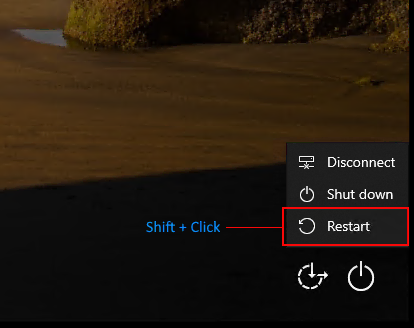
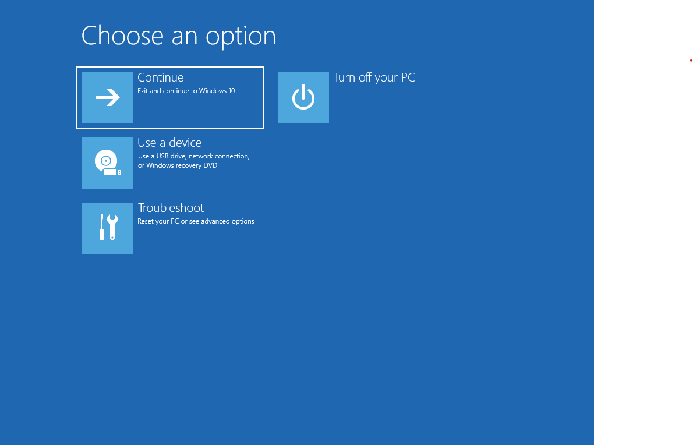
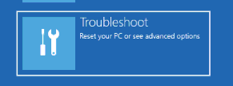
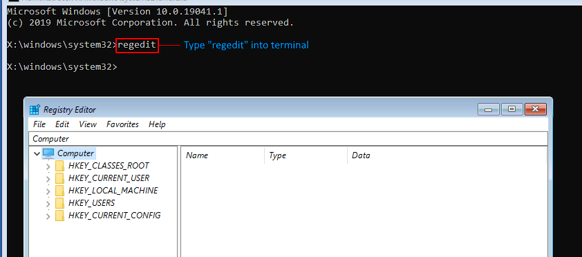
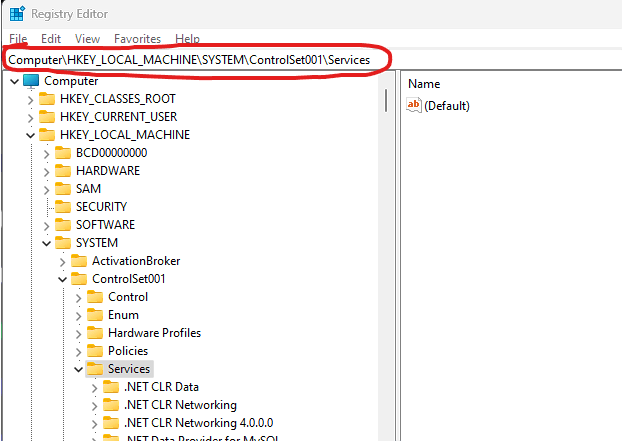
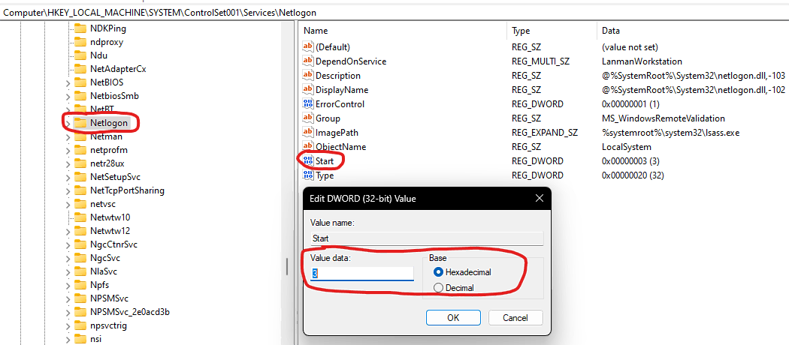

If by accident you have disabled Microsoft services when performing a Cleanboot, __**which is something you should never do**__, this guide will detail how to attempt to fix the failed Cleanboot.

> Note that we will only cover how to fix Cleanboot. For information on how to do a Cleanboot, please refer to the "[How to Cleanboot Windows](/factoids/cleanboot)" guide.

> Another point to mention is that all the screenshots depict Windows 10, but Windows 11 will operate the same way.

## 1. Restart into Windows Recovery Environment and load Regedit

Press and hold the `Shift` key when clicking the `Restart` button on the login page. **Keep holding the shift key** until you get the blue screen depicting troubleshooting options.

> Note that you may have to restart twice to get to the troubleshooting screen.

This will cause the PC to restart into Windows Recovery Environment, where all forms of settings appear. Here, we will need to go to `regedit` to start the login services upon booting of Windows.

Open up the terminal by selecting `Troubleshoot` -> `Advanced Options` -> `Command Prompt` as depicted below:

### Step 1: Troubleshoot

### Step 2: Advanced Options

### Step 3: Command Prompt

After Step 3, you will have to select your user account, type the password to access the terminal, and will be greeted to the terminal screen, where you will need to type in `regedit` to open up the corresponding application:

## 2. Open up the Services HIVE in regedit

> [!WARNING] Warning
> The registry is a core component of the OS. Messing up the registry may result in you having to reinstall windows!

First, we will try to open up the SERVICES hive as a test in regedit (the "folders" depicted on the side of regedit are referred to as hives.)

In the top bar, type `Computer\HKEY_LOCAL_MACHINE\SYSTEM\ControlSet001\Services` as shown in the picture:

!

This will bring lots of folders up. These are the Microsoft Services Hive essential for your operating system, and now we will have to look for certain folders to fix the issues.

> Note that different regedit folders may look differently from one another depending on the applications installed. However, the services hive will be identical in all Windows 10 and Windows 11 version.

If the services hive opens up, then that means that your OS is working. **If the services hive here is missing, then your Windows install may be corrupted**, and you may have to reinstall windows, following this guide [here](/windows).

## 3. Fixing the broken logins

Here we will look for 4 different registry hives and keys to fix.

> [!WARNING] Warning
> 
> Depending on the type of login you utilize, not all keys may be present! If 1 or 2 of these keys are missing, there is no need to worry. If all 4 are missing, you will have to resort to [reinstalling windows](/windows).

You will have to look for the following folders:
- `KeyIso`
- `Netlogon`
- `seclogon`
- `VaultSvc`

In all 4, you will have to look for the "Start" key, double click it, and set them all to 3. Here, I am using `Netlogon` as an example, but the principle is the same for the rest of them:

> Note that you can search for these keys in the top search bar as well!

## 4. Restart and observe

Restart the PC now, and boot into normal windows. If the login page shows up, the fixes have worked and you can carry on with a cleanbooted PC.

Otherwise, you may have to [reinstall windows](/windows), as a broken registry is not simple to fix.
