## What is OCCT?
OCCT stands for Overclock Checking Tool. Its a stability testing suite as well as a excellent error checking tool that allows for stress testing (like that found in the [HWInfo stress test guide](/guides/hwinfo)) and as an added bonus, error checking within that stress test to ensure that the system/components are stable.

> [!NOTE] Information
> 
> Keep in mind that OCCT does not log data and will not output a CSV file (if using the free edition, which we will be here). For logging performance data while using OCCT, use the `game logging` procedure from the [HWInfo stress test guide](/guides/hwinfo).
>
> Another point to mention is the fact that despite it saying it is an `Overclock Checking Tool`, it is important to state that **we will not explain how to overclock in r/techsupport as it goes against our rules**. We are using this to test your system, nothing more. Adjusting the clocks and voltages of any component can cause system instability or irreversible damage if done incorrectly. You can perform these changes at your own risk, **we will not provide help with it**.

## Downloading OCCT
1. Download OCCT from the official OCCT website [here](https://www.ocbase.com/download).

    

    **Either version will work (Base vs Cooler Master), it is just a difference in the theme.**

2. Once downloaded, you will need to run the program as administrator (automatic prompt usually, otherwise you must right click the application and select `Run as administrator`). Admin permissions are necessary for OCCT to collect the error logs.

    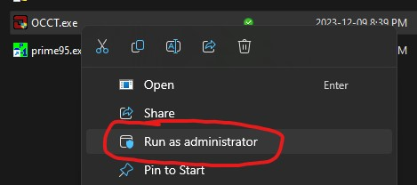

## Using OCCT
There are multiple type of tests to run OCCT, each dependent on what you will need to test. Here we will only describe the methods to run specific stability tests (Selected on the right hand pane of the application):

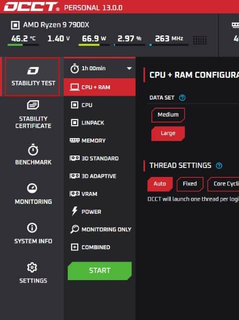

### CPU + RAM stability test
Default values are best set here. Ensure the test is set at 1 hour, and all other configurations are set as default (Unless specified otherwise):
- Data set: `Large`
- Mode: `Extreme`
- Load Type: `Variable`
- Start at Cycle: `1`
- Instruction Set: `Auto`
- Thread Settings: `Auto`

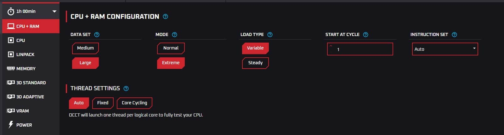

### Linpack stability test
In case CPU stability does not reveal anything, you may run Linpack (a stress test from Intel), which also has decent error detection. Once again, default values will be good here (Unless specified otherwise):
- Version: `2021`
- Threads: `Physical and virtual`
- Memory: `2048`

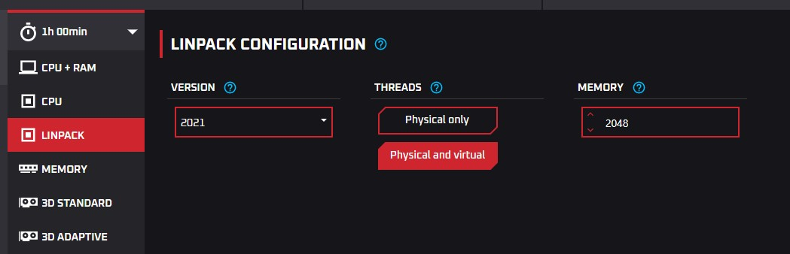

### Memory stability test
> [!NOTE] Information
> 
> A better version of this is using [memtest86+](/guides/memtest/memtest86). We **highly** recommend using that for proper RAM testing.

Here, change Memory utilization to 90%-95% (unless specified otherwise.) Leave the other configurations as default (1 hour testing):
- Memory: `90 %` - Ensure that `%` is selected, not `MB`.
- Instruction Set: `Auto`
- Threads: `Auto`

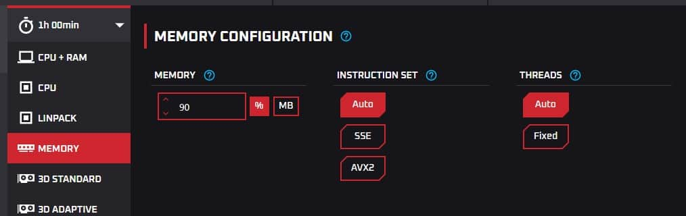

### GPU stability testing
There are 3 different types of tests you can run. Depending on your issue, you may be running just the `3D Standard test` as well as the `VRAM` test. Depending on your issue, you may be asked to run `3D Adaptive` as well.

> [!NOTE] Information
> It would be recommended to run the following GPU tests in the combined section as you most likely will be testing all 3 tests anyways. Simply select the `Combined` tab and select `3D Standard`, `3D Adaptive` and `VRAM` in the checkboxes. Change the details to whats mentioned below in the respective fields.

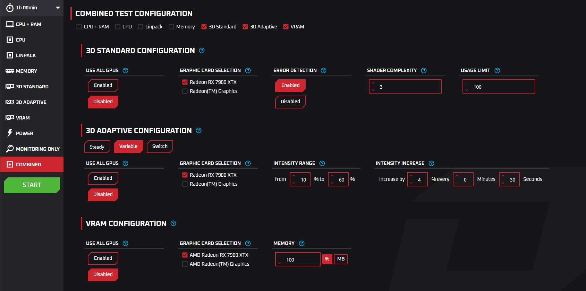

#### 3D Standard test
Ensure `Error Detection` is set to `enabled`, while ensuring the proper GPU is selected here (integrated iGPU vs dGPU, etc.):
- Use All GPUs: `Disabled`
- Graphics Card Selection: Whichever one you are using for game output (usually dGPU)
- Error Detection: `Enabled`
- Shader complexity: `3`
- Usage limit: `100`

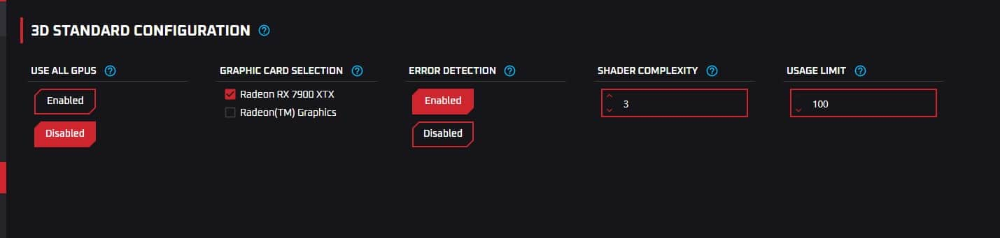

#### VRAM test
> [!WARNING] Warning
> If you have an iGPU or shared GPU memory with normal RAM, ensure that memory utilization is set at 90%. Otherwise, set it to 100%.

If not using an iGPU (and you have a GPU with dedicated VRAM), you can set VRAM to 95%. Ensure the proper GPU is selected here:
- Use All GPUs: `Disabled`
- Graphics Card Selection: Whichever one you are using for game output (usually dGPU)
- Memory: `100%` if not iGPU.

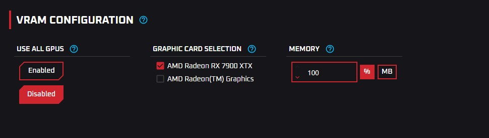

#### 3D Adaptive test
> [!WARNING] Warning
> Useful for testing after testing the the `3D Standard test` as well as the `VRAM` test if issue is still not found. If you have not ran the previous tests, it is highly recommended you run them before running this test.

There are 2 sets of tests you will need to run here: `Variable` and `Switch`. You will need to run them both to see any reasonable results. If running the combined setup, set the settings to `Variable`.

- **3D Adaptive test - Variable**

    Leaving everything as default will work here:
    -  Use All GPUs: `Disabled`
    - Graphics Card Selection: Whichever one you are using for game output (usually dGPU)
    - Intensity Range: `10% to 60%`
    - Intensity Increase: `4% every 0 minutes 30 seconds`

    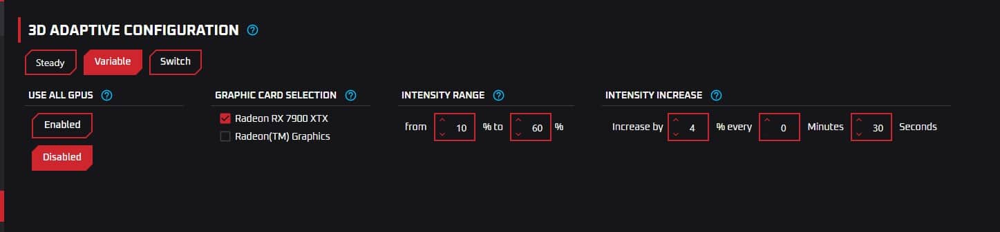

- **3D Adaptive test - Switch**

    Leaving everything as default will work here:
    -  Use All GPUs `Disabled`
    - Graphics Card Selection: Whichever one you are using for game output (usually dGPU)
    - First Intensity: `20%`
    - Second Intensity: `80%`

    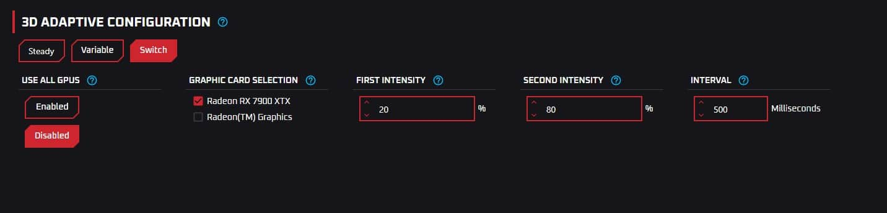

### PSU/Power stability test
> [!NOTE] Information
> 
> A better version of this is following our full [hwinfo stress test guide](/guides/hwinfo). We **highly** recommend using that for proper power testing as it will provide better logs. Otherwise, ensure that you are running hwinfo for logging purposes.

This is a quick way to test your full system to check if your PSU is good enough to handle the system it is running as it will stress test your entire system. Set the following options:
- Use All GPUs: `Enabled`
- Instruction Set: `Auto`

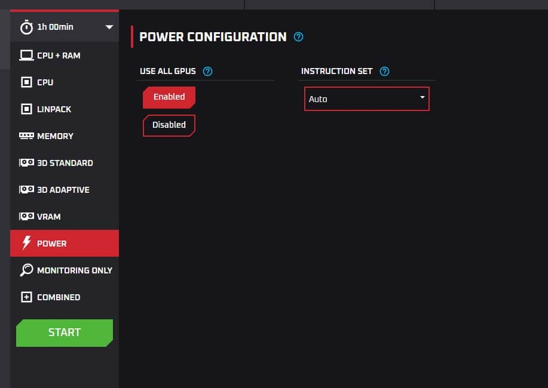
