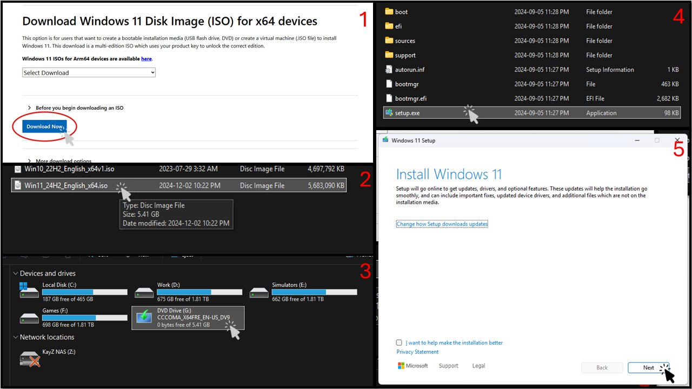
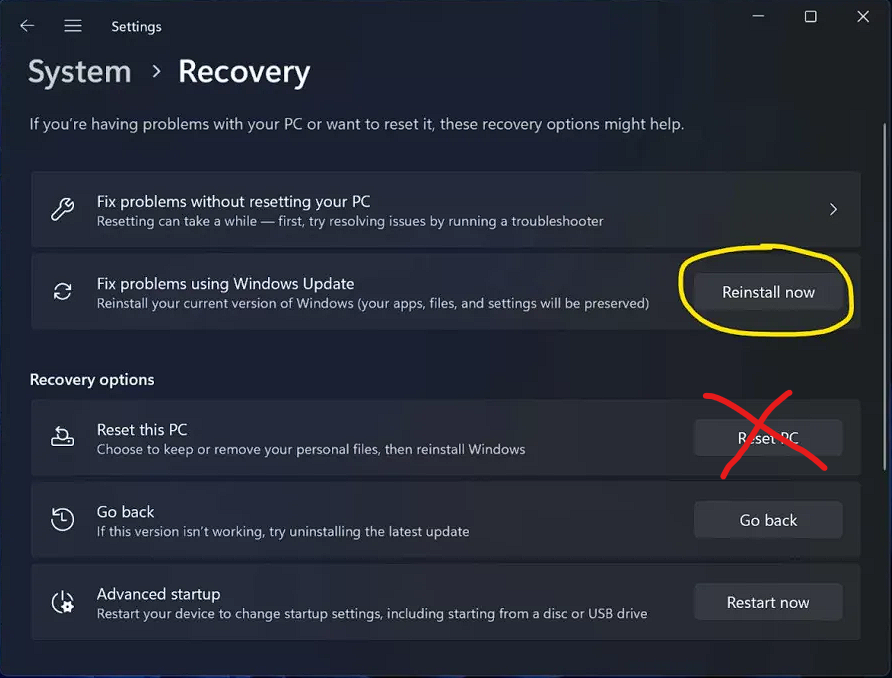

> [!WARNING] Do not use the built-in Reset features of Windows!
>
> These options do not perform a full system reinstall and can result in a broken OS. Resets use the current OS image as a base, which means any issues from the old installation can carry over and potentially cause further damage.

> [!NOTE] Neither Resets nor In-Place upgrades help with removing Malware!
>
> Please refer to our [official malware](/safety-security/malware-guide) guide below to see how to deal with malware.

There are 2 methods to do an In-Place Installation, either method will work.

## Method 1: Downloading the Windows ISO file
1. Download the Windows ISO file from Microsoft's official website: https://www.microsoft.com/en-us/software-download/windows11
    - Scroll all the way to the bottom to get the direct link to download the ISO.
2. Double click the downloaded ISO file to mount it.
    - You may get a User Account Control (UAC) dialogue, you may click Open anyways.
3. Head to the mounted drive by double clicking it.
4. In the mounted drive folder, run "setup.exe".
5. Follow the on-screen instructions to proceed with the in-place upgrade/install.
    - You may also be prompted to input a product key. You can select "I previously installed Windows 11 or Windows 10 on this PC" instead to bypass this.

    

## Method 2: Utilizing Recovery Settings

> [!NOTE] This method will only work in Windows 11 24H2 and higher!
>
> Windows 11 23H2 or lower, or Windows 10 installs will not be able to utilize this method. [Please refer to method 1 instead](#method-1-downloading-the-windows-iso-file).

1. Open up settings, and head to `System` -> `Recovery`.
2. You will be met with multiple options, select "Fix problems using Windows Update."
    - It may have a button labled "Reinstall now".

    

If there is no button labelled as such or you cannot select it (i.e., it is greyed out), please use [Method 1](#method-1-downloading-the-windows-iso-file) instead.