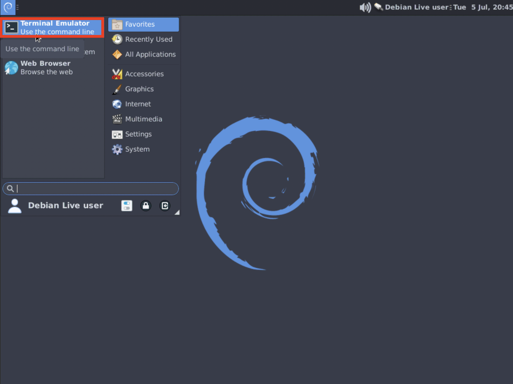

This article relies on the live media [created here](/live-sessions/linux-live-session).

Stressful Application Test is a memory testing tool, notably used by Google.

## Running the test
1. After you boot into the media, click the Debian logo in the top-left corner, then click "Terminal Emulator" to open the terminal:

2. In the terminal, type `stressapptest -W -s <time>`. Replace `<time>` with the time in seconds that you want to run the test for. We suggest an hour, so the command would be `stressapptest -W -s 3600`. Then press Enter to actually run the command.
