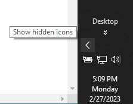
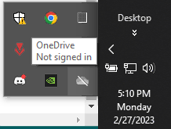
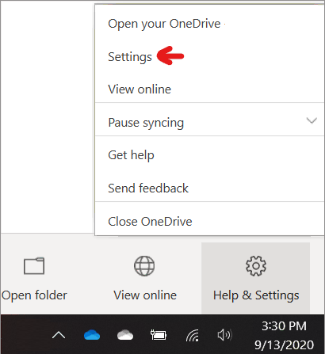

## Unsyncing for a short period of time
If you want to stop syncing OneDrive on your computer because you are on a metered or slow internet connection, you can Pause and Resume your sync. Pausing and Resuming can also help if OneDrive status displays "Processing changes" for a long time.

### To pause syncing
1. Select the white or blue OneDrive cloud icon in the notification/menu area. This icon may be under the "show hidden icons"tab on your taskbar. (See pictures for referencing below)
 

2. Right-click (or CTRL-click in Mac) the OneDrive icon on the taskbar, Click the  icon and select Pause syncing > 2 / 8 / 24hours.

### To resume syncing
1. Select the white or blue OneDrive cloud icon in the notification/menu area. This icon may be under the "show hidden icons"tab on your taskbar.
2. Right-click (or CTRL-click in Mac) the OneDrive icon on the taskbar, Click the  icon and select Resume syncing.

## Unlinking OneDrive 

### Windows:
1. Select the white or blue OneDrive cloud icon in the notification/menu area. This icon may be under the "show hidden icons"tab on your taskbar.
2. Right-click (or CTRL-click in Mac) the OneDrive icon on the taskbar, Click the  icon
3. Click the settings text, which will open a separate window.
4. Go into the "Accounts" tab and click "Unlink this PC"

### MacOS:
1. Click the OneDrive cloud icon up in your Menu bar, click the three dots  to open the menu, and select Preferences.
2. Go to the "Account" tab.
3. Select "Unlink this PC"

## Hiding OneDrive
OneDrive is built in to some versions of Windows and can't be uninstalled. But you can hide it and stop the sync process, so it stays hidden. To do this, turn off all the OneDrive settings and remove the OneDrive folder from File Explorer.
### Windows 10/11:
1. Select the white or blue OneDrive cloud icon in the notification area, at the far right of the taskbar.This icon may be under the "show hidden icons"tab on your taskbar.
2. Select    > Settings.

   
   
3. On the Settings tab, uncheck all the boxes under General.
4. On the Auto Save tab, set the Documents and Pictures lists to This PC only, and uncheck the other boxes.
5.On the Account tab, click Choose folders.
6. In the Sync your OneDrive files to this PC box, check and uncheck the box at Sync all files and folders in my OneDrive. (The first check selects all the boxes, then the uncheck clears them all.) Click OK to close the box and return to settings.(This step removes all OneDrive files from your computer, but leaves them on OneDrive.com.)
7. Click OK to save your changes in the Settings box.
8. Open the Settings again. On the Account tab, click Unlink OneDrive. Close the Welcome to OneDrive box that appears.
9. Open File Explorer, right-click OneDrive, and then click Properties.On the General tab, next to Attributes, check the Hidden box. This hides OneDrive from File Explorer.
10. One more time, select  and select Quit OneDrive. This removes the OneDrive icon from the Notifications area.

## Uninstalling OneDrive
You won't lose files or data by uninstalling OneDrive from your computer. You can always access your files by signing in to [OneDrive online](https://onedrive.com/)
### Windows 10
1. Select the Start button, type Programs in the search box, and then select Add or remove programs in the list of results.
2. Under Apps & features, find and select Microsoft OneDrive, and then select Uninstall. If you're prompted for an administrator password or confirmation, type the password or provide confirmation.

### Windows 8 and Windows 8.1
The OneDrive app on Windows 8 and 8.1 RT cannot be uninstalled.

### MAC OS
1. Just drag the OneDrive app to Trash
