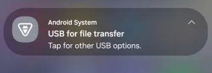
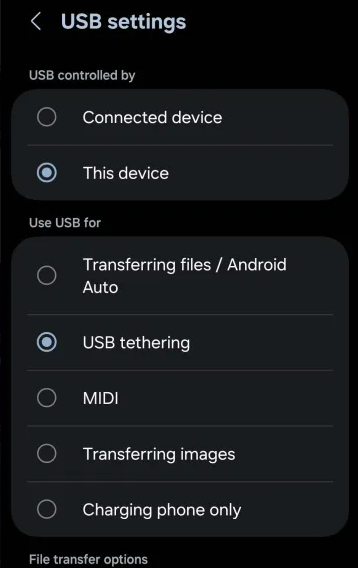
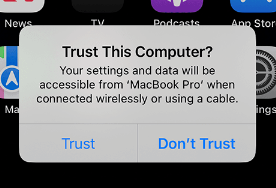

# No network available on the device
If you have installed/reinstalled Windows, and notice you do not have any WiFi/Ethernet drivers available to connect to the internet, or your WiFi/Ethernet device has stopped working leaving you with a device incapable of connecting to the network, you can temporarily provide network access to the device in question via USB Tethering.

This involves utilizing the network capabilities of a smartphone and using it as a WiFi dongle.

## Android with Windows, Linux or ChromeOS
This is the easiest method to enable USB tethering without the need of any other drivers or tool. The process is relatively straightforward and almost plug-and-play. The only changes needed to be done is on the Android phone only.

> [!IMPORTANT] Mac computers can't tether with Android by USB!
> The following method will only work with Windows, Linux and ChromeOS computers. Due to proprietary communication standards between Apple and other devices, the user will require a iPhone to attempt USB tethering with Apple devices.

1. Connect your phone to the other device with a USB cable. A notification will show up at the top of the screen. Swipe down to reveal the notification in more detail:
    
2. Select it, and from the options, select USB Tethering under the section titled "Use USB for".
    

> [!NOTE] Note
> Sometimes the USB tethering options may be hidden in another menu on other android phones. The other most common area this setting will be present in is in Settings > Connections/Hotspot > USB Tethering.
>
> Alternatively, searching up "USB Tethering" within the settings app will also reveal the options accordingly.

## iPhones and iPads with Macs
If you own an iPhone or iPad and need to set up networking for a Mac, the USB tethering process is far more straightforward as both utilize the same proprietary communication standards set forth by Apple.

> [!IMPORTANT] Turn on Personal Hotspot on iPhone/iPad
> Before you try to connect, make sure your iOS or iPadOS device has its Personal Hotspot turned on (to check, go to Settings > Personal Hotspot on your device). Note that this is dependant on the carrier you may be using for the device.

1. Connect your iPhone or iPad to your Mac with the USB cable that came with your device.
2. If you see an alert on your iPhone or iPad that says “Trust This Computer?” tap Trust.
    

## iPhones and iPads with Windows
- Mention that the windows device must have iTunes preinstalled (no you cannot install itunes via an iPhone as file browsing capabilities also rely on itunes)
    - Follow this guide if user has itunes: https://discussions.apple.com/thread/255456736?sortBy=rank

## iPhones and iPads with Linux
- Ubuntu: https://www.reddit.com/r/Ubuntu/comments/1cnuail/tether_iphones_to_linux/
- Fedora: https://www.reddit.com/r/Fedora/comments/ocn6ko/usb_tethering_with_ios_146_on_fedora/
- Arch: https://wiki.archlinux.org/title/IPhone_tethering

TBH is this even necessary? If you use linux chances are you know your stuff...

## iPhones and iPads with ChromeOS
- Lol see if this is even possible