## Introduction
After you have installed Windows 11, you will enter the Out-Of-The-Box experience (a.k.a OOBE). From here, you can simply follow the prompts on screen and setup Windows. 

However, there are certain cases where you'll need to bypass the network requirements or the account requirements (i.e. you have no internet or no Microsoft account). In these cases, you need to make a local account and follow the steps shown below. The process will differ based on whether you have the Home edition or Pro edition.

### Bypassing network requirements 
For both editions, it is recommended to follow these steps at the beginning of the OOBE. (See image) 

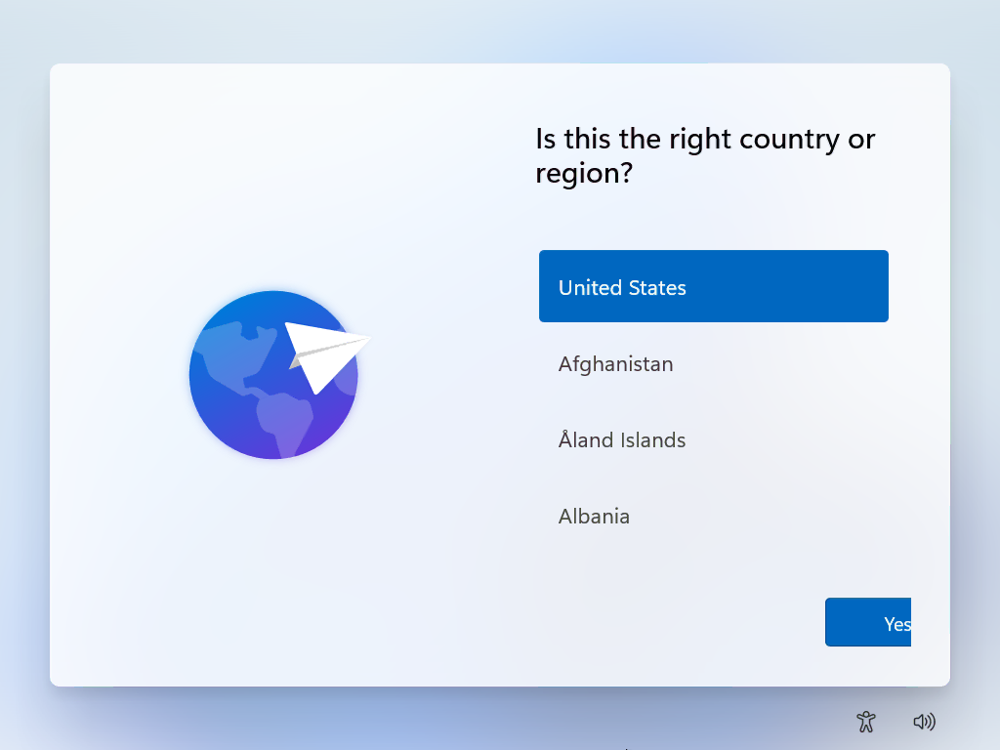

1. Press Shift + F10 to open a Command Prompt (a.k.a CMD) window.
     - You might need to click on the new window in order to focus the window and type in it.
2. Type in `OOBE\BYPASSNRO` and press Enter.

    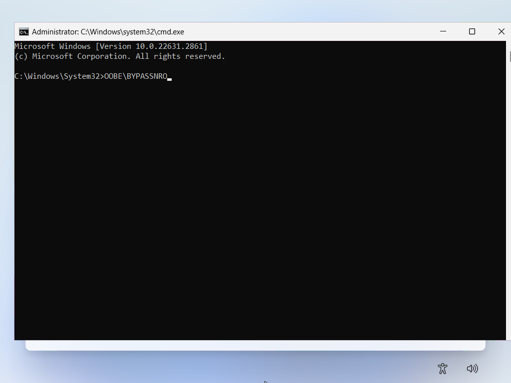

3. The system will now reboot, and restart the OOBE process. 

4. Follow the prompts that pop-up. 

    Hopefully, running this command gives you the option of "I don't have internet" when you reach this screen. (See image)

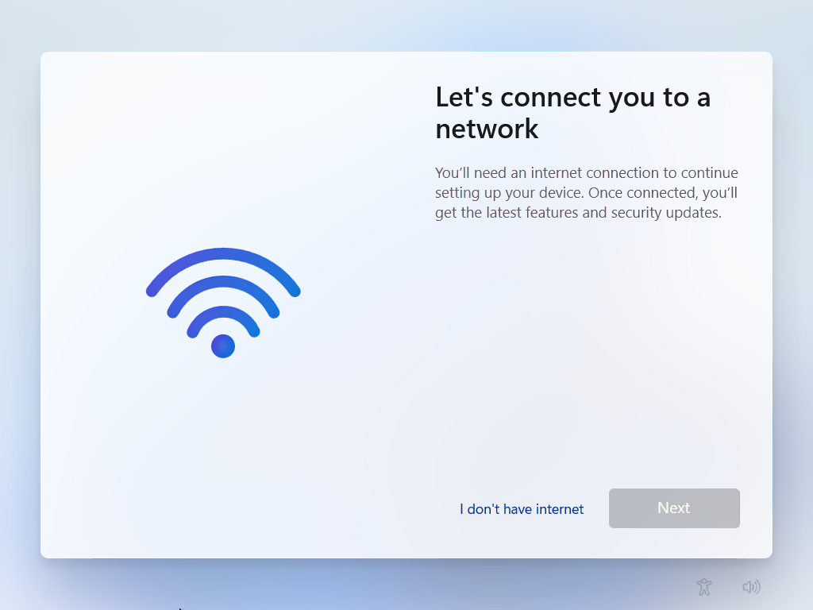

### Bypassing Microsoft account requirements
If you don't have a Microsoft account, or don't want to log into one, follow the steps shown below. 
#### Home edition
If you have reached this screen and have done the steps in the previous section, follow these steps: 

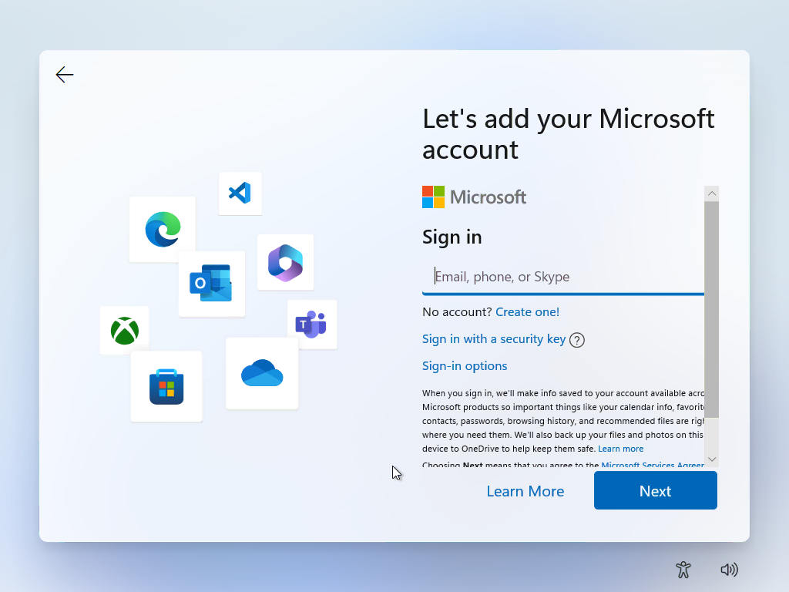

1. Press Shift + F10 to open a CMD window.
     - You might need to click on the new window in order to focus the window and type in it. 

2. Type in `ipconfig /release`and press Enter. 

     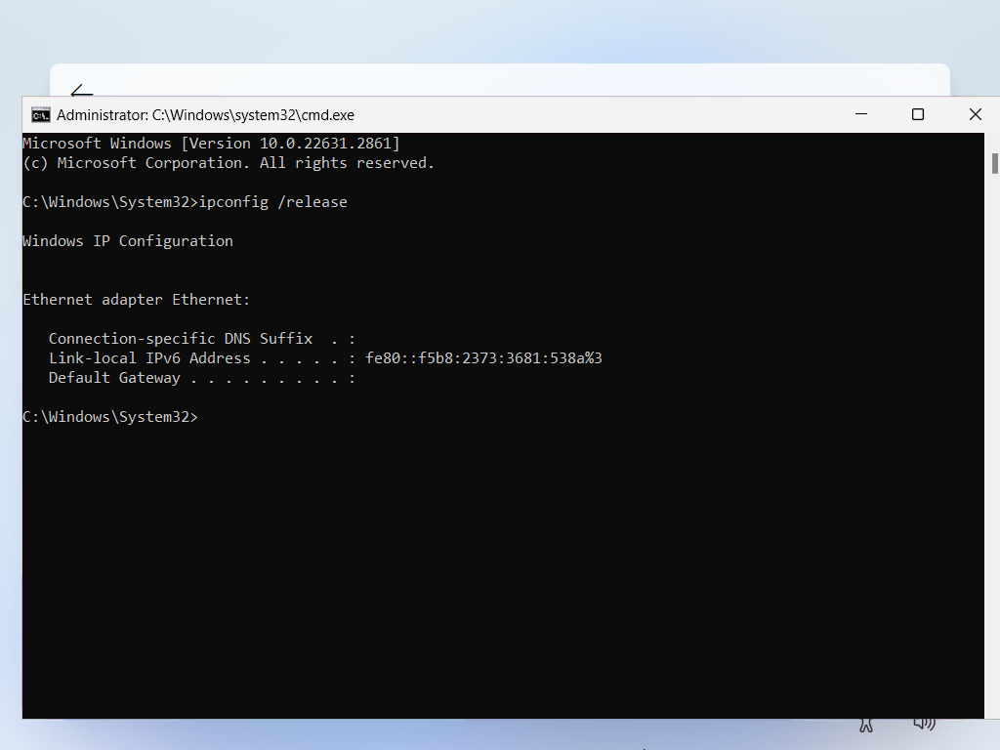

3. Focus back onto the OOBE screen. 

4. Click the back arrow in the top left corner. 

     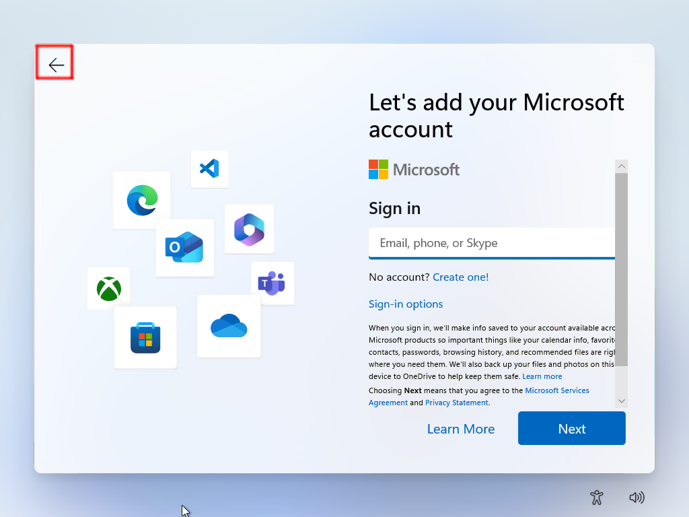

#### Pro edition
Pro Edition has an simple method of bypassing the Microsoft account requirement. 

If you reached this screen seen below, follow these steps: 

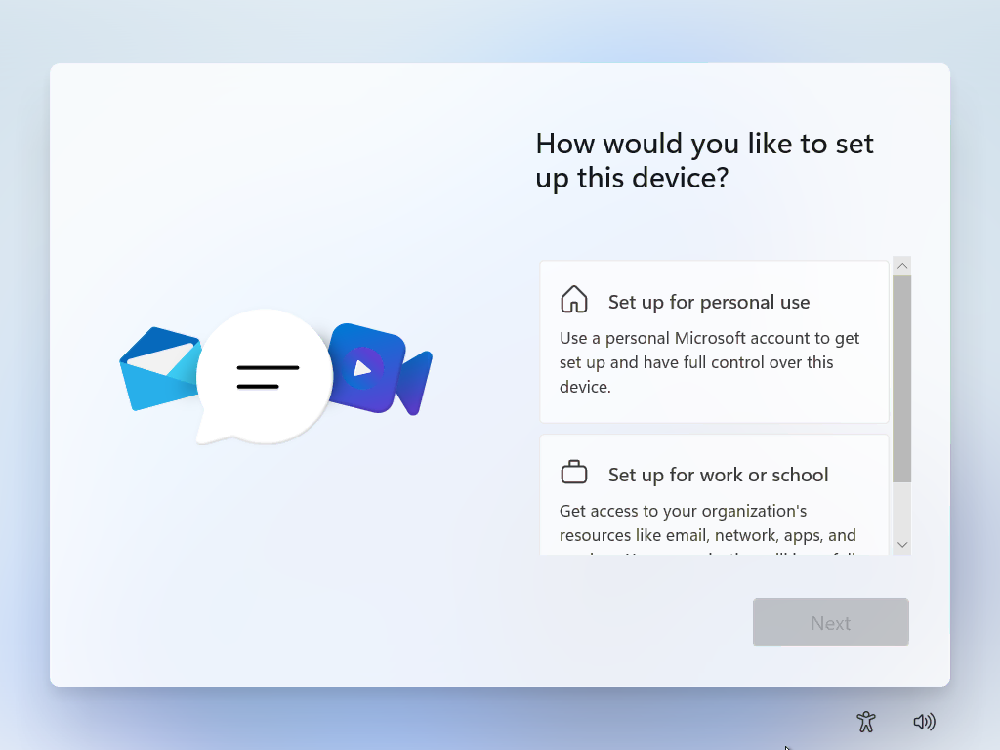

1. Click on "Set up for work or school". 

     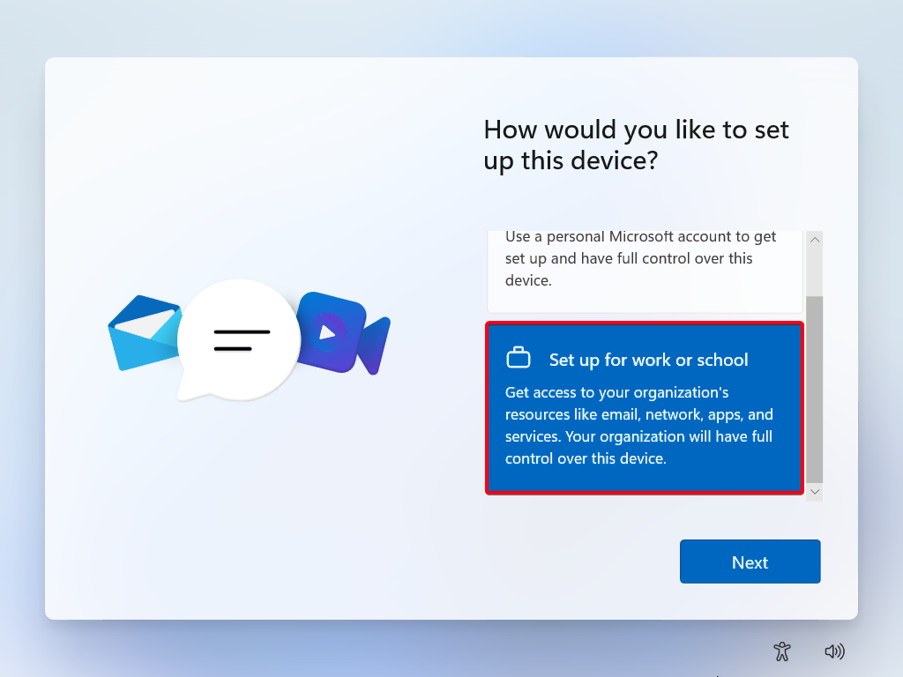

2. Click on "Sign-in options". 

     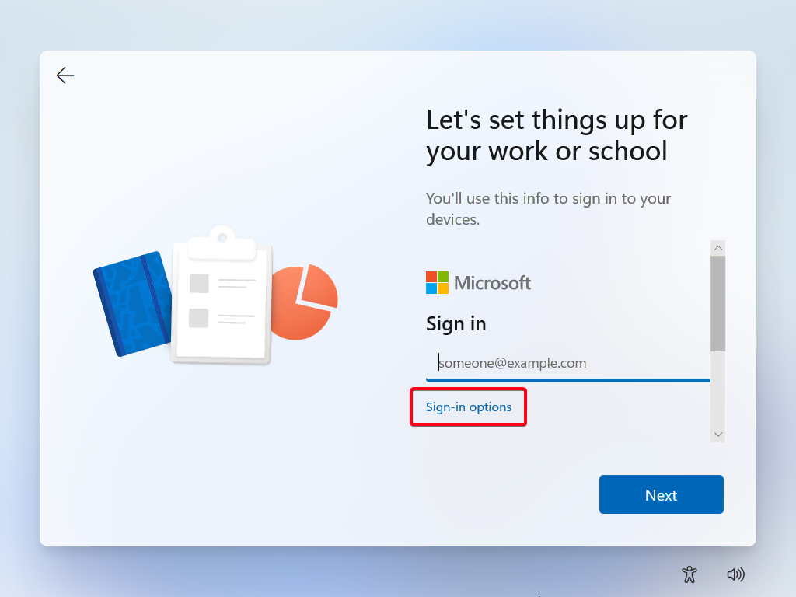

3. Click on "Domain join instead".

     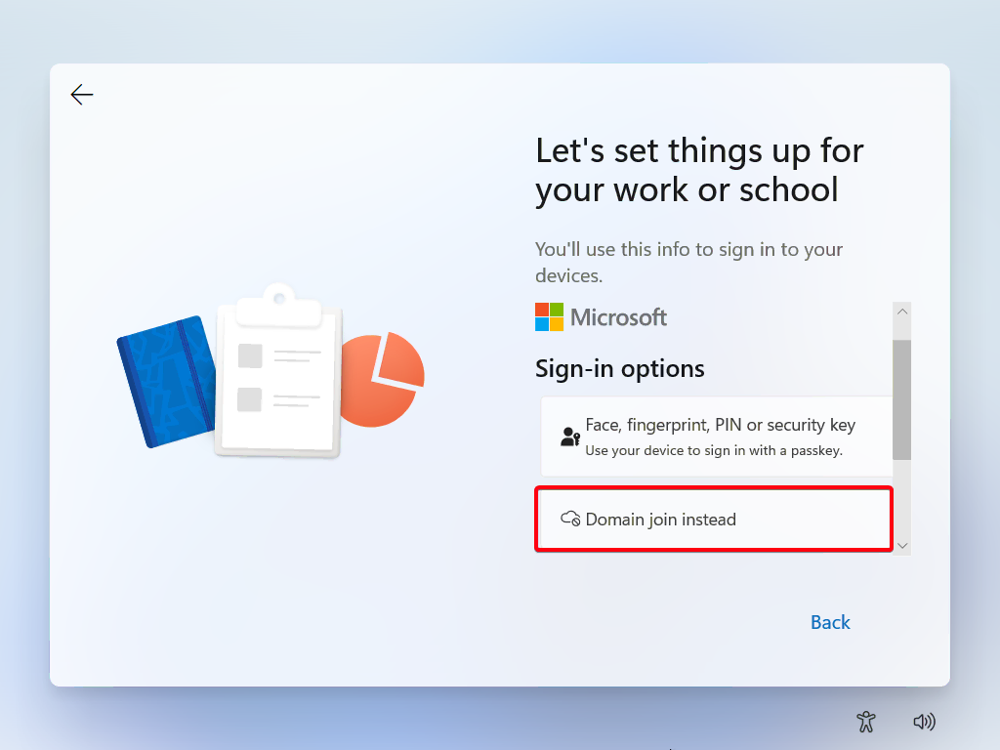

### End result
Following these steps should bring you to the local account creation screen. (See image) 

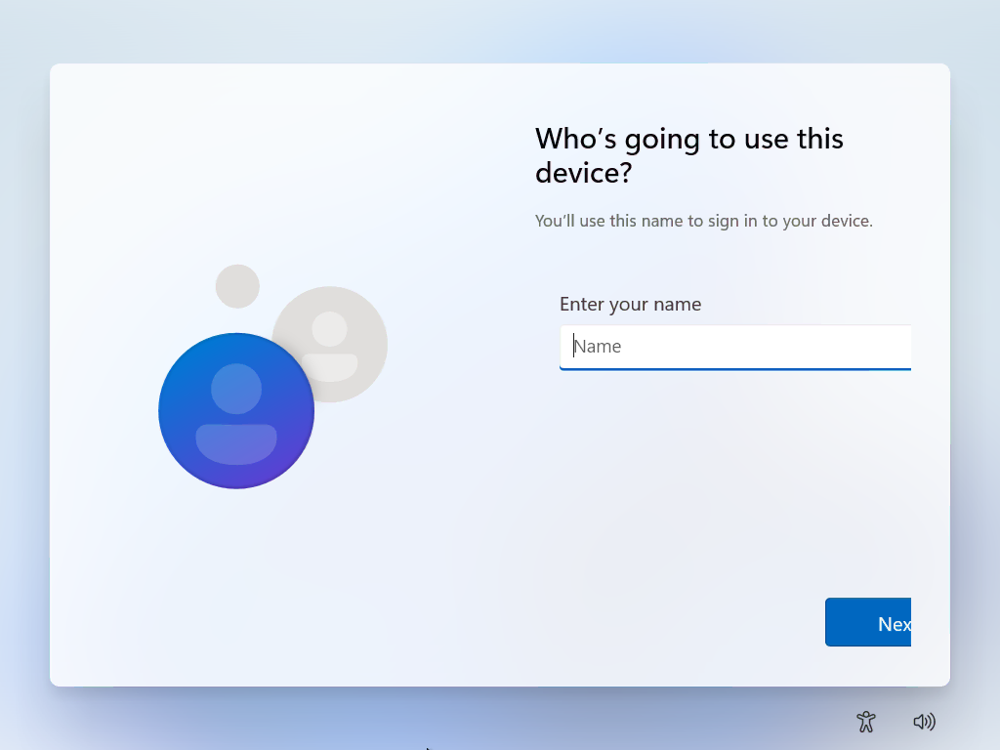

From there, you can continue through the OOBE process and setup Windows with a local account.  

