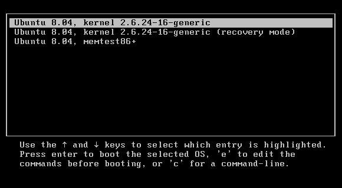

Because of the length and variety of troubleshooting methods, the following article will be segmented by each step of the boot process.

## UEFI/BIOS
When the system is first powered on, the UEFI/BIOS preforms basic integrity checks of your disk, then checks the MBR for a valid bootloader, and if it's a GPT system, it will check the ESP(EFI System Partition) for a valid bootloader. If it is not found, you may get an error stating boot failure, the system may load into the UEFI/BIOS, or it may reboot. 

### Troubleshooting
Try a live environment.

#### If the live environment boots successfully:
It indicates the bootloader is not functioning correctly. You can attempt to fix the bootloader by `chroot`ing in:
##### On non Arch based distributions:
Mount the root filesystem, where `sdXY` is your root partition, or `/`. You can find it by running `lsblk`, and looking at the size, or using `sudo fdisk -l`, and looking at the partition size and type.
```
mount /dev/sdXY /mnt
```
Mount the API filesystems:
```
cd /mnt
```
```
mount -t proc /proc proc/
```
```
mount -t sysfs /sys sys/
```
```
mount --rbind /dev dev/
```
```
mount --rbind /sys/firmware/efi/efivars sys/firmware/efi/efivars/
```
Mount the `efi` partition if the system is UEFI/GPT:<br>
use `sudo fdisk -l` to list disks, look for a partition of ~200-500M, labeled `EFI System`, again, where `/dev/sdXY` is the EFI system partition
```
mount /dev/sdXY /mnt/boot/efi
```

If you require an internet connection:
```
cp /etc/resolv.conf etc/resolv.conf
```

Chroot into `/mnt` using a bash shell:
```
chroot /mnt /bin/bash
```

##### On Arch based distributions:
Chroot into the system using arch's `arch-chroot` script:
```
arch-chroot /dev/sdXY
```
Mount the `efi` partition if the system is UEFI/GPT:
Use `sudo fdisk -l` to list disks, look for a partition of ~200-500M, labeled `EFI System`, again, where `/dev/sdXY` is the EFI system partition
```
mount /dev/sdXY /boot/efi
```

To reinstall grub:
```
grub-mkconfig -o /boot/grub/grub.cfg
```
If the system is EFI, you do not need any arguments for `grub-install`:
```
grub-install
```
If the system is MBR:
```
grub-install --target=i386-pc /dev/sdXY
```
#### If the live environment does *not* boot successfully:
- See if Secure Boot is enabled:

Check your UEFI/BIOS and ensure Secure Boot is disabled for most Linux distros, or enabled if you are using a Linux distro that supports secure boot.

- Try Ventoy, if it boots to the Ventoy menu without issue, try re-downloading/burning your Linux ISO. You can ensure the ISO checksum matches:

From Linux(this utility is included in most distros):
```
sha256sum [file]
```
From Windows(from PowerShell):
```
Get-FileHash
```
If the checksum doesn't match with the one provided by the original source, than something went wrong during the download process, and the ISO needs to be downloaded again.
If the checksum matches and the ISO *still* isn't booting:
- Try a different ISO utility(Rufus, Ventoy, `dd`(UNIX only), BalenaEtcher)
- Try a different "base" of distro(RHEL, Debian/Ubuntu, Arch, and OpenSUSE are all common alternatives)
- Try a different USB drive
- See if the drive works on a different computer
*If the ISO is STILL not booting:*
- Pray to Tux for mercy
- Ensure it's not a PEBKAC
- Update your UEFI/BIOS

## GRUB/Bootloader
*Note: this section assumes you use GRUB*

At this point, your UEFI/BIOS has passed control over to GRUB, by default, it presents a menu similar to the one shown below, although the appearance may vary.


### Recovery shell
With the standard boot option selected in GRUB:
- Hit `e` to temporarily edit the boot config
- Find the line that says `linux`, and go to the end of the line and put `systemd.unit=rescue.target`
- Then hit Ctrl + x or F10 to boot with the modified config.
- If the recovery shell doesn't work, you can try an emergency shell(a more minimalistic recovery interface) by replacing `systemd.unit=rescue.target` with `systemd.unit=emergency.target`

### Init shell
In Linux, the init process is the very first process launched by the system, identified with a PID of 1. This can be changed with a GRUB variable.
- Hit `e` over the correct entry to temporarily edit the boot config
- Append `init=/bin/bash` to the line that starts with `linux`. You can experiment with having it earlier in the line to see if it makes a difference.

### Troubleshooting from a shell
- Update everything
- Reinstall GPU drivers
- Reinstall the display manager and desktop environment
- Try manually starting display manager/desktop environment
- Revert your package manager repo to an older date and downgrade packages(process varies by package manage)

## System Boot
Once GRUB passes booting over to Linux, it will start booting in VGA text mode under tty1. Troubles here can show symptoms including:
- Appears unresponsive during boot 
- Screen goes black as it leaves VGA text mode, then crashes or hangs
- Begins shutting down after a partial boot


### Different TTY
During the boot process, you can try switching to a different TTY to bypass the TTY used at boot. You can use Ctrl + alt + f2-f9 to drop to a different interface.
#### Troubleshooting from a recovery shell
If the shell loads successfully, than the system not booting might be prevented by a bad config loaded at startup, a nonfunctional display manager or desktop environment. 

**If X11:**
Try starting your desktop environment using [xinit](https://wiki.archlinux.org/title/Xinit):
You can also try skipping xinit by specifying the start environment as a `startx` argument:
(example uses KDE plasma)
`startx startplasma-x11`
if that fails, you can check `dmesg` logs if stdout is inconclusive.

Try starting your display manager with `systemctl`:
(`sddm` used in example)
`sudo systemctl start sddm`
If you don't know what the systemd service is named, you can try to find it with `systemctl list-units | grep possiblename` where `possiblename` is the or part of it.
