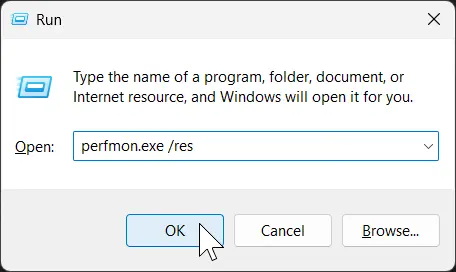
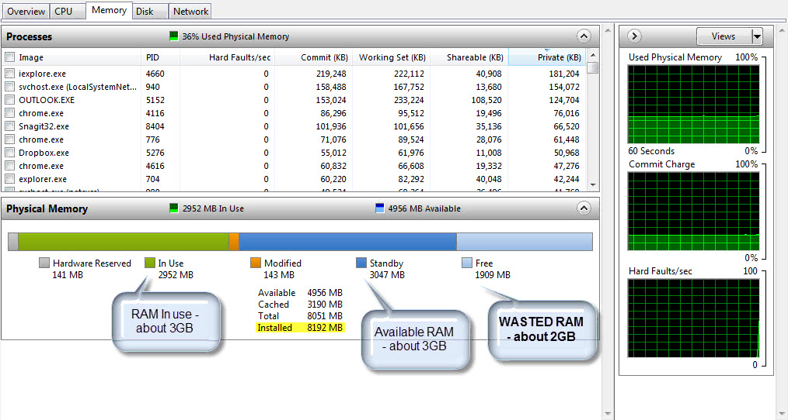

This guide explains how to see if you are actually are running low on RAM before buying more. Adding RAM to a machine only helps if your going to use it. If you have enough it wont do anything and you may want to consider other upgrade options.

Firstly, launch all of the apps that you generally have going. Open a few apps and browser tabs you use regularly. Aim for an average session on the more intensive side, but don’t open every app on your machine. If you have an intensive game you’re trying to run, open that. The example below is a desktop that’s running Firefox, Steam, Discord, Google Drive, Windows Explorer, and a ton of other apps.

**Open Resource Monitor**
1. Press Win + R to launch the run box

2. Type `perfmon.exe /res` into the box, and hit Enter

     

3. Go to the Memory tab

There are 5 different sections of memory usage on the bar graph, but only 3 of them are really important to you.

## Hardware Reserved
This section, in gray, is RAM that the hardware itself uses. 1-2 GB may be used by your integrated graphics. A large amount could mean one of your ram sticks is faulty or incompatible in some way.

## In Use
This section, in green, is the total amount of physical RAM that your machine is currently using for open programs, the “active memory“. In the graphic linked above, the machine has 10 GB of actively used RAM.

## Modified
This section, in orange, is used by low priority tasks and should be relatively small. Ignore this section.

## Standby
This section, in dark blue, is RAM that the system is using for caching files, but that the programs on the system do not actively need for running. This is memory that’s ready to be freed for use at any time for whatever application needs it next, if the next section runs out. In this example, there’s 20 GB of RAM being used for cache.

## Free
This section, in light blue, is empty RAM. The name “Free” is kind of misleading, as this is more like wasted RAM. The memory in this section is the amount that Windows is just ignoring because it has no use for it. It’s not being used at all, not even as a cache – it’s just sitting there doing nothing. In the example above, there’s 1 GB of RAM being used for nothing.

## What to look for
If the Free section is very small (<500 MB) then your computer is making use of almost all of the available memory (some completely free memory is required). It could likely benefit from having additional RAM installed. Note that your OS prioritizes what to put into the Standby cache and therefore growing Standby has diminishing returns.

If both the Free and Standby sections are small, then your computer is running very low on memory. By default, most systems will start using the disk instead of the RAM for storing program memory (basically, the opposite of Standby). This is extremely slow, and can reduce the lifespan of SSDs. If this is the case, you should purchase more RAM or close programs to free up some memory.

---

## Conclusions

If someone were to show this display and ask if they need more RAM then the answer would be no. The person has more installed than the machine is using. In this example the machine is only actively using ~10 GB with another ~20 GB on cache/standby, and ~1 GB doing nothing at all. Having 12 GB in the machine would be acceptable, and having 30 GB would be just enough for this session to run at its optimal speed. It’s got 32 GB installed (see the line highlighted in yellow), so ~1 GB is ‘wasted’ because Windows simply has no use for it when running only these programs. Adding more RAM to this machine, for this workload, would be nothing but a waste of money.

A well-optimized computer will have a large amount of “Standby” and a decent amount of “Free” when running its typical workload.

*This guide is an adaptation of [/u/jeffbx’s guide on SlickDeals](https://slickdeals.net/e/4922990-how-to-know-if-you-need-more-ram)*
