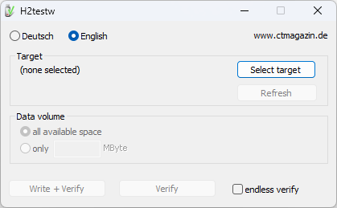
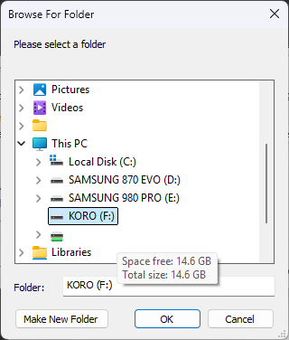
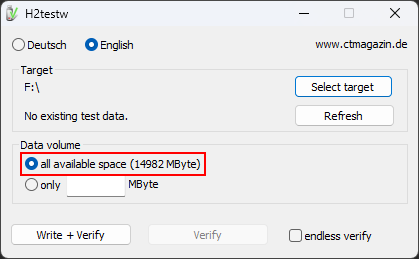
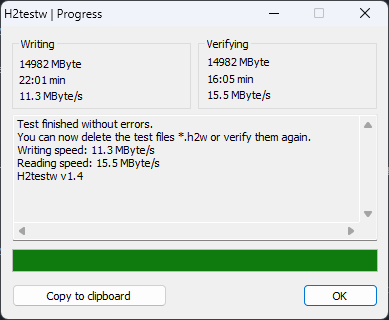

This guide will guide you through using H2TestW to help you determine if a storage drive is counterfeit or faulty.

## What is H2TestW?
H2TestW is a program designed to help test the actual size of your storage devices, as opposed to what is advertised. This tool was created in response to counterfeit drives that did not match their advertised capacity being sold (such as a 32GB SD card with a reported capacity of 2TB).

## Downloading H2TestW
1. Download H2testW from [here](https://www.heise.de/download/product/h2testw-50539/download).

2. Once you have downloaded the .zip file, extract the .zip file and run `h2testw.exe`.

## Using H2TestW

> [!CAUTION] Caution
> You should ensure that you are not running H2testW on a drive with important data. The target drive should be empty.

1. Change the language to `English`, and then click on `Select target`.

    

2. Find the drive that you want to test. All of the connected storage drives can be found under `This PC`, click on the drive that you want to test with its corresponding drive letter.

    

3. Once you have selected the drive you want to test, leave the data volume as the default (`all available space (##### MByte)`).

    

4. Click `Write + Verify` and wait until the program is completed. This may take some time depending on the speed of the drive.

5. Once HW2TestW has finished verifying, a legitimate and healthy storage drive should return `Test finished without errors.`. If not you may have a faulty or counterfeit drive.

    
