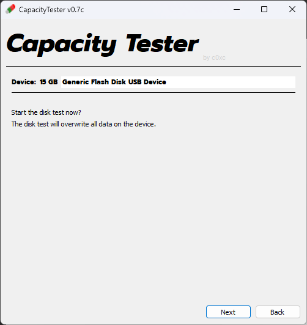
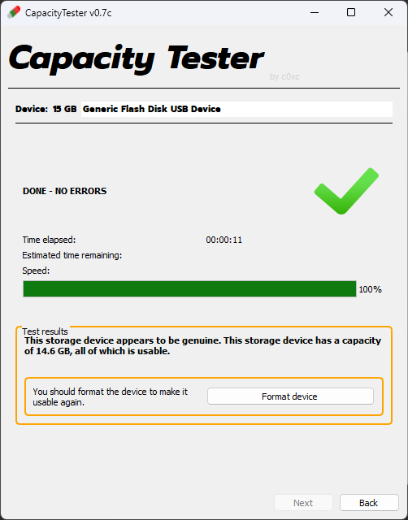

This guide will help you use CapacityTester for Windows 11 to determine if a USB storage drive is counterfeit.

## What is CapacityTester?
CapacityTester by c0xc tests whether a USB storage/flash drive is genuine, such as a 32GB SD card with a reported capacity of 2TB. If one were to go above the actual limit of 32GB, everything beyond that will be lost.

## Downloading and Running CapacityTester
1. You can download the Windows version of CapacityTester from its [GitHub repository](https://github.com/c0xc/CapacityTester).

1. Once you have installed `capacity-tester.exe`, run the executable as an administrator. The program will not work otherwise.

## Using CapacityTester

> [!WARNING] Warning
> 
> Avoid using CapacityTester on storage devices with existing, irreplaceable data, as the Volume Test will overwrite and format the target drive. Otherwise, we recommend using [CrystalDiskInfo](https://rtech.support/factoids/cdi/), to assess the device's [S.M.A.R.T](https://rtech.support/disks/disk-health/) data.

1. Select the storage drive from the list below, and then click `Quick start`.

  

2. The next page will warn you that the targeted drive will be wiped and formatted. Once you have ensured that you selected the correct drive, click `Next`.

  

3. Once the volume test has finished, it will return whether or not the drives reported capacity can be fully utilized. If the test did not pass, you most likely have a counterfeit or faulty drive.

  
