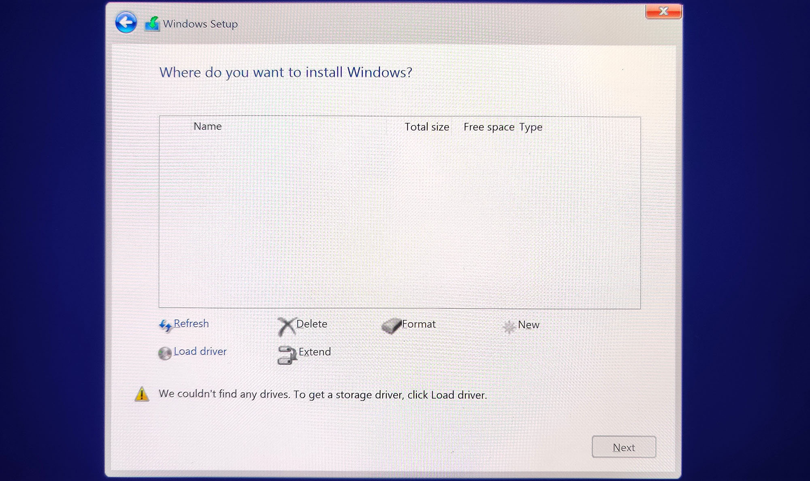

During the instalaltion of Windows 10 and Windows 11 you may encounter an error message:

> "We couldn't find any drives. To get a storage driver, click load driver."

To resolve this issue you have two choices:
- Easist: [Disable Intel RST in BIOS](#disable-intel-rst-in-bios)
- If you want to use RAID: [Load an Intel RST Driver](#load-and-intel-rst-driver)

## Disable Intel RST in BIOS
The easist way to resolve this issue is to disable Intel RST in your BIOS. 

The menus vary by manufacture but the basic entries you want to find may be called "Storage" or "Disk" mode. 

This field should currently be set to "RAID" and you want to change it to "AHCI".

You can reboot and load back into the Windows install USB and complete the installation without issue.

### Asus
Below are helpful images for some ASUS BIOS'

## Load and Intel RST Driver
If you would like to use RAID and leave Intel RST on then you will need to download the Intel RST driver from your motherboard or laptop manufacturers support page then put that on your Windows install USB.

See below for some guides from various manufactures on this process.

### MSI
- https://www.msi.com/support/technical_details/NB_Installation_Unrecognizable

### Asus
- https://www.asus.com/support/faq/1044458/

