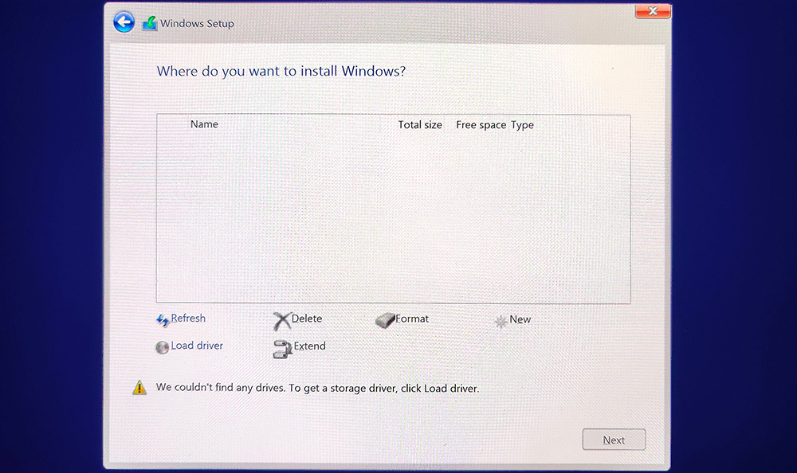
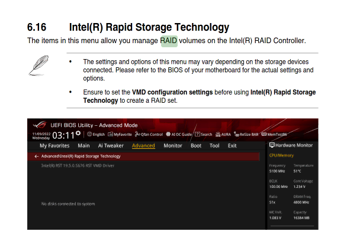
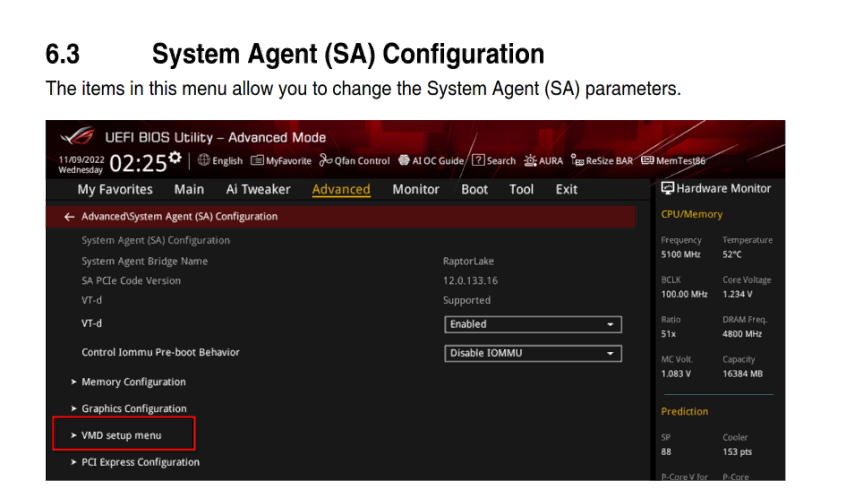
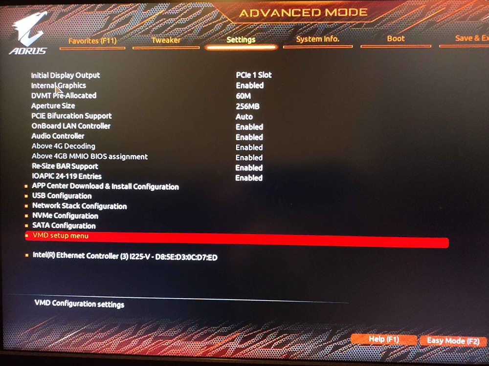
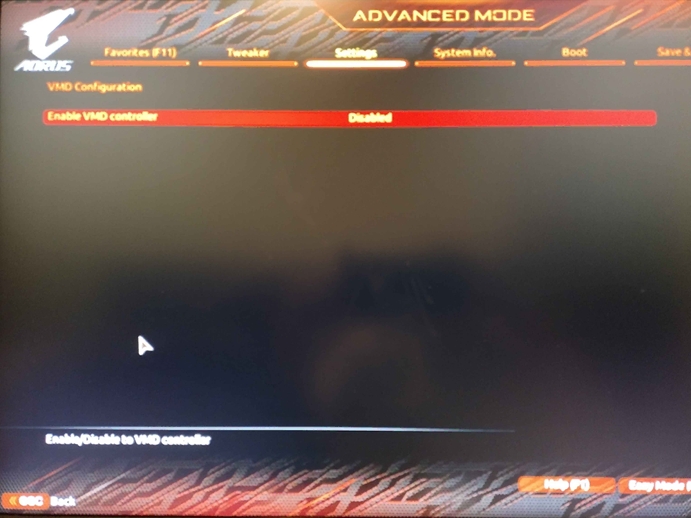

During the installation of Windows 10 and Windows 11 you may encounter an error message:

> "We couldn't find any drives. To get a storage driver, click load driver."

If you are certain disk is plugged in, to resolve this issue you have two choices:
- Easiest: [Disable Intel RST in BIOS](#disable-intel-rst-in-bios)
- If you want to use RAID: [Load an Intel RST Driver](#load-an-intel-rst-driver)

## Disable Intel RST in BIOS
The easiest way to resolve this issue is to disable Intel RST in your BIOS. On many laptops and select motherboard, Intel RST is enabled by default.

The menus vary between manufacturers and models, but the basic entries you want to find may be called "Storage" or "Disk" mode. 

This field should currently be set to "RAID" and you want to change it to "AHCI".

On some systems you may find a "VMD setup/controller" option, disabling this will have the same effect on RST.

You can reboot and load back into the Windows install USB and complete the installation without issue.

### Asus
Below are helpful images for some ASUS BIOS

## Gigabyte Aorus
Below are helpful images for some Gigabyte Aorus BIOS

## Load an Intel RST Driver
If you would like to use RAID and leave Intel RST on then you will need to download the Intel RST driver [from your motherboard or laptop manufacturers support page](/learning/computing-101/#support-sites), then put that on your Windows install USB.

See below for some guides from various manufactures on this process.

### MSI
- https://www.msi.com/support/technical_details/NB_Installation_Unrecognizable

### Asus
- https://www.asus.com/support/faq/1044458/
