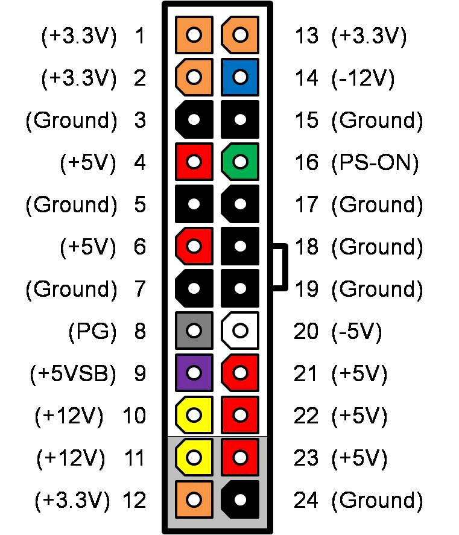

This guide will cover the basics of a desktop PSU, ways to test it's power output. Always be careful when performing any task that requires a multi-meter or another tool.

## The Dangers
Before we get into the guide, we need to address the dangers involved with computer power supplies first.

> [!CAUTION] Never do any of these things
> 
> - **NEVER OPEN UP A PSU BY YOURSELF. IT CAN HOLD LETHAL AMOUNTS OF CHARGE EVEN AFTER BEING UPLUGGED FOR EXTENDED PERIODS OF TIME.**
> - Mix PSU cables (e.g. CPU and PCIe)
> - Reuse modular cables from another PSU (Always only use the ones that are made directly for your PSU)

## Why you should care about your power supply unit (PSU)

The power supply unit (PSU) is the engine on which your entire computer system is based. It is responsible for taking the high voltage mains power from your wall outlet and transforming it into the low voltage DC that your computer requires. Without electricity, your computer would be useless, but the importance of quality power supplies are often overlooked by the end user.

The reason for this is simple = When a power supply is doing its job then the user should never have to know it is there.

Unlike RAM, storage space, CPU cycles, etc, a power supply should operate transparently from the time it is installed until the time the computer becomes obsolete. Unfortunately because of this transparent nature many users do not put much thought into their PSU, and thus problems ranging from intermittent errors to catastrophic cascading hardware failures resulting from inadequate or mediocre PSUs occur, and are often misdiagnosed.

Remember - if your PSU is causing your problems, then swapping out other components during troubleshooting will not only be a waste of time, but you may end up with an even larger stack of dead parts as they get damaged by the faulty power unit.

##  Common Misunderstandings Regarding Computer Power Supplies

 Advertised wattage ratings are a good indicator of PSU capability and/or quality
    If a power supply is faulty or underpowered then the system will simply not power on and/or the problem will be obvious
    Power supplies with identical advertised specifications are equally good. 
    All PSUs have a standard specification, for example ATX, 80+ and EPS. They all specify how a PSU  should be designed, what voltage it is supposed to deliver etc. If a PSU doesn't qualify for one of the aforementioned standards, running it may be dangerous as you may get voltage spikes that can fry your components, incompatibility as well as a possible fire hazard. Cheap PSUs are likelier for such events to occur, as the quality of internal components can vary even while meeting the standards.

### Regarding misunderstanding #1:

In order to understand why wattage is a poor indicator of actual PSU capability one must first learn a very important electrical rule called "Joule's Law". Don't worry, it is easy.

`Power (watts) = Voltage * Amperage`

This means that wattage, which is the overall power, is directly proportional to voltage and current (amps).

Since there are many interdependent components inside of computers which rely on different voltages to run, and require different amounts of power, then the power supply must be able to not only convert power from the wall outlet but also split this power into different voltage **rails** of different power capability.

Let us create a make-believe and simplistic (ideal) power supply. This supply has a 12V rail capable of 10A, a 5V rail capable of 5A, and a 3.3V rail capable of 1A. We will ignore negative rails for simplicity. This gives us a total power capability of:

`P(watts) = (12V * 10A) + (5V * 5A) + (3.3V * 1A) P = 148.3watts`

However, this does not mean that all 148.3W are available to all components. For instance, only 120W total is available on the 12V rail, and even if the other rails are barely utilized all of the 12V devices are limited to 120Watts total regardless of the total power capability of the unit.

Another key factor making wattage ratings misleading is that power output can be highly variable outside of ideal conditions. Due to poor component choices, poor quality, and poor design, many power supplies become increasingly unable to output their 'rated' power once temperatures and/or loads start to rise. Since increasing temperature results in lower ability to supply stable power to components, as well as increasing power requirements of the components themselves, it is easy to see how a 'high wattage' but poor quality PSU would result in instability and possibly hardware failures when a user attempts to run the supply at its rated power.

### Regarding misunderstanding #2:

Power supply problems often lead to misdiagnosis during troubleshooting because they manifest themselves as errors in other components.

### Regarding misunderstanding #3:

Build quality, internal component quality, and design are the most important aspects of a good power supply. It is much more important to get a reliable power supply than to get a bigger power supply.

Most power supply brands are simply repackaged units that have been sourced from a large manufacturer and cosmetically altered. Thus, a different model PSU from the same brand may be made by a completely different manufacturer and be of entirely different quality than others by the same brand. A google search for your make and model PSU and the letters 'OEM' will often reveal which manufacturer made the unit if it is a re-branded unit.

## I have a suspicious PSU in my system. Should I replace it?

That depends. Answer the following questions:

   * If the computer becomes unreliable will it have a significant negative impact on your life?
   * Is the hardware in the computer non-expendable?
   * Do you feel that a relatively small investment now is worth it to help ensure trouble free operation of your system on a hardware level?

If you answered YES to any of the questions above, you should seriously consider pro-actively replacing your power supply.

##  What are good desktop PSU models?
The PSU Cultists group has made a tier list that tries to point out the quality and safety of PSU models. If you have a high end PC, aim for Tier A, if you have a mid-range, aim for Tier B. If you have Tier F, it is dangerous to continue running the computer, as these units have been reported exploding.
The link to it can be found [here](https://cultists.network/140/psu-tier-list/)
    
    
    
---

Read this guide over, top to bottom, at least once before attempting. Working with electricity can be very dangerous, you could harm the components, your multimeter, your house’s wiring, or even yourself!

This guide will use this template:
`<Name of pin> (<Number of pin>) socket`, for example `+12V (10/11) socket`

**Note:** The power supply does not need to be physically removed from the case.

## Procedure

  1.  Switch the Power Supply Unit (PSU) to the OFF position or unplug the power cord if it does not have a switch.

  2.  Remove the side panel of the computer case and unplug the ATX power connector from the motherboard.

  3.  Unplug all other power connectors including CPU and any graphics cards (if present).

  4.  Using a piece of wire, a paper clip or bobby pin form it into a U-shape to construct a jumper.

  5.  Insert one end of the of the jumper into the 16th pin of the 24 or 20 pin ATX power connector.

  6.   Insert the other end of the jumper into the 17th pin to ground it out and trigger it to start once powered later. **Important:** On the multimeter, ensure the red probe is attached to the `mAV Ω` connection and that the black probe is connected to `COM (-)`. On an auto-ranging multimeter, select the `VDC` position. Otherwise, turn the dial to `20 VDC` setting. > If you are ever unsure of the output voltage you should always use the highest choice first, ex: `200V DC`. Once confirmed low disconnect and select the `20V DC` setting.
  
  (Picture for reference)

## Taking Measurements

**Note:** It is important that your power outlet is properly grounded. Always use caution when working with live power!

   -  Switch the PSU to the ON position. Its fan should start spinning as it is energized, because you made a connection between the green wire and (any) black wire on the ATX connector. Some fans are thermally activated, meaning they only come on when they are hot (to save power), so just because the fan isn't spinning does not mean it isn't on. If the fan is not spinning, you should consider adding some load to the PSU by connecting a molex powered fan.

   - Insert the black probe of the multimeter into any one of these pins: `COM/Ground (3/5/7/15/18/19/24)`

Hold the ATX connector in your non-dominant hand. Using your dominant hand and the red probe, you can check each socket as follows:

### PWR_OK

Power OK (PWR_OK) is a voltage high signal generated by the power supply to tell the computer that the DC voltages are within the ranges required for proper operation.

   * Insert the red probe of the multimeter into the `PS_ON (16)` socket of the ATX connector.

   * Observe the reading on the meter’s display then compare it to the acceptable voltage range listed below:

|Output|Tolerance|Minimum|Nominal|Maximum|Unit|
|---|---|---|---|---|---|
+5 V|±5%|4.75|+5.0|5.25|V DC|

**Note:** In cheap PSUs, the 5V side could be connected to this inside the PSU, negating this to save parts and allow the motherboard to turn on. Hopefully not.

### 12V

   * Insert the red probe into any `+12V (10/11)` socket of the ATX connector. 

   * Observe the reading on the display then compare it to the value ranges listed below:

|Output|Tolerance|Minimum|Nominal|Maximum|Unit|
|---|---|---|---|---|---|
|+12 V|±5%|11.40|+12.00|12.60|V DC

**Note:** If your video card requires power connectors, the +12V pins should be checked for each set looking for the tolerance listed above. Although they supply voltage from the same source, each power connector may have its own over-current protection.

### 5V

   * Insert the red probe into any `+5V (4/6/21/22/23)` socket of the ATX connector.

   * Observe the reading on the display then compare it to the acceptable value ranges listed below:

|Output|Tolerance|Minimum|Nominal|Maximum|Unit|
|---|---|---|---|---|---|
|+5 V|±5%|4.75|+5.00|5.25|V DC

### 3.3V

   * Insert the red probe into any `+3.3V (1/2/12/13)` wire socket of the ATX connector.

   * Observe the reading on the display then compare it to the acceptable value ranges listed below:

|Output|Tolerance|Minimum|Nominal|Maximum|Unit|
|---|---|---|---|---|---|
|+3.3 V|±5%|3.14|+3.30|3.47|V DC

### -12V

   * Insert the red probe into the `-12V (14)` socket of the ATX connector. If you have an analog meter (not digital to indicate polarity +/-), you will have to reverse the leads: red probe to ground, black probe to -12V.

   * Observe the reading on the display then compare it to the acceptable value ranges listed below:

|Output|Tolerance|Minimum|Nominal|Maximum|Unit|
|---|---|---|---|---|---|
|-12 V|±10|-10.80|-12.00|-13.20|V DC

### 5VSB (5V Standby)

  *  Insert the red probe into the `+5VSB (9)` socket of the ATX connector to check for standby power.

|Output|Tolerance|Minimum|Nominal|Maximum|Unit|
|---|---|---|---|---|---|
|+5 V|±5%|4.75|+5.00|5.25|V DC

   * Remove the jumper wire from the ATX connector to turn the PSU off.

   * Once again, check the standby power.

## Results

Compare your measured values to these to ensure your PSU is within tolerance:

|Output|Tolerance|Minimum|Nominal|Maximum|Unit|
|---|---|---|---|---|---|
|+12 V|±5%|11.40|+12.00|12.60|V DC
|+5 V|±5%|4.75|+5.00|5.25|V DC
|+3.3 V|±5%|3.14|+3.30|3.47|V DC
|-12 V|±10%|-10.80|-12.00|-13.20|V DC
|+12 V|±5%|4.75|+5.00|5.25|V DC

With the black lead still inserted in a ground pin, hold the ATX connector in your non-dominant hand. Using your dominant hand, you can probe each socket as follows:

**Expect to see 0V on any COM(ground)**

Pinout Reference for ATX 24-pin

|Pin|Name|Wire Color|Description|
|---|---|---|---|
1|+3.3V|Orange|+3.3 VDC
2|+3.3V|Orange|+3.3 VDC
3|COM|Black|Ground
4|+5V|Red|+5 VDC
5|COM|Black|Ground
6|+5V|Red|+5 VDC
7|COM|Black|Ground
8|PWR_ON|Gray|Power Good
9|+5VSB|Purple|+5 VDC Standby
10|+12V1|Yellow|+12 VDC
11|+12V1|Yellow|+12 VDC
12|+3.3V|Orange|+3.3 VDC
13|+3.3V|Orange|+3.3 VDC
14|-12V|Blue|-12 VDC
15|COM|Black|Ground
16|PS_ON|Green|Power Supply On
17|COM|Black|Ground
18|COM|Black|Ground
19|COM|Black|Ground
20|NC|White| -5 VDC**
21|+5V|Red|+5 VDC
22|+5V|Red|+5 VDC
23|+5V|Red|+5 VDC
24|COM|Black|Ground

**Optional - Removed in ATX12V v2.01, now an empty pin

Picture for the sake of simplification.

