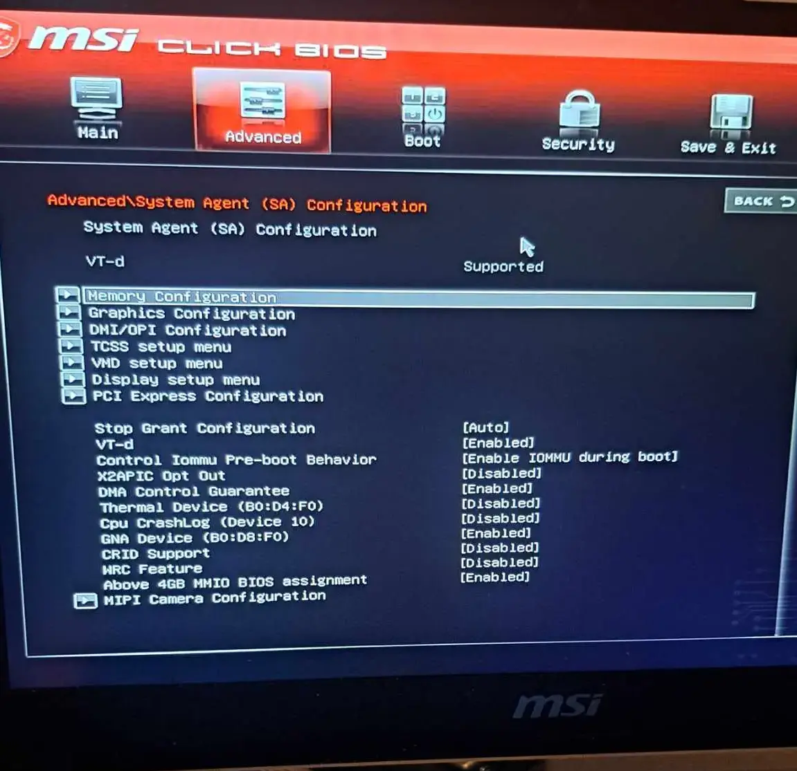
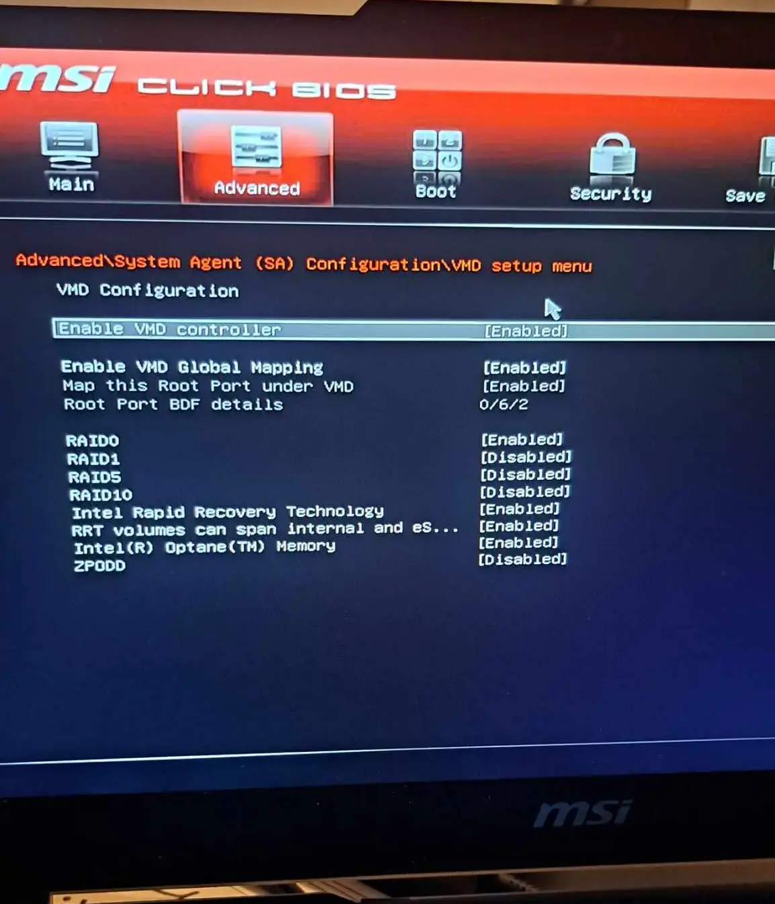

During the installation of Windows 10 and Windows 11 you may encounter an error message:

> "We couldn't find any drives. To get a storage driver, click Load driver."

If you are certain disk is plugged in, to resolve this issue you have two choices:
- Easiest: [Disable Intel RST / AMD RaidXpert2 in BIOS](#disable-raid-in-bios)
- If you want to use RAID: [Load a RAID Driver](#load-an-raid-driver)

## Disable RAID in BIOS
> [!NOTE] Information
>
> Some laptops have RST or RaidXpert2 option permanently turned on and it's impossible to change. For this, installing drivers are the only known way to fix this.
> Please head to [Load a RAID Driver](#load-an-raid-driver) for more information.

The easiest way to resolve this issue is to disable Intel RST or AMD RaidXpert2 in your BIOS. On many laptops and select motherboard, these are enabled by default.

The menus vary between manufacturers and models, but the basic entries you want to find may be called "Storage" or "Disk" mode. 

This field should currently be set to "RAID" and you want to change it to "AHCI".

Disabling the "StoreMi" or "VMD setup/controller" option on some systems, which might also be called "Optane Memory," will have the same effect on RST and RaidXpert2.

You can reboot and load back into the Windows install USB and complete the installation without issue.

### Acer 
Option to change RAID option may be hidden. On select models it's possible to reveal them, by pressing Ctrl+S in Advanced tab.

Possible menus to disable RAID include:
- Advanced\System Agent (SA) Configuration\VMD setup menu\Enable VMD controller => Disabled

Below are helpful images for some Acer BIOS

### Asus
Possible menus to disable RAID include:
- (EZ Mode) Intel Rapid Storage Technology => OFF
- Advanced\VMD setup menu\Enable VMD controller => Disabled
- Advanced\System Agent (SA)\VMD setup menu\Enable VMD controller => Disabled
- Advanced\Integrated Peripherals\RAID Configuration (Intel VMD)\Enable RAID/Optane Function => Disabled
- Advanced\PCH Storage Configuration\SATA Mode selection => AHCI Mode

> [!TIP] Tip
> The same applies for AMD systems, except instead of searching for Intel RST, you are looking for StoreMi and RaidXpert2 instead.

Below are helpful images for some ASUS BIOS

### Dell
Possible menus to disable RAID include:
- System Configuration\SATA Operation => AHCI
- Storage\SATA/NVMe Operation => AHCI

### Gigabyte Aorus
Possible menus to disable RAID include:
- Chipset\SATA Mode => AHCI
- Settings\IO Ports\SATA Mode => AHCI
- Settings\IO Ports\NVMe RAID mode => Disabled
- Settings\VMD setup menu\Enable VMD Controller => Disabled
- Peripherals\SATA Mode Selection => AHCI
- Peripherals\SATA Configuration\SATA Mode Selection => AHCI

Below are helpful images for some Gigabyte Aorus BIOS

### HP 
Possible menus to disable RAID include:
- Advanced\System Options\Configure Storage Controller for RAID => Unchecked
- Configuration\SATA Emulation => AHCI

Below are helpful images for some HP BIOS

### Lenovo
Possible menus to disable RAID include:
- Devices/ATA Drive setup/Configure SATA as => AHCI

### MSI
> [!NOTE] Information
> Some MSI motherboards have a function called M.2/Optane Genie, which will automatically configure RAID even if RAID is manually disabled. Ensure that M.2/Optane Genie function is disabled as well.

Option to change RAID option may be hidden. On select MSI notebook models it's possible to reveal them, by pressing `Shift+Ctrl+Alt+F2` in BIOS configuration screen.

Possible menus to disable M.2/Optane Genie include:
- (EZ Mode) M.2\Optane Genie => OFF
- Advanced\Integrated Peripherals\M.2/Optane Genie => Disabled

Possible menus to disable RAID include:
- Advanced\Integrated Peripherals\SATA Mode => AHCI Mode
- Advanced\Integrated Peripherals\RAID Configuration (Intel VMD)\Enable RAID/Optane Function => Disabled
- Advanced\Enable VMD Controller => Disabled (If grayed out, edit setting below)
- Advanced\System Agent (SA) configuration\VMD setup menu\Enable VMD Controller => Disabled

Below are helpful images for some MSI BIOS

### Razer
Possible menus to disable RAID include:
- Chipset/SATA and RST Configuration/SATA Mode Selection => AHCI
- Chipset/Intel VMD Technology => Disabled

## Load a RAID Driver
If you would like to use RAID and leave Intel RST / AMD RaidXpert2 on then you will need to download the following driver [from your motherboard or laptop manufacturers support page](/learning/computing-101/#support-sites), then put that on your Windows install USB.

See below for some guides from various manufactures on this process.

### MSI
- https://www.msi.com/support/technical_details/NB_Installation_Unrecognizable

### Asus
- https://www.asus.com/support/faq/1044458/

If downloaded file is an executable called `SetupRST.exe`, you need to extract it first. Open a command prompt in a location with the executable, and run following command to extract drivers:

    .\SetupRST.exe -extractdrivers .\RST

The command will extract drivers a folder called `RST` in same location as executable. Copy the folder into the USB and then proceed with Windows setup.