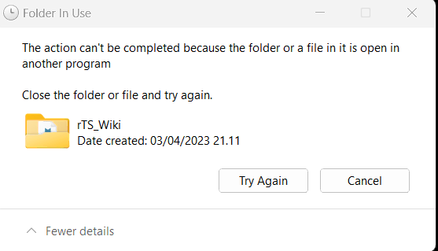
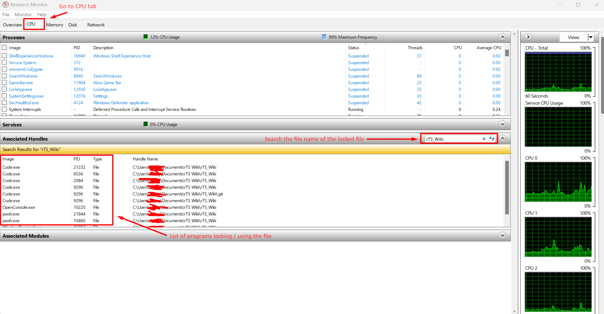

If you see a popup like this telling you that you cant modify a file because it is locked or used by another process

You can find out which process is locking or using the file with Resource Monitor. To do so follow these steps:

1. Press Win + R to launch the run box

2. Type `perfmon.exe /res` into the box, and hit Enter

3. Go to the CPU tab

4. In the search bar at *Associated Handles* input the file name.

5. You will now see a list of processes locking the file.

See picture below for reference:

