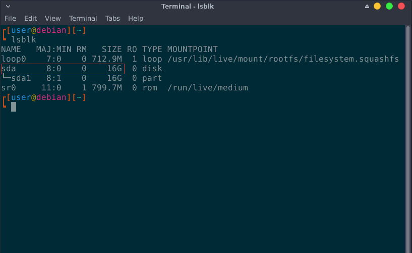
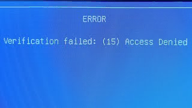

Ventoy is an useful tool that can create USB drives which can have more than one ISO at once, rather than traditional ISO writers, which can only use one ISO at a time. You need Windows or Linux to create a Ventoy drive initially, but you can add/remove ISO files to it on any system that supports exFAT.

> This guide uses a template for ventoy releases, you will have to replace `1.0.xx` with the current ventoy release name.

## Installation

### Windows

1. Go to [Ventoy's GitHub page](https://github.com/ventoy/Ventoy/releases)
2. Click on `ventoy-1.0.xx-windows.zip`
3. Extract the downloaded zip and open `Ventoy2Disk.exe`
4. If your machine supports GPT/UEFI, click on options and select GPT as partition style, if your machine requires Secure Boot, select "Secure boot support"
5. Choose your USB drive from the dropdown menu and hit install. **All data on it will be wiped.**

### Linux

1. Open your web browser, go to the [Ventoy's GitHub page](https://github.com/ventoy/Ventoy/releases) and click on the `.tar.gz` file. Wait for the downloads to finish.
2. Open Terminal, find your USB's directory by looking at the size. In this case the USB drive is 16GB, labeled `sda`:

3. Run `cd ~/Downloads` followed by `tar -xf ventoy-1.0.xx-linux.tar.gz`.

4. Run `cd ./ventoy-1.0.xx`, followed by `sudo ./Ventoy2Disk.sh /dev/sdX -i`. **This will delete everything on the target drive**. Type `y` if prompted with a warning.
   * Replace 'sdX' with your flash drives label. If your computer supports UEFI, add the '-g' switch. If it requires secure boot, also add the '-s' switch. 

## Usage

Once you have installed ventoy, you can put any amount of ISO's onto the newly created "Ventoy" volume, as long as it fits into the USB. **Do not mess with the `VTOYEFI` volume, as it holds Ventoy's boot data.**

A few notable ISOs to download are: [Windows 10 Installation ISO](https://www.microsoft.com/en-gb/software-download/windows10), [our Linux rescue media](https://github.com/r-Techsupport/rTS_Debian/releases/latest/download/rTS_RescueMedia.iso), and [Our WinPE](https://github.com/r-Techsupport/rTS_WinPe/releases/latest/download/rTS_WinPE.iso).

<!--
In Windows, you can drag & drop ISOs to the "Ventoy" partition.

In case you are using Linux, this is how to access and use Ventoy:

1. Open a terminal instance and run "lsblk", your usb should now have two partitions on it. Ignore the 32Mb one, mark down the number of the bigger one. In this case it is 'sda1' with the size of 16Gb.

2. Run these commands: `sudo mkdir /mnt/abc` and `sudo mount /dev/sdXY /mnt/abc`.
   * Replace 'sdXY' with the label of the aforementioned partition, in this case it is 'sda1'

3. Run `cd ~/Downloads && sudo mv ./xyz /mnt/abc`.
   * Replace "xyz" with the name of your downloaded ISO.
-->

## Common issues

### Secure boot key enrolling

When booting into a Ventoy stick, you may encounter a screen that says `Verification failed: (15) Access denied`:

To Fix this:
1. Press enter followed by any other key to start the enrolling process
    * Once you are facing the enrolling screen, you can navigate with your enter key and arrow keys
2. Navigate to the following directory: `Enroll key from disk` -> `EFI` -> `ENROLL_THIS_KEY`, once the key is selected press Enter
3. Ventoy will now restart and boot properly after
  
### Black screen after booting

1. Try disabling Secure boot and Fast Boot, as these can intefere with the stick
2. If the stick was installed in the GPT format while your machine doesn't have UEFI support, you need to remake the usb as MBR.
3. If your machine supports UEFI, the exact opposite may be the case. If the usb was made as MBR, you need to have CSM (Compatibility Support Module) enabled in your BIOS. Newer BIOSes often have the option labelled as "Boot type," in which case you can choose "UEFI + Legacy." Keep in mind that GPT (UEFI) is preferred over MBR.
4. If the stick still refuses to boot after performing the previous steps, try remaking the usb, using a different port, or a different usb altogether.
