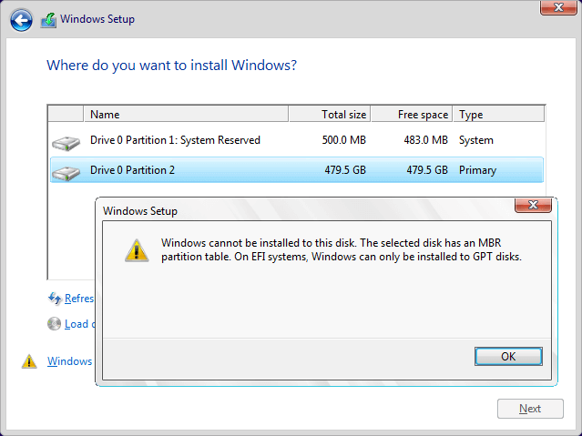
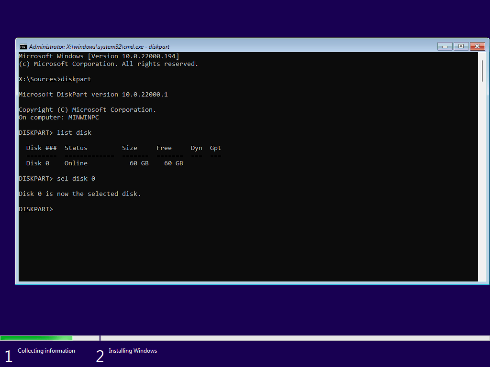
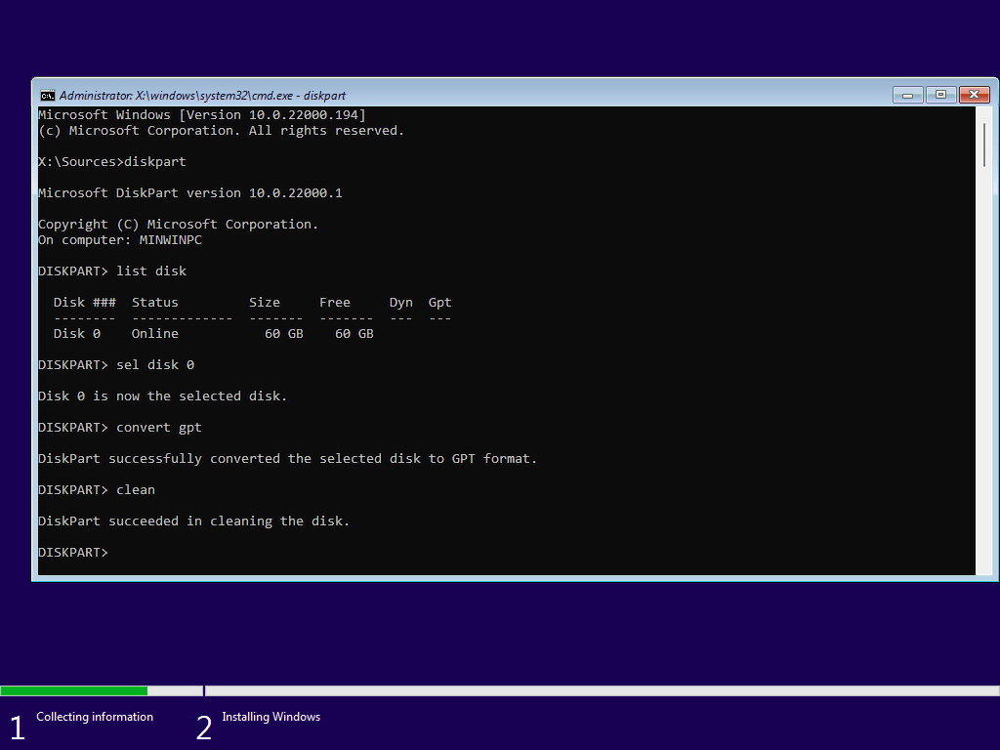
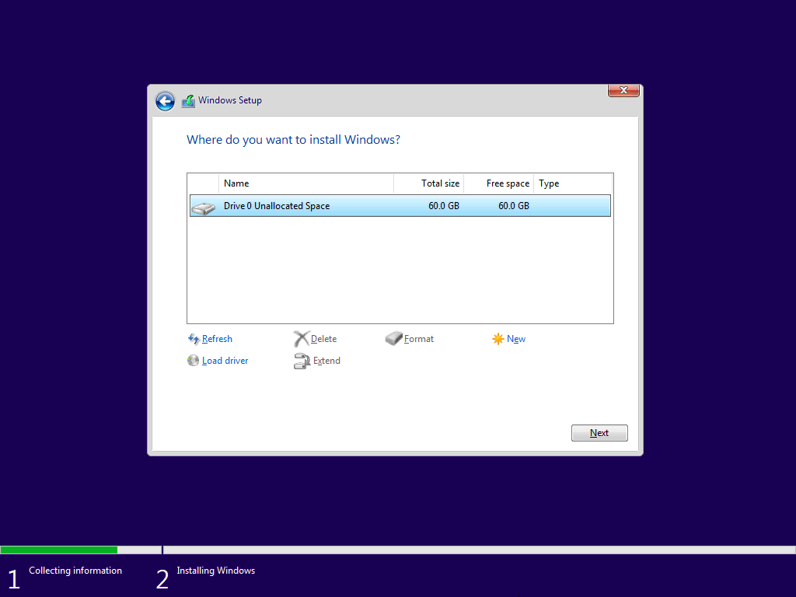

During the instalaltion of Windows 10 and Windows 11 you may encounter an error message:

> Windows cannot be installed on this disk. The selected disk has an MBR partition table

## Resolution
1.  Press `Shift+F10` to open CMD and follow below.
    

2. Type `diskpart` and press Enter
    

3. Type `list disk` and press Enter
    

4. Make note of the disk you want to install to from the step above then type `sel disk #` and press Enter

    

5. Type `convert gpt` and press Enter
    

6. Type `clean` and press Enter
    

7. You can exit the CMD and click `Next` again.
    