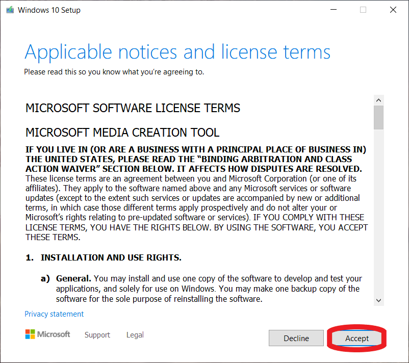
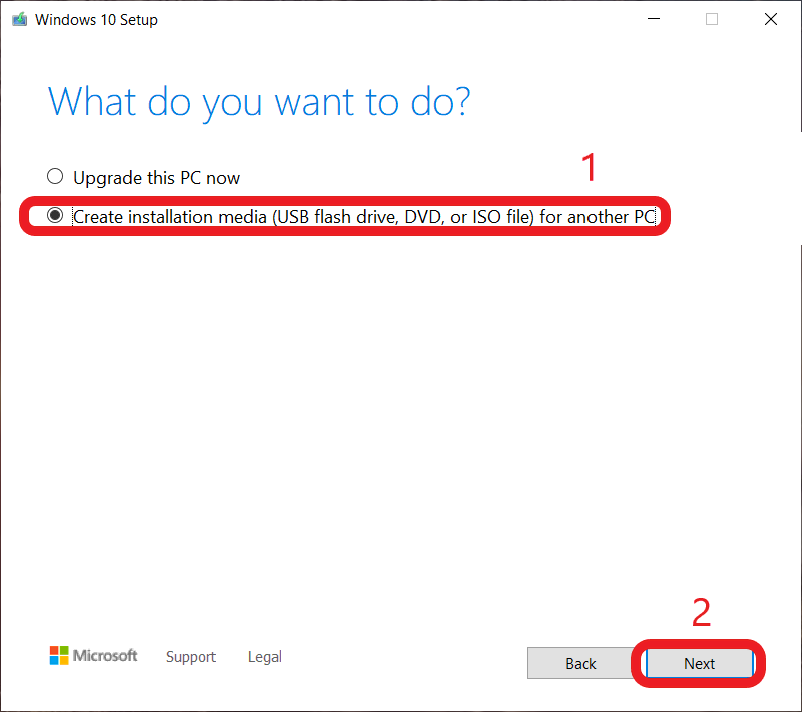
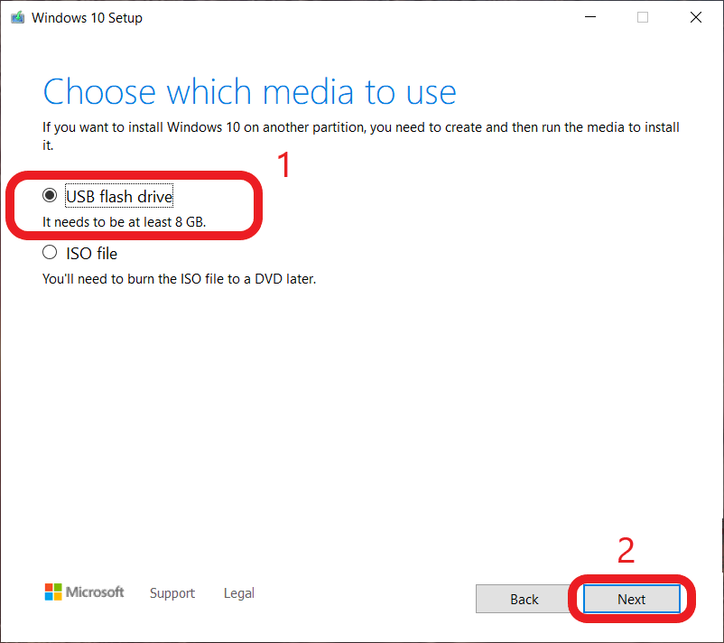
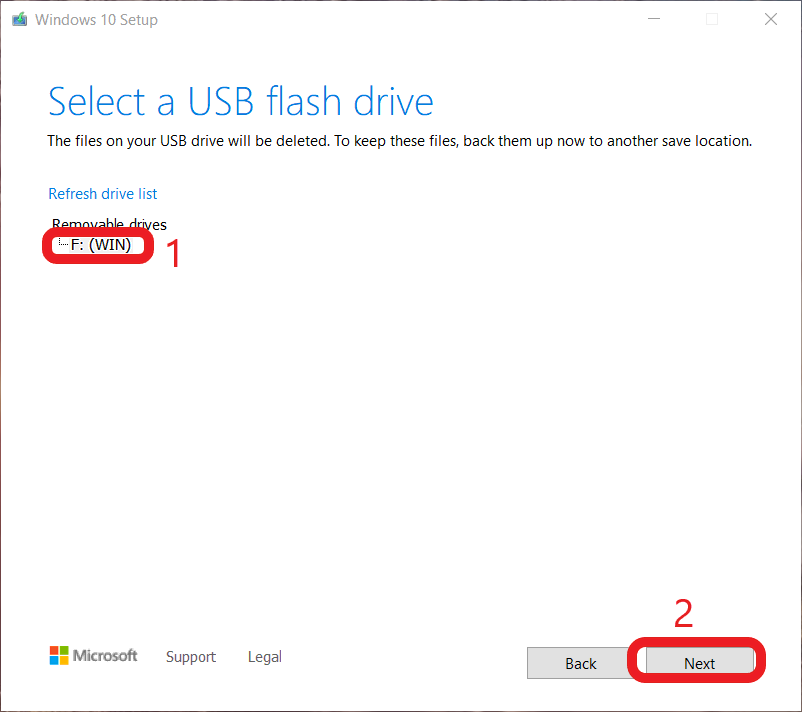
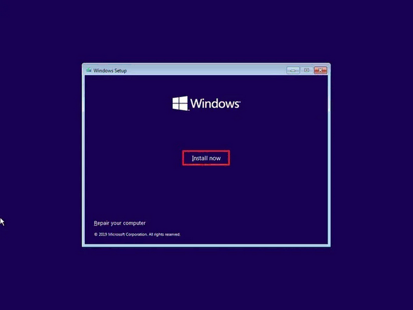
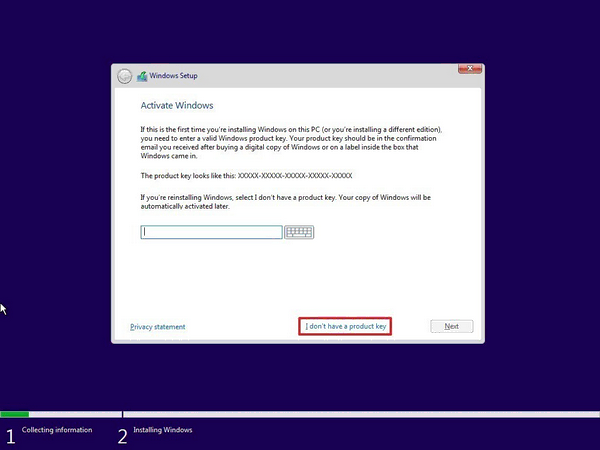
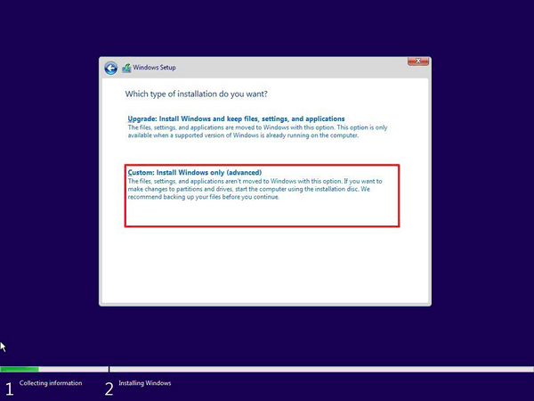
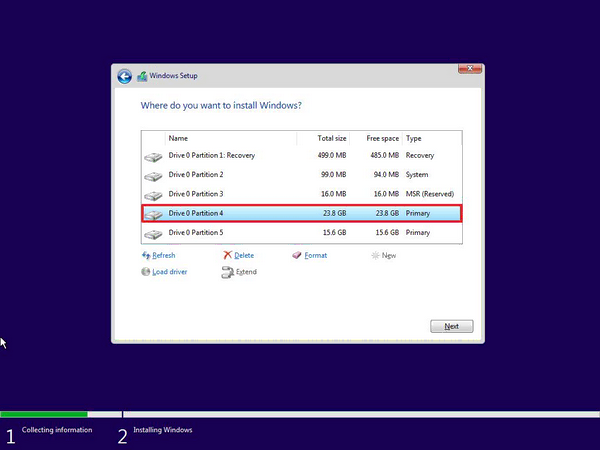
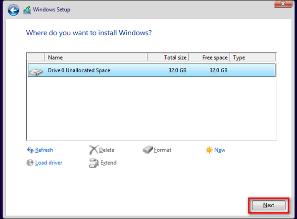

import DiskErrors from '../../../_includes/embeds/install-disk-errors.md';

> [!CAUTION] Caution
> 
> All files on the drive you plan to install Windows to will be **deleted** if you follow this guide - this is intended. Please ensure you have an adequate [backup policy](/backups) in place before proceeding if you have files of value.

## Prerequisites

* An internet connection.
* A working computer to run the Windows Media Creation Tool.
* A USB flash drive that is at least 8GB or greater.

## Creating installation media

1. Using a USB flash drive **at least 8 gigabytes in size**, create a bootable USB flash drive using the [Media Creation Tool](https://www.microsoft.com/en-us/software-download/windows10) from Microsoft. This will also wipe any data stored on the USB flash drive.
   
    > [!WARNING] Warning
    > Save MCT to Desktop or Downloads folder. MCT must be saved and run from outside the USB flash drive. Just moving an ISO file to the USB flash drive will not make it bootable.

2. Run MCT by double clicking it. You will be greeted with windows Terms Of Service, after reading it, press Accept.

     

3. Select create installation media for another PC, and then click next.

     

4. You can leave this to default, press next.  

     

5. Select USB flash drive, then press next.

     

6. Select the USB you want to use, press next. 

    > [!WARNING] Warning
    > This step will wipe the selected USB Flash drive, so ensure you have nothing important on the USB drive, and back up all important documents.

     

7. Wait till MCT finish its job. this may take some time.

     

8. After MCT says it finished, shutdown your PC.

## Installing Windows

> [!CAUTION] Caution
> Disconnect all storage disks except the main (C Drive) disk from the computer before installing Windows 10. Not doing so can accidentally wipe other disks or result in the installer choosing the wrong disk as the boot drive and putting actual windows on another drive.

1. Boot into your USB that has the Windows 10 Media on it. 

    > [!NOTE] Information
    > You can do this by entering your systems' BIOS and change the BIOS boot order to have USB media as the first priority (this can usually be found under the boot tab), or simply look for the words "boot menu" when you see your BIOS boot screen, press the corresponding function key and choose the USB flash drive to boot from it.

2. Follow the steps on screen to install Windows 10.

3. Click Install now

     

4. Continue on until you hit the license key screen. Here you can either enter your license code or, if Windows has been installed to this computer before, click on the "I don't have a product key" link.

    

5. Continue on until you hit the “Which type of installation do you want?” screen. Click "Custom". 

    

6. Click on each partition of the target drive and select delete, once all the partitions are gone you will be left with unallocated space. At this point click `Next`.

    > [!CAUTION] Caution
    > If you see any drive other than "Drive 0" as seen in our images, power down and unplug the extra drives that you don't want to install windows on.

    > [!WARNING] Warning
    > ***Each means ALL*** But do you mean ALL? ***Yes, All***. Once all the partitions are gone you will be left with unallocated space.

    > [!NOTE] Information
    > Ensure that you only have drive 0 partitions in this window before deleting, otherwise this means you didnt disconnect other drives as noted in step 8.

    

    

    <DiskErrors />

7. Windows will now install. When it finishes it will automatically restart your machine, when your screen goes black pull out your installation USB drive.

> [!TIP] Congratulations!
>
> You have successfully installed Windows 10. Once the computer has rebooted, you will be greeted with the Out-of-the-Box Experience and you can start setting up your new installation of Windows. 
