import DiskErrors from '../../../_includes/embeds/install-disk-errors.md';

> [!CAUTION] Caution
> 
> All files on the drive you plan to install Windows to will be **deleted** if you follow this guide - this is intended. Please ensure you have an adequate [backup policy](/backups) in place before proceeding if you have files of value.

## Prerequisites

* An internet connection.
* A working computer to run the Windows Media Creation Tool.
* A USB flash drive that is at least 8GB or greater.

## Creating installation media

### Using MCT to create the installation media

1. Create a bootable USB flash drive using the [Create Windows 11 Installation Media download](https://www.microsoft.com/en-us/software-download/windows11) from Microsoft. It can be found under the headline "Create Windows 11 Installation Media"
    
> [!WARNING] Warning
> Save MCT to Desktop or Downloads folder. MCT must be saved and run from outside the USB flash drive. Just moving an ISO file to the USB flash drive will not make it bootable.
    
2. Run MCT by double-clicking it. You will be greeted with windows Terms Of Service, after reading it, press Accept.

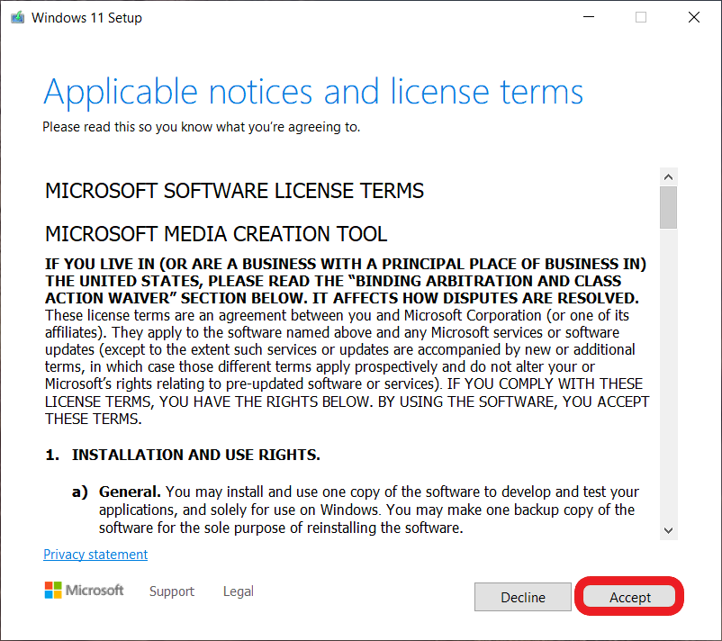

3. You can leave this to default, press next.

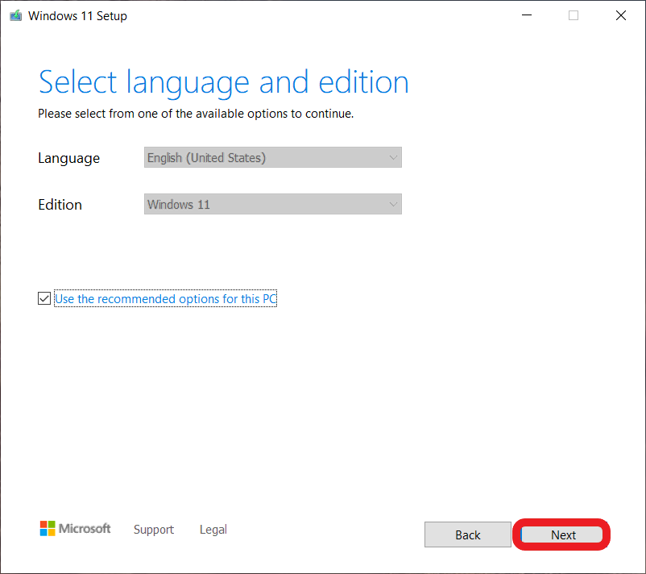

4. Select create installation media for another PC, and then click next.

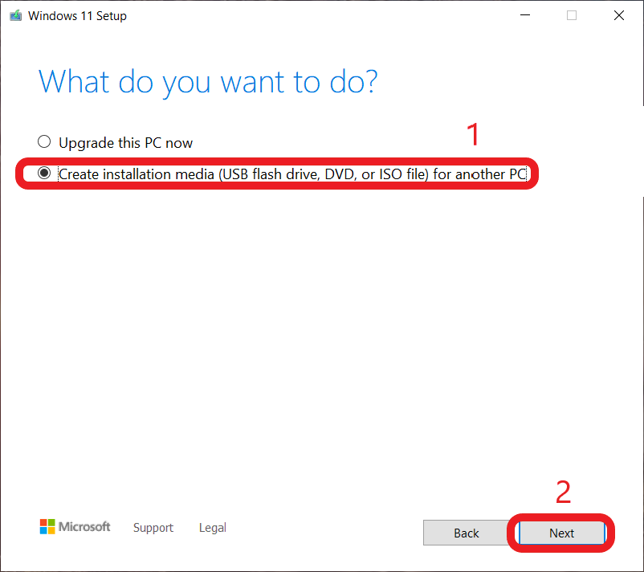

5. Select the option "USB flash drive", then press next.

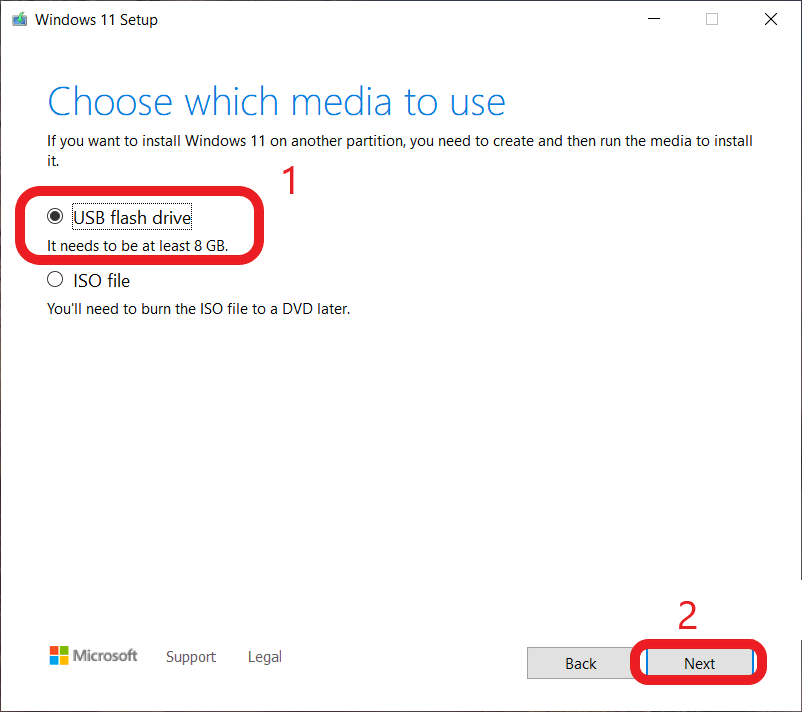

6. Select the USB drive you want to use, press next. 

> [!CAUTION] Caution
>  This step will wipe the selected USB Flash drive, so ensure you have nothing important on the USB drive, and back up all important documents.

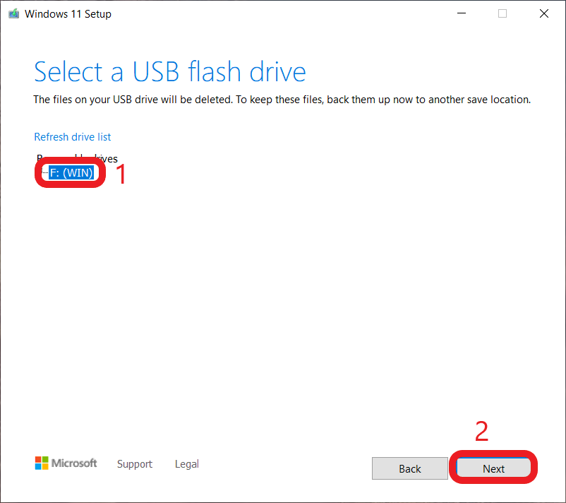

7. Wait until MCT finishes its job. This may take some time.

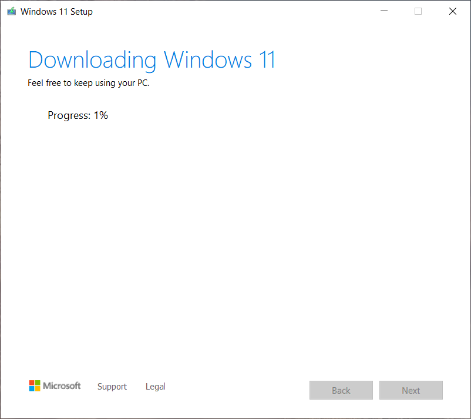

8. After MCT says it finished, shutdown your PC.

## BIOS and Setup

1. Disconnect all storage disks except from the main (C Drive) disk from the computer before installing Windows 11. Not doing so can accidentally wipe other disks or result in the installer choosing the wrong disk as the boot drive and putting actual windows on another drive.

> [!NOTE] Information
> The following section occurs in your BIOS, you can enter your systems' BIOS by looking for the words "setup" when you see your BIOS boot screen then pressing the corresponding function key.

2. Please make sure these settings are configured correctly.
   * CSM is disabled
   * Secure boot is enabled
   * TPM is enabled (Intel® Platform Trust Technology (Intel® PTT)/ fTPM)
   * The drive controller mode is set to AHCI/NVMe, and with RAID/VMD/IRST disabled

3. Boot into your USB which has the Windows 11 Media on it, to do this Change the BIOS boot order to have USB media as the first priority (this can usually be found under the boot tab), or simply look for the words "boot menu" when you see your BIOS boot screen, press the corresponding function key and choose the USB flash drive to boot from it.

## Installing Windows
 
1. Follow the steps on screen to install Windows 11. 
 
2. Click "Install now"

     > [!WARNING] Warning
     > If you do not see an installer like the below screenshot, click next twice, then click "Previous version of Setup" near the bottom left corner of the installer window.

     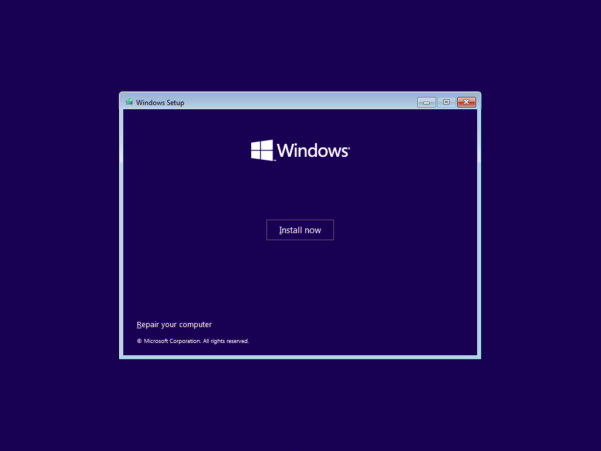

3. Continue on until you hit the license key screen. Here you can either enter your license code, or if Windows has been installed to this computer before, click on the `I don't have a product key` link.

    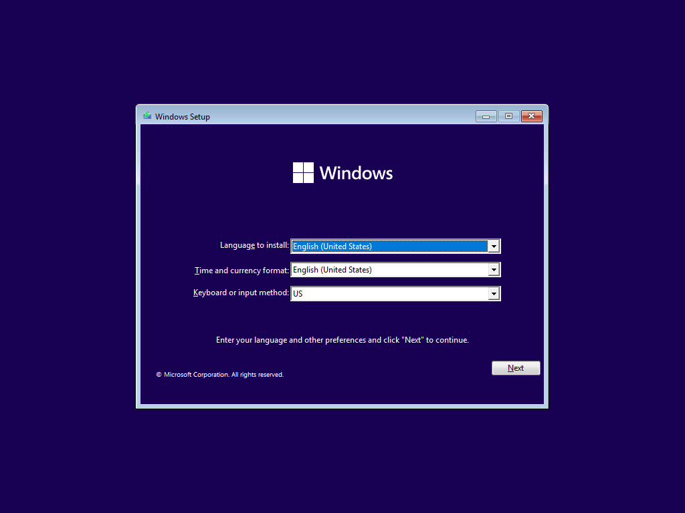

    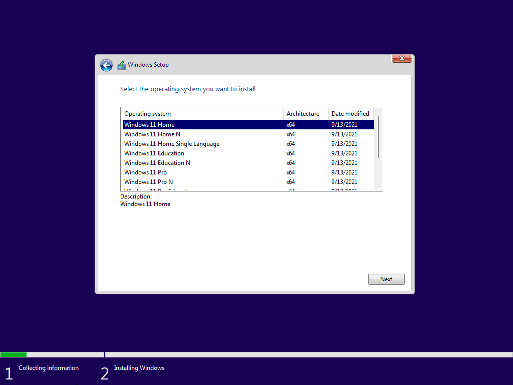

4.  Continue on until you reach the “Which type of installation do you want?” screen. Click "Custom". 

     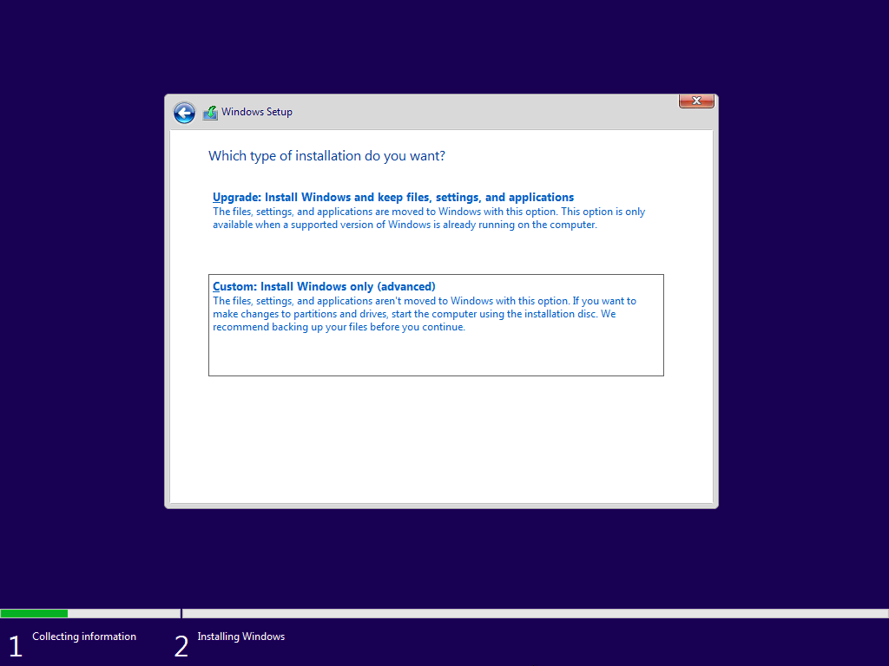

5. Click on each partition of the target drive and select delete, once all the partitions are gone you will be left with unallocated space. At this point, click `Next`. *****Each means ALL*** But do you mean ALL? ***Yes, All***. Once all the partitions are gone, you will be left with unallocated.**

    > [!CAUTION] Caution
    > Ensure that you only have drive 0 partitions in this window before deleting. If you see any drive other than "Drive 0" as seen in our images, power down and unplug the extra drives that you don't want to install windows on.

    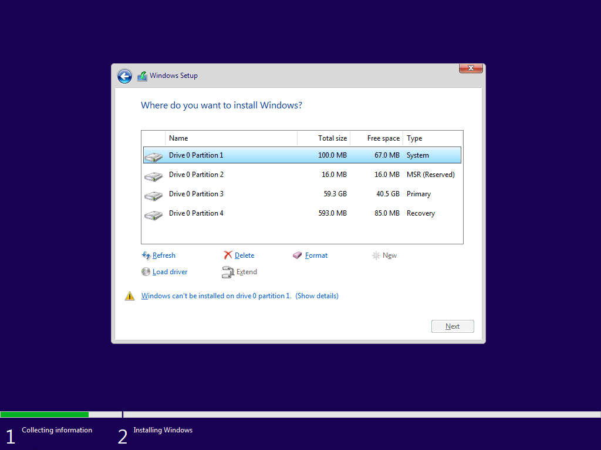

    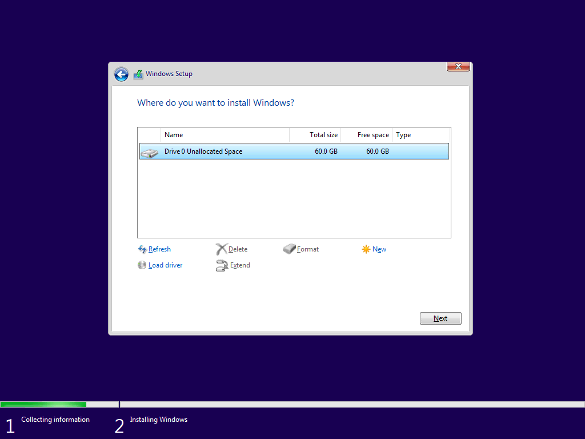

    <DiskErrors />

6. Windows will now install. When it finishes it will automatically restart your machine, when your screen goes black pull out your installation USB drive.

> [!TIP] Congratulations!
>
> You have successfully installed Windows 11. Once the computer has rebooted, you will be greeted with the Out-of-the-Box Experience and you can start setting up your new installation of Windows. 

## Post-install setup guides
If you need to set up Windows 11 without an internet connection or without a Microsoft account, follow this [article](/guides/bypass-11).
