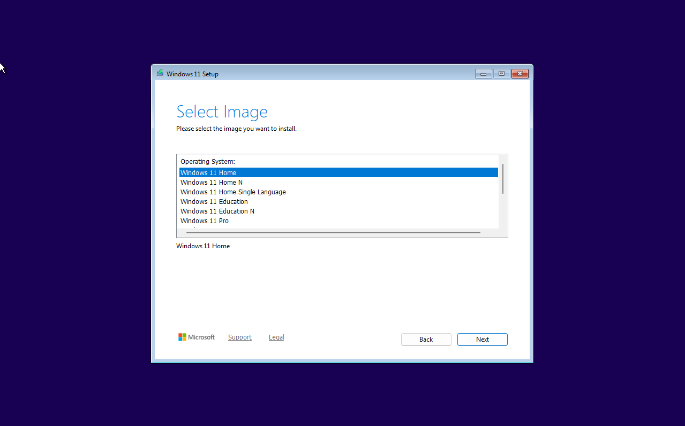
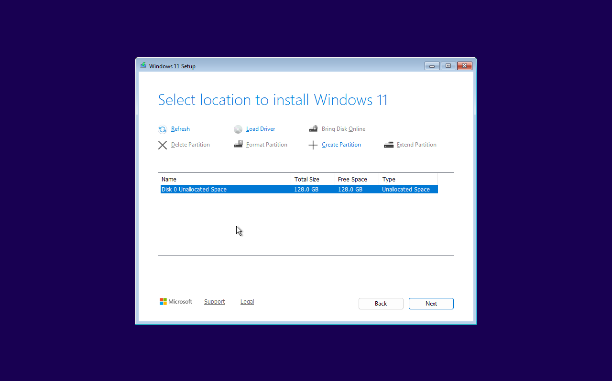
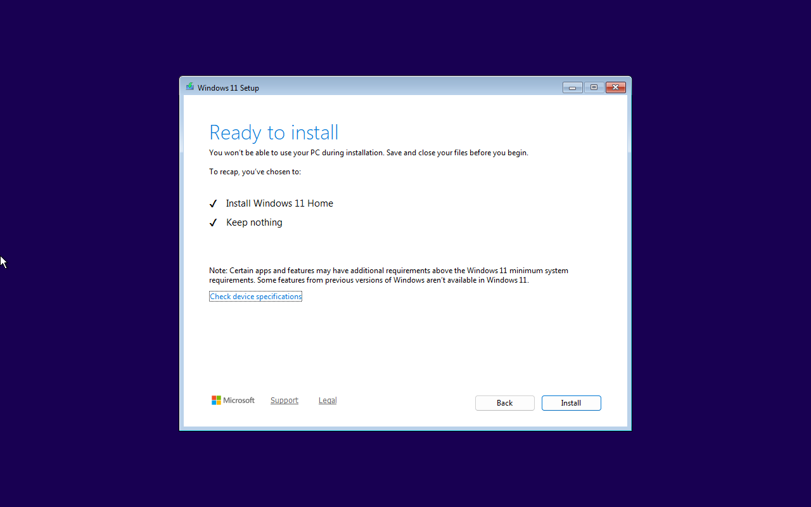
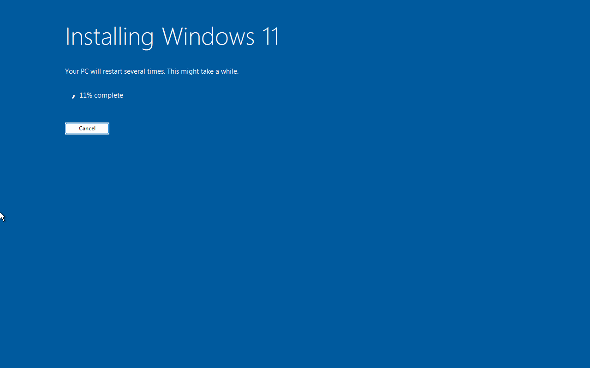

 ---
title: Installing Windows 11
sidebar:
    hidden: false
    order: 2
has_children: false
parent: OS Install Guides
pagefind: true
last_modified_date: 2025-03-15
redirect_from: /books/how-to-and-guides/page/clean-installing-windows-11
---
import DiskErrors from '../../../_includes/embeds/install-disk-errors.md';

> [!CAUTION] Caution
> 
> All files on the drive you plan to install Windows to will be **deleted** if you follow this guide - this is intended. Please ensure you have an adequate [backup policy](/backups) in place before proceeding if you have files of value.

## Prerequisites

* An internet connection.
* A working computer to run the Windows Media Creation Tool.
* A USB flash drive that is at least 8GB or greater.

## Creating installation media

### Using MCT to create the installation media

1. Create a bootable USB flash drive using the [Create Windows 11 Installation Media download](https://www.microsoft.com/en-us/software-download/windows11) from Microsoft. It can be found under the headline "Create Windows 11 Installation Media"
    
> [!WARNING] Warning
> Save MCT to Desktop or Downloads folder. MCT must be saved and run from outside the USB flash drive. Just moving an ISO file to the USB flash drive will not make it bootable.

> [!NOTE] Information
> As of October 2025, due to a bug the MCT may do nothing when ran. If this is the case, download Windows ISO instead and use [Rufus](/factoids/rufus) or [Ventoy](/guides/ventoy) to create a bootable media, then continue at [BIOS and Setup](#bios-and-setup) section.
    
2. Run MCT by double-clicking it. You will be greeted with windows Terms Of Service, after reading it, press Accept.

3. You can leave this to default, press next.

4. Select create installation media for another PC, and then click next.

5. Select the option "USB flash drive", then press next.

6. Select the USB drive you want to use, press next. 

> [!CAUTION] Caution
>  This step will wipe the selected USB Flash drive, so ensure you have nothing important on the USB drive, and back up all important documents.

7. Wait until MCT finishes its job. This may take some time.

8. After MCT says it finished, shutdown your PC.

## BIOS and Setup

1. Disconnect all storage disks except from the main (C Drive) disk from the computer before installing Windows 11. Not doing so can accidentally wipe other disks or result in the installer choosing the wrong disk as the boot drive and putting actual windows on another drive.

> [!NOTE] Information
> The following section occurs in your BIOS, you can enter your systems' BIOS by looking for the words "setup" when you see your BIOS boot screen then pressing the corresponding function key.

2. Please make sure these settings are configured correctly.
   * CSM is disabled
   * Secure boot is enabled
   * TPM is enabled (Intel® Platform Trust Technology (Intel® PTT)/ fTPM)
   * The drive controller mode is set to AHCI/NVMe, and with RAID/VMD/IRST disabled

3. Boot into your USB which has the Windows 11 Media on it, to do this Change the BIOS boot order to have USB media as the first priority (this can usually be found under the boot tab), or simply look for the words "boot menu" when you see your BIOS boot screen, press the corresponding function key and choose the USB flash drive to boot from it.

## Installing Windows
 
1. Follow the steps on screen to install Windows 11. 
 
2. Select Windows language, localization, then click "Next". Select keyboard settings, then click "Next".

     

3. Select "Install Windows 11" and select checkbox to agree to remove all files. Click "Next".

     

4. If prompted, select Windows edition you want to install from the list, most commonly Windows 11 Home or Windows 11 Pro. 

    

5. Continue on until you hit the license key screen. Here you can either enter your license code, or if Windows has been installed to this computer before, click on the `I don't have a product key` link.

6. Click on each partition of the target drive and click "Delete partition". Once all the partitions are gone you will be left with unallocated space. Select the unallocated space and click `Next`. *****Each means ALL*** But do you mean ALL? ***Yes, All***. Once all the partitions are gone, you will be left with unallocated space.**

    > [!CAUTION] Caution
    > Only disk 0 partitions should be visible in this window before deleting, except for partitions named "ESD-USB", "Ventoy" or any USB related disks. If you see any non-USB disk other as seen in our images, power down and unplug the extra drives that you don't want to install windows on.

    

    

    <DiskErrors />

7. Confirm installing Windows 11 by clicking "Install".

    

8. Windows will now start copying installation files on the disk:

    

    When the copy process reaches near 100% this screen will be displayed:

    

    From there your PC will automatically restart after a few seconds. As soon as it does, remove the USB key from your computer to avoid booting from it again.

    Let the installation process continue from here. It will take several minutes until you see the welcome screen.

> [!TIP] Congratulations!
>
> You have successfully installed Windows 11. Once the computer has rebooted, you will be greeted with the Out-of-the-Box Experience and you can start setting up your new installation of Windows. 

## Post-install setup guides
If you need to set up Windows 11 without an internet connection or without a Microsoft account, follow this [article](/guides/bypass-11).
