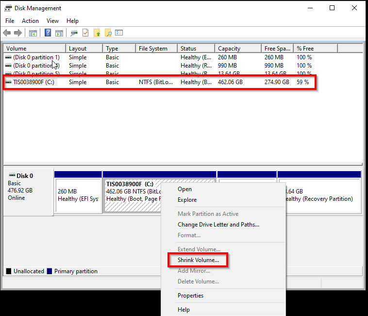
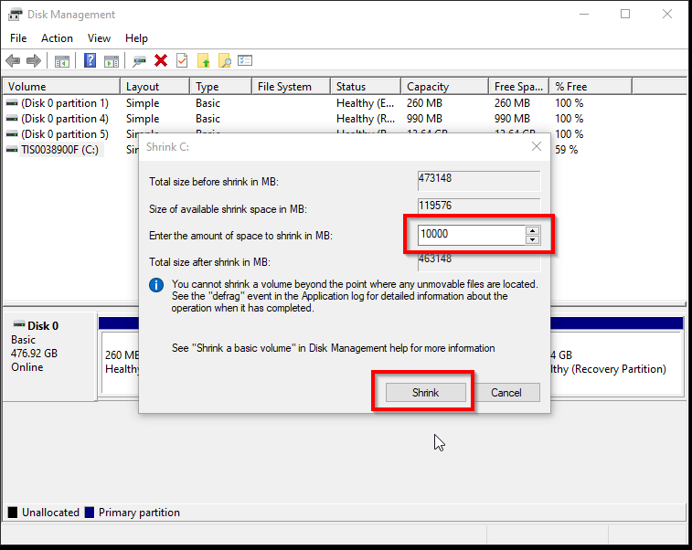
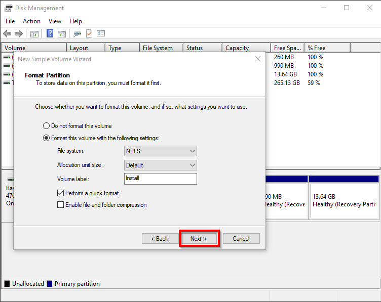
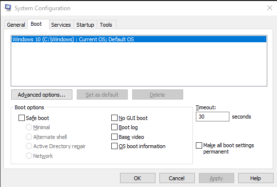
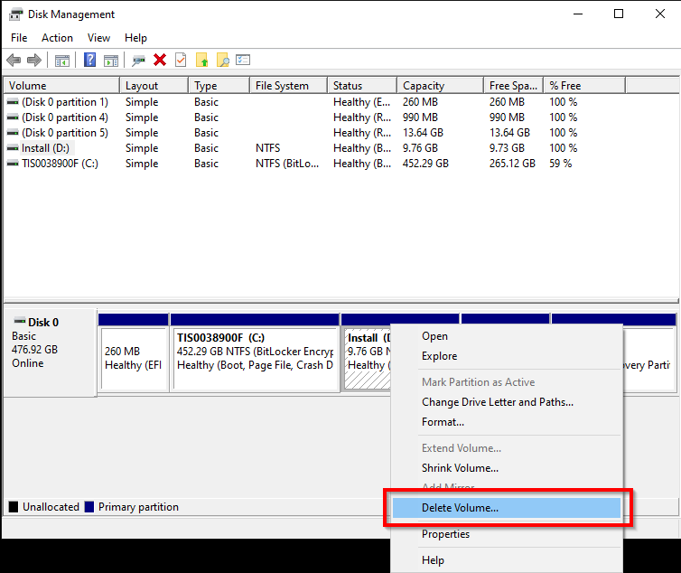
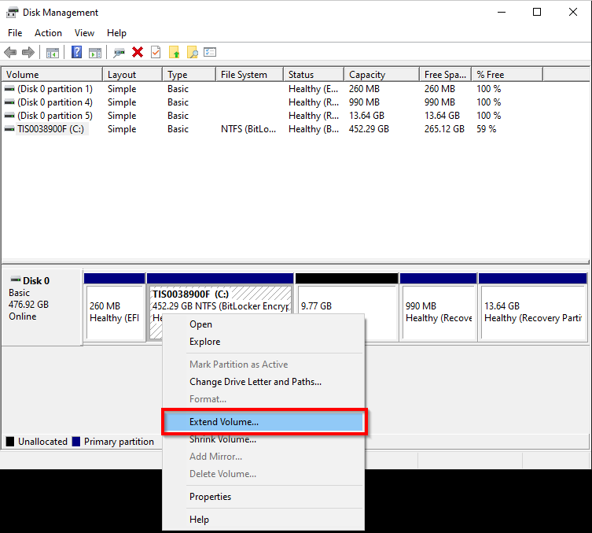
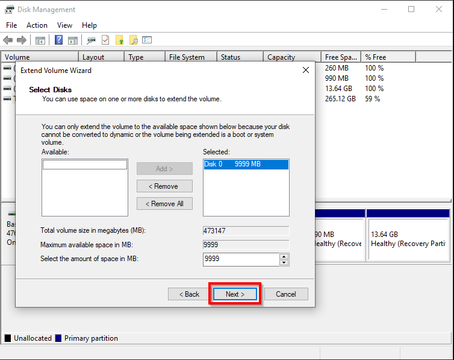

> [!CAUTION] Caution  
>
> This guide will help you install or reinstall Windows without needing a USB flash drive or DVD. It will involve deleting your primary Windows partition during installation. Back up any important data before continuing.

## Prerequisites

* A Windows ISO file downloaded from Microsoft such as [Windows 10](https://www.microsoft.com/software-download/windows10) or [Windows 11](https://www.microsoft.com/software-download/windows11).
* A currently working Windows installation (even temporary).
* At least **10 GB of free space** on your hard drive to create a temporary install partition.
* Familiarity with Disk Management and Command Prompt/Terminal is a plus.

---

## Preparing the install partition

1. Press your Windows+R and type diskmgmt.msc, then press enter.
2. Right-click your main partition (usually C:) and select **Shrink Volume**.

    

3. Shrink the volume by at least **10,000 MB** (~10 GB) to create enough space for the installer.

    

4. After shrinking, a new block of unallocated space will appear. Right-click it, select **New Simple Volume**, format it as **NTFS**, and label it `INSTALL`.

    

---

## Mounting and extracting the Windows ISO

1. Double-click the downloaded ISO to mount it (Windows mounts it as a virtual DVD).
2. Copy **all files** from the mounted ISO to the new `INSTALL` partition.

    > [!TIP] Tip  
    >
    > You can press `Ctrl + A` in the mounted ISO window and then `Ctrl + C`, then paste to the INSTALL drive.

---

## Creating a boot option for the installer

1. Open **Command Prompt as Administrator**.


2. Create a new BCD boot entry for UEFI Windows Setup:

    ```cmd
    bcdedit /create /d "Windows Installer" /application osloader
    ```

    You'll receive a GUID like `{9dea862c-5cdd-4e70-acc1-f32b344d4795}`. Copy it for the next steps.
   

3. Point the new boot entry to the UEFI setup loader from the ISO (located in \efi\boot\bootx64.efi):

    ```cmd
    bcdedit /set {GUID} device partition=D:
    bcdedit /set {GUID} path \efi\boot\bootx64.efi
    bcdedit /displayorder {GUID} /addlast
    ```

    Replace `{GUID}` with the one returned in step 2, and D: with your INSTALL partition’s actual drive letter.


## Reboot into the installer

1. Reboot your system.
2. You should see a new boot option called **Windows Installer**.
3. Select it to boot into Windows Setup.


---

## Installing Windows

> [!CAUTION] Caution
>
> When you reach the partition selection screen, be sure **NOT** to delete the `INSTALL` partition until **after** the rest of Windows is installed. This will be the partition that shows up as 9.77GB in the list.

1. Navigate the initial menus until you get to the screen asking which type of installation you want.
2. Click "Custom: Install Windows only (advanced)"

     


3. Delete all partitions **except** the INSTALL partition on the target drive.
4. Select the unallocated space, click **Next**, and let Windows install.

> [!WARNING] Warning
>
> Ensure that you only have partitions with all the same drive nummber in this window before deleting. If you see any drive other than "Drive 0" as seen in our images, power down and unplug the extra drives that you don't want to install windows on.

    

(note that in the generic picture above, there is no 'Install' partition)

    


---

## Final steps

1. After installation completes and you land on the desktop, press `Win + R`, type `msconfig`, and go to the **Boot** tab.
2. Delete the "Windows Installer" entry.

    

3. Optionally, delete the `INSTALL` partition via Disk Management and extend your main partition to fill the drive.

    
    
    

---

> [!TIP] Congratulations!
>
> You've now installed Windows without external media. This method can be reused any time you need to reset your PC without extra tools or drives, so long as you can still boot into Windows. Periodically updating the installation contents is advisable to avoid lengthy update sessions if you decide to use this as a reset tool.
