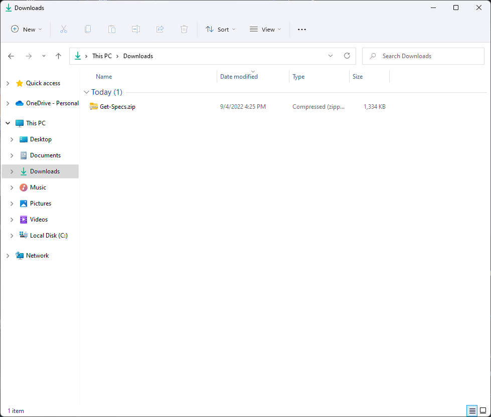
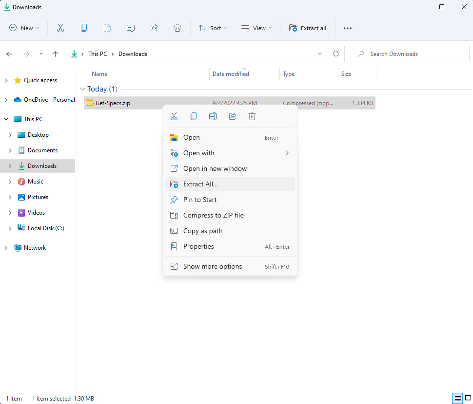
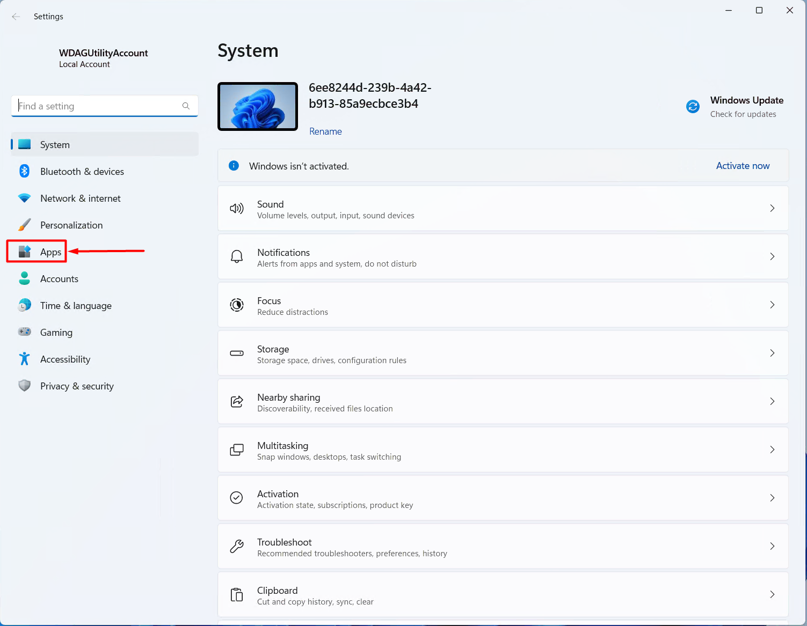
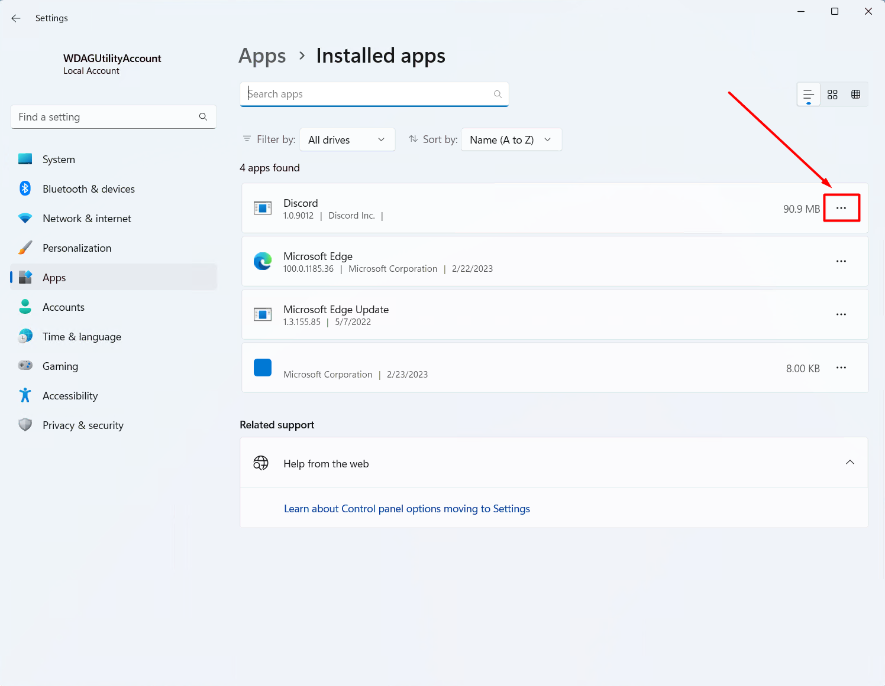
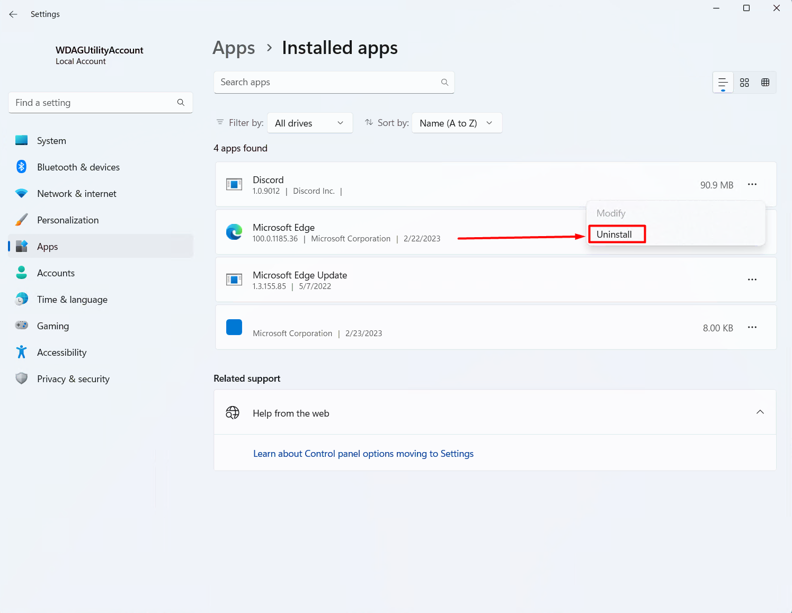
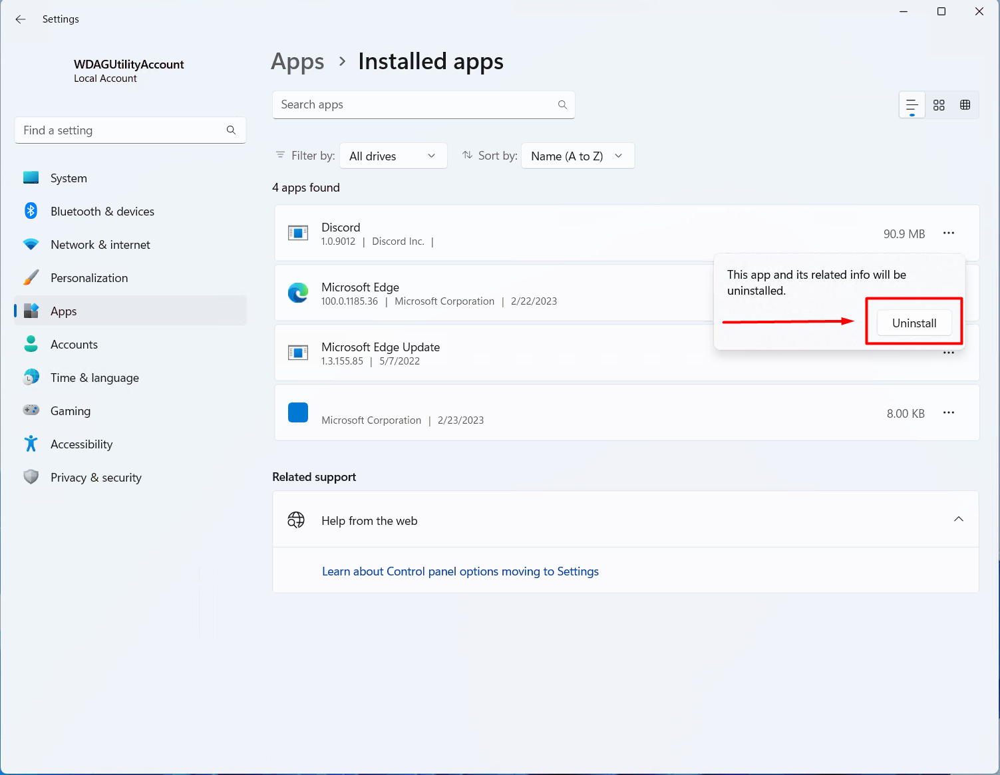
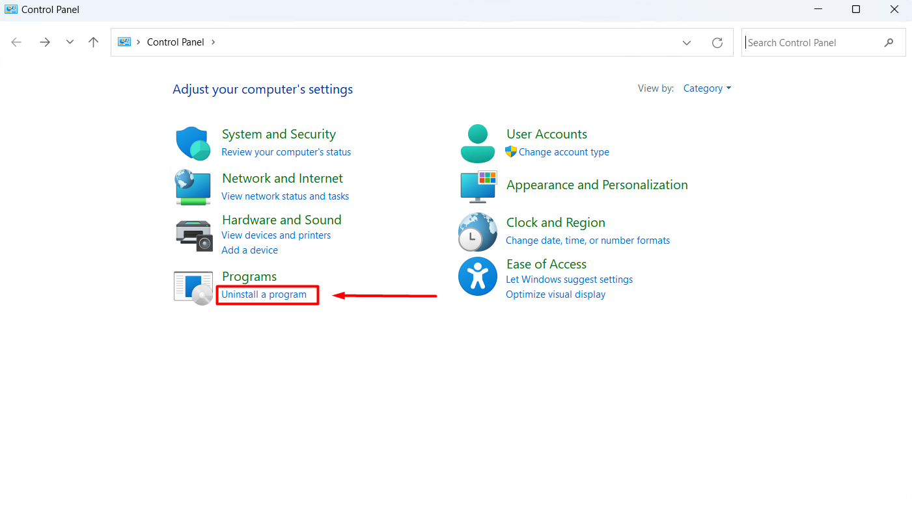
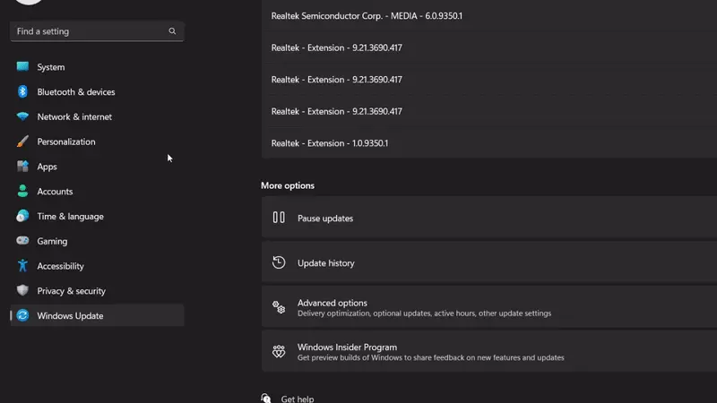

This article will be going over some of the basics with using a computer. In this article we will cover topics such as installing drivers and programs, uninstalling programs, ending processes, and rebooting. 

## Shutting down your computer
You've had a nice game with your friends and want to go to bed, so *you shut down your computer*

You can do this by hitting the start button. From there, hit the power icon and press the *shut down option*. 

Alternatively, you can shut down through CMD by typing and entering `shutdown /s`. Running this command will make your computer act as if you pressed the shut down option.

## Rebooting 
Sometimes as the user you will run into an issue with your computer. Before reaching out for help, try a reboot to see if that fixes the issue. 

Similarly to shutting down your computer, you can do this by hitting the start button. From there, hit the power icon and select *restart*. Another way is hitting the reboot button on your computer. 

This is a common first step to troubleshooting and will fix some problems that you are experiencing. Otherwise you can view our other guide that goes into a little more details about problems [here](/learning/basic-troubleshooting) or check out some [general guides](/guides).

## Installing Programs
Installing programs is a little bit more work, navigate to the website of the program you would like to install and download the latest version from there. Once you have downloaded the program you will have to run the setup or .exe for the program to install, afterwards you are free to use that program. 

For example, a program that you might want to install would be *Discord* which you can find [here](https://discord.com/). You would click the download button and run the .exe file you just downloaded to install. You would do this with any program that you wanted to install.

> [!WARNING] Warning
>Avoid downloading software from file sharing sites like Softpedia. Their releases are rarely official and often harbor **malicious software** instead of a clean legitimate product.

### Sites to avoid:
- Softpedia
- FileHippo
- Filehorse
- CNET
- Softonic

## Unzipping/extracting a Folder
1. Navigate to the spot where the zip folder is located. 

    

2. Right click on the name of the folder then hit `Extract All`.

    

3. Now you have a new folder with the unzipped contents. 

## Uninstalling Programs
> [!WARNING] Warning
> **DO NOT** manually delete the files associated with the program.

You want to fully uninstall which would remove the associated files, settings, registry keys, etc. There are a few ways to do this. 

### Uninstall program from Settings

Go to settings on your PC. Click *Apps*.

Click on *Installed Apps*.

Click on the three dots for the program you want to uninstall.

Click *Uninstall* and then click it again to confirm.

Either the program will uninstall right away and be removed from the list of your installed apps or the program may launch a uninstall prompt from where you finish the uninstallation process. 

### Uninstall program from Control Panel

Open *Control Panel* and click *Uninstall a program*.

This will launch a list of installed apps where you can simply double click the desired entry which will uninstall the app. 

As before, either the program will uninstall right away and be removed from the list of your installed apps or the program may launch a uninstall prompt from where you finish the uninstallation process. 

If you have trouble uninstalling a program, or if the program is not properly uninstalling and leaving behind remnants of itself, you can try and use an advanced uninstall program such as Revo Uninstaller.

## Installing Drivers
Installing drivers is usually straight forward, you let Windows update install the drivers for you. 

You can also install the optional drivers that Windows provides, to check for optional drivers open Windows Update in your Settings and click Advanced Options, then Optional Updates.

There might be a couple drivers Windows does not provide on their own, these can be found on their respective support sites. 

Refer to the matrix below to identifier what product you need the drivers for, then check the next list to find the support site of the manufacturer.

### Hardware Matrix

| Part                 | Site to check                                  | Driver Name         |
| -------------------- | ---------------------------------------------- | ------------------- |
| Built in Ethernet    | Motherboard or laptop manufacturer             | "LAN" or "Ethernet" |
| PCIe or USB Ethernet | Check the site for the brand of adapter in use |                     |
| Built in WiFi        | Motherboard or laptop manufacturer             | "WLAN" or "WiFi"    |
| PCIe or USB WiFi     | Check the site for the brand of adapter in use |                     |
| Built in Audio       | Motherboard or laptop manufacturer             | Audio               |
| PCIe or USB Audio    | Check the site for the brand of adapter in use |                     |

### Support Sites
- [Acer](https://www.acer.com/ac/en/US/content/support)
- [Asrock](https://www.asrock.com/support/index.asp)
- [ASUS](https://www.asus.com/us/support/)
- [Corsair Downloads](https://www.corsair.com/us/en/downloads)
- [Corsair Support](https://help.corsair.com/hc/en-us)
- [Creative - Sound Blaster](https://support.creative.com/Products/Products.aspx?catid=1)
- [Dell](https://www.dell.com/support/home/en-us)
- [Gateway](https://www.gateway.com/gw/en/US/content/support-overview)
- [Gigabyte](https://www.gigabyte.com/Support)
- [HP](https://support.hp.com/us-en)
- [Lenovo](https://support.hp.com/us-en)
- [Logitech](https://support.logi.com/hc/en-us/)
- [MSI](https://us.msi.com/support)
- [Razer](https://support.razer.com/)
- [Roccat](https://support.roccat.com/s/downloads?language=en_US)
- [Samsung](https://www.samsung.com/us/support/)
- [Toshiba](https://www.samsung.com/us/support/)
- [Zotac](https://www.zotac.com/us/support/)

### GPU Driver Downloads
- [AMD](https://www.amd.com/en/support)
- [NVIDIA](https://www.nvidia.com/download/index.aspx)

## Ending Processes
Ending a process that might not be responding is a task everyone should know. 

Open Task Manager by pressing the `ctrl + shift + esc` keys on your keyboard at once. This should open Task Manager.

Next, go to the *processes* tab on Task Manager. It should already be on the tab, if not, move over to it. This is where we will end a process.

From there, select the process you want to end by left clicking on it. Afterwards, hit the *end task* button. 

**Be careful when you are in here.** Ending background processes could cause more issues and would require a reboot to fix. 
