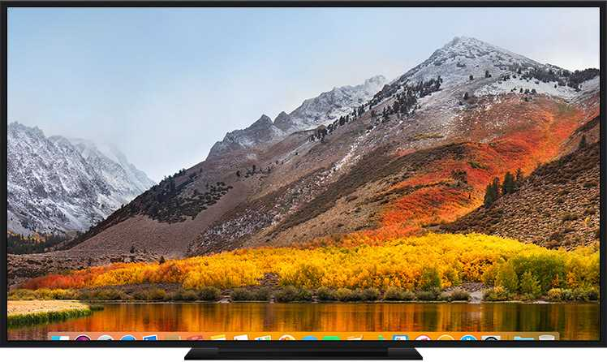
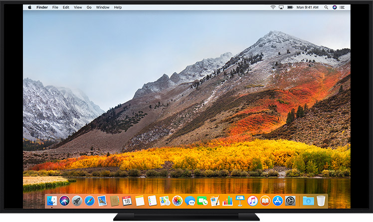

## Why is this important?
Displays are not exactly the same, and different display types have different pros and cons.

## Panel Types

### Twisted Nematic (TN)
The most common type of LCD panels. These panels offer fast response times and high refresh rates, but have limited viewing angles and poor colors.

### Vertical Alignment (VA)
These panels have more saturated colors and a higher contrast ratio than TN panels, but have have the slowest response times of the three. A good choice for watching movies and other multimedia content.

### In-Plane Switching (IPS)
IPS is the newest technology of the three covered. They offer the best color reproduction, a wide viewing angle, and relatively low response times. However, they are more expensive than the other two and can suffer from [IPS glow](https://www.displayninja.com/what-is-ips-glow-and-how-can-i-reduce-it/). 

## TVs vs Monitors
TVs and monitors are electronic display devices that show images and videos. They share common video input ports like HDMI and VGA, and also come with the same panel types. However, there are some key differences:

|  | Monitor | TV |
| ---- | ---- | ---- |
| Size | Typically smaller, with sizes ranging from 19 inches to 50 inches. Laptop screens range from 11 inches to 17 inches. | Generally larger, ranging from 30 inches to over 80 inches. |
| PPI (pixels per inch) | Typically have higher density. | Usually have lower density. |
| Refresh rate | Comes with higher rates such as 60, 144, 165, 240 and 360Hz | Commonly between 60-165Hz. |
| Input ports | Fewer ports than TVs, being HDMI and DP (modern) or VGA and DVI (legacy) | More ports including HDMI, VGA, RCA connectors, YPbPr component video, DIN connector, S-Video, and RF connector (Coaxial connector). |
| Latency | Generally lower than TVs. | Generally higher than monitors. |
| Scaling/Resolutions | More limited support. | Better support. |

Due to these factors, monitors are generally preferred over TVs for tasks that require high levels of detail, such as photo/video editing and gaming.

### Over/Underscan
When you use a TV with a computer, you may notice that the edges of the display are hidden beyond the borders of the screen, as if the picture is zoomed in:

This is probably because of **overscan**. On the other hand, black bars surrounding the display is an indication of **underscan**:

These issues can usually solved by adjusting the TV's display settings, or changing resolution/display scaling in the computer settings or GPU control panel.

### Lag and Scaling Resolution Issues
TVs tend to have a higher noticeable latency than monitors, and having limited supported scaling resolutions compared to monitors.

