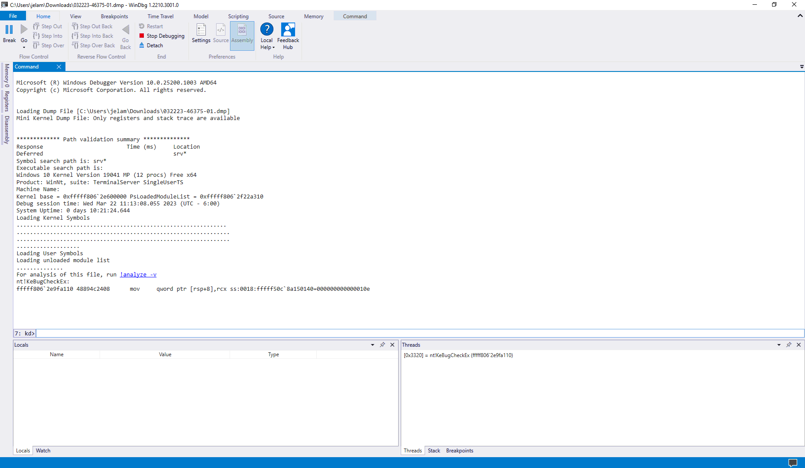

Everyone who has used a computer for more than a brief period of time has experienced what is known as the Blue Screen of Death (BSOD). The computer suddenly stops working, and you are met with an ominous `:( "Something went wrong!"` with a few vague words that don't actually make sense to those who don't know how to interpret it. 

What is a "DRIVER_IRQL_NOT_LESS_OR_EQUAL" error? And what does that mean for my computer? Hopefully, reading this article will shed some light on what a BSOD is, why it happens, and help you figure out why your computer is crashing.

We will first start off with the very basics, so if you are just here to learn how to understand the cause of a BSOD, feel free to skip ahead. More advanced topics will only be brought up later.

## What is a BSOD?

Windows is essentially a very complex program that allows you to run other programs inside of it. If you have ever played a buggy game, you have experienced programs crashing or giving you error messages that make no sense, like `0xC0000409`. This error is called an *"unhandled exception."* 

Exceptions like this happen when the program is *trying to do something that is impossible*.

For example: dividing a number by zero, trying to deal damage to creature #347 when only 346 creatures exist, or reading data from a file that does not exist. 

Computers are stupid and *will only do exactly what you tell them to*. If you tell a computer to do something impossible, it has to know how to react when that task turns out to be impossible.

These exceptions happen all the time. If you have any experience in software development, you may know what is called a `try-catch block`. The code tries to do something, and if an exception occurs inside the try block, the exception is caught. After the catch, some other code is run, usually to log the exception or to simply hide it and keep the program running. 

An *unhandled exception* is when an exception happens in a section of code that is not catching exceptions. The program asks Windows to perform an impossible task, Windows understands that the task is impossible, but because the program has no routines in place for how to continue working after failing the impossible task, the program is forced to crash.

In many cases, a BSOD is a more serious form of an unhandled exception, but instead of a program doing something it should not and crashing back to Windows, it is Windows *itself* doing something it should not. Unlike a game, which has Windows to fall back on when it crashes, Windows has no fallback. There is nowhere to crash to, and the only option is to crash the computer entirely.

While these errors are very frustrating and can often seem random or pointless, it is very important to note that BSODs do not occur for no reason. Windows, for all its faults, handles errors very effectively. If an error happens in such a way that Windows cannot handle it, Windows forces itself to enter a ***Blue Screen of Death*** to avoid sending improper instructions that may cause damage to any hardware, corrupt data, or breach the system's security measures.

## What causes a BSOD?

While unhandled exceptions are a *major cause* of BSODs, unhandled exceptions not the sole cause of BSODs, and that piece of information alone does not help with troubleshooting.

It may be important to know that Windows is telling *itself* to BSOD, not another part of the computer. Windows understands that what it is attempting to do can compromise the computer either by corrupting data, breaching the security of the computer, or damaging the hardware itself, and forces itself to stop before damage can occur.

As Windows is simply a complex piece of software, let's start with what causes the software to trigger the error. There are three main causes:

  1. A driver experiences an unhandled exception during an operation that Windows can't correct.

  2. A driver has too many instructions waiting to be completed, or has had instructions waiting for too long a time. This typically means a device is not working correctly, or that two drivers are interrupting each other, preventing them from completing their work.

  3. A driver tells Windows something is wrong with the hardware it is driving, either because the driver is buggy and is improperly interpreting information or because the hardware itself is sending an error signal. While all three of these causes are not equivalent in severity, all three of them cause the same blue screen of death and crash the computer.

So, what causes these errors in the first place? 

[According to Microsoft](https://learn.microsoft.com/en-us/troubleshoot/windows-client/performance/stop-error-or-blue-screen-error-troubleshooting#what-causes-stop-errors), 70-75% of BSODs are caused by poorly written drivers that are simply experiencing errors and not handling them correctly. They are attempting to perform illegal tasks, and Windows is being forced to crash the system entirely. 

While I, (writer [JimmahDean](https://github.com/JimmahDean)), do not subscribe to that statistic, this does happen very regularly, and it is becoming especially common with the rise of *kernel-level anti-cheats* as they interact poorly with antivirus software and other applications on the system. These anti-cheats have not been in use long enough for the developers to have worked out all the issues with these interactions.

The remaining causes are split between hardware failure and indeterminate reasons, with a small amount being caused by Windows bugs. Unless you are intentionally causing the blue screen of death, and you would know if you were, these errors are in no way your fault. 

Something you installed may be causing them, but nothing you are doing during the use of the computer is directly putting Windows into the BSOD. You, either have an old driver for something that simply needs to be reinstalled, you have one of the aforementioned anti-cheat programs, Windows corrupted itself, or the hardware inside the computer simply failed.

But how can we know what is causing your particular BSOD?

## Using the Debugger

> [!WARNING] Warning
> 
> *All further information in this article may be very technical. If you, at any point, feel uncomfortable with reading dumps, I would **highly recommend** seeking the advice of a professional rather than attempting to diagnose the issue yourself. You are not stupid if it doesn't make sense, this is not easy stuff. Feel free to upload the dumps to [our Discord](https://rtech.support/discord) with [this guide](/factoids/bsod) where volunteers can analyze the dumps for you.*

We have covered what a BSOD is and why they happen, now let's get into the tricky stuff! What is causing your computer to crash?

When a BSOD occurs, Windows will create what is called a memory dump. During the last seconds of functioning, it saves the data stored in RAM to a file, which can be analyzed to help determine the cause of the crash. 

> [!WARNING] Warning
> *There are certain programs out there that attempt to automatically analyze these dumps and detail what happened, but before you download them, let me stop you right now: **They are awful.** They make guesses, pull information out of thin air and lead you in the wrong direction.*

The only app I can recommend for analyzing these dumps is [WinDbg Preview](https://aka.ms/windbg/download), which can be downloaded for free from the Microsoft Store.

When you have WinDbg Preview installed, find your minidump folder in C:\Windows\Minidump. You should now be able to open them simply by double-clicking one. 

> ❓ *If you have issues with read permissions, try copying the dump to your Downloads folder and opening it again. Do not move the file, it will simply move the locked file, and you will be unable to read it due to the lock. You must copy it. Windows gets weird with permissions when you're in system folders.*

When you first open a dump file, you will be greeted with a screen like this:



Nothing in here is *particularly* important, but go ahead and click on the blue `!analyze -v -` text. Now, you get a whole lot of scary-looking information that makes no sense. 

> [!WARNING] Warning
> *If your immediate reaction is, "Is this just the matrix?" I, again, advise you to **seek advice from a professional** rather than continue on.*

Let's break this down. I am only going to briefly explain the different sections of the analysis first and go over them in more detail later. 

### The First Part

The first thing you should see is something that looks like this:

```
DRIVER_POWER_STATE_FAILURE (9f)
A driver has failed to complete a power IRP within a specific time.

Arguments:
Arg1: 0000000000000003, A device object has been blocking an IRP for too long a time
Arg2: ffffa68adae7e9e0, Physical Device Object of the stack
Arg3: ffffcb8c25661850, nt!TRIAGE_9F_POWER on Win7 and higher, otherwise the Functional Device Object of the stack
Arg4: ffffa68adecba010, The blocked IRP
```

All this section shows you is an ***overview of the error***. You have your error on top, a brief description of the error, and four parameters, called "arguments" here, which give more information about the error. These parameters vary in importance from being completely meaningless to being the most important information in the dump, depending on the specific error and parameter.

Let's look closer. Okay, some of this is written in plain English, but what do the numbers mean? The numbers are written in [hexadecimal](https://simple.wikipedia.org/wiki/Hexadecimal), or Base 16. `ffffa68adae7e9e0` is simply a number in Base 16. You can convert this to a base 10 number using any hex to decimal converter you would find on Google, but in most cases the exact number is not important. 

> ❓ *Recognize that this is just a number. In this case, the number is just an ID. It is not scary nonsense that means nothing to anyone except the smartest people, it is simply an identification number like the number on your driver's license.*

Like the number on your driver's license, a memory address is not a number that means anything *on its own*. It points to an area of memory that contained more information about the computer during the crash. You cannot take the address alone and use it to infer anything about the cause of the crash, and the addresses will always be different between crashes, even if the cause of the crash and the state of the computer during the crash *are identical*. Addresses are assigned randomly each time the computer is restarted.

### The Second Part

Following the overview, you have a list of Key Values. I would ignore these. After the key values are the bugcheck code and parameters again. There is no new information here; **you can skip over them**.

Following the reiteration of the error codes, WinDbg will provide you with information it deems relevant to the error. What information is displayed here *will differ depending on the specific bug check*. 

For example, if the BSOD is caused by an unhandled exception, you will usually see:

```
EXCEPTION_RECORD:
EXCEPTION_RECORD:  fffff904f6c8a128 -- (.exr 0xfffff904f6c8a128)
ExceptionAddress: fffff807383e4b29 (nt!IovpValidateDeviceObject+0x0000000000000005)
   ExceptionCode: c0000005 (Access violation)
  ExceptionFlags: 00000000
NumberParameters: 2
   Parameter[0]: 0000000000000000
   Parameter[1]: 00000000046dc232

Attempt to read from address 00000000046dc232
```

More scary numbers, but again, recognize that these are just numbers describing the error. 

The exception code is the main error, in this case a memory access violation, and the parameters are details about the error. WinDbg then attempts to describe the exception beneath it, if possible. 

`(.exr 0xfffff904f6c8a128)` is WinDbg telling you the command it ran to get this information. If you want, you can run this command yourself by clicking on that or by typing the command in the box beneath the analysis labeled `kd>`.

However, running the command now will garner no further information than what has already been given.

### The Third Part

You may also see a `CONTEXT` or `TRAP_FRAME` with even more numbers:

```
TRAP_FRAME:  ffffdb809cf9bf20 -- (.trap 0xffffdb809cf9bf20)
NOTE: The trap frame does not contain all registers.
Some register values may be zeroed or incorrect.
rax=0000000000000000 rbx=0000000000000000 rcx=ffffdb809cf9c228
rdx=ffffa60c112eeaa0 rsi=0000000000000000 rdi=0000000000000000
rip=fffff8057208c82c rsp=ffffdb809cf9c0b0 rbp=ffffdb809cf9c129
 r8=ffffa60c112eeaa0  r9=0000000000000532 r10=ffffa60c26b03d10
r11=0000000000000000 r12=0000000000000000 r13=0000000000000000
r14=0000000000000000 r15=0000000000000000
iopl=0         nv up ei pl zr na po nc
```
You have the familiar blue `(.trap 0xffffdb809cf9bf20)` which, again, is simply the command WinDbg ran to provide you with this information. 

The numbers in this grouping are the values stored in the CPU's registers at the time of the BSOD. The CPU uses registers to store various information, such as memory addresses, or the result of a mathematical operation. It may want to add the value of `r8` to `r9` and store the result of that operation in `rdx`. In this case, `r8` is 0 and `r9` is 0, so the result is 0 + 0 = 0, which would then make `rdx 0`. These numbers are rarely important, but I will be mentioning them in later sections.

After the context record, we have the `PROCESS_NAME`. This will almost always blame an application, and it will ***almost never be useful***. `System` is not helpful. `steam.exe` does not cause blue screens. It is simply the program running on the thread that ran into the error. While this is very rarely the cause, it is still worth looking at. Occasionally software will interact with drivers in a way that causes a blue screen. Most notably, anti-cheats, 3rd-party RGB controllers, and occasionally overclocking tools.

### The Fourth Part

In most BSODs, the next section is the most important:

The stack trace. You have seen a fair few scary numbers; now we get a lot more. Most dumps have small stack traces with only a few lines, but these can be massive walls of text. When troubleshooting, it is critically important that you have an understanding of what you are looking at here:

```
ffffdb80`9cf9bdd8 fffff805`6fe3e2a9     : 00000000`0000000a 00000000`00000008 00000000`00000002 00000000`00000000 : nt!KeBugCheckEx
ffffdb80`9cf9bde0 fffff805`6fe39934     : 00000000`00000125 00000000`00000000 00000000`00000000 00000000`00000000 : nt!KiBugCheckDispatch+0x69
ffffdb80`9cf9bf20 fffff805`7208c82c     : ffffdb80`9cf9c1f0 ffffa60c`112eeaa0 ffffdb80`9cf9c1f0 ffffa60c`112eeaa0 : nt!KiPageFault+0x474
ffffdb80`9cf9c0b0 fffff805`7208c0db     : ffffa60c`112eeaa0 ffffa60c`112eeaa0 ffffa60c`26b03d01 00000000`00000000 : NETIO!StreamInvokeCalloutAndNormalizeAction+0x5c
ffffdb80`9cf9c180 fffff805`72089c7b     : ffffa60b`b4b20014 fffff805`e03c2390 ffffa60b`00000004 ffffdb80`9cf9cb18 : NETIO!StreamProcessCallout+0x2c7
ffffdb80`9cf9c2b0 fffff805`72088d2d     : ffffa60b`f8a20014 ffffdb80`9cf9cb18 ffffdb80`9cf9cb40 ffffdb80`9cf9c9c0 : NETIO!ProcessCallout+0xa4b
ffffdb80`9cf9c430 fffff805`72087a3e     : 00000000`00000005 ffffdb80`9cf9cb40 ffffa60b`b4a4eaa0 fffff805`6fcd5bdc : NETIO!ArbitrateAndEnforce+0x59d
ffffdb80`9cf9c560 fffff805`72085525     : ffffa60b`f8a24bb0 ffffdb80`00000000 ffffdb80`00000000 ffffdb80`9cf9c9c0 : NETIO!KfdClassify+0x33e
ffffdb80`9cf9c910 fffff805`72085128     : 00000000`00000000 00000000`00000000 00000000`00000000 00000000`00000000 : NETIO!StreamClassify+0x279
ffffdb80`9cf9cab0 fffff805`72084d97     : ffffdb80`9cf9d240 ffffa60b`ce803140 ffffa60b`b49fd490 00000000`00000000 : NETIO!StreamCommonInspect+0x2ac
ffffdb80`9cf9ce90 fffff805`72178b41     : ffffa60c`0fbf0900 ffffa60c`0fbf0b50 ffffdb80`9cf9d010 ffffa60c`0fbf0920 : NETIO!WfpStreamInspectReceive+0x157
ffffdb80`9cf9cf10 fffff805`7217727c     : 00000000`00000003 ffffdb80`9cf9d510 00000000`00000000 00000000`00000000 : tcpip!TcpTcbFastDatagram+0x1351
ffffdb80`9cf9d110 fffff805`72172f72     : 00000000`00000000 00000000`00000000 00000000`00000000 ffffa60b`ce6ba9d0 : tcpip!TcpTcbReceive+0x1ac
ffffdb80`9cf9d2c0 fffff805`7217228f     : ffffa60b`d39f8088 00000000`0000001c ffffa60b`cfdf6088 ffffa60b`ce803280 : tcpip!TcpMatchReceive+0x1f2
ffffdb80`9cf9d4a0 fffff805`721be8f6     : ffffa60b`b49fd490 ffffa60b`cff4bb01 00000000`00000001 00000000`0000a7c5 : tcpip!TcpReceive+0x35f
ffffdb80`9cf9d5b0 fffff805`72194286     : fffff805`723769d0 00000000`00009411 00000000`00000000 fffff805`7237d6a8 : tcpip!TcpNlClientReceiveDatagrams+0x16
ffffdb80`9cf9d6d0 fffff805`72192f63     : fffff805`723769d0 ffffa60b`ce8688e0 ffffa60b`ce803000 ffffa60b`ce803200 : tcpip!IppReceiveHeaderBatch+0x3b9
ffffdb80`9cf9d7c0 fffff805`722051a7     : ffffa60b`b4bc44e0 ffffa60b`efa2b6d0 00000000`00000001 00000000`00000000 : tcpip!IppReceivePackets+0x503
ffffdb80`9cf9d8f0 fffff805`721aac3b     : ffffa60b`b4bc44e0 ffffa60b`efa2b6d0 00000000`00000000 00000000`00000000 : tcpip!IpFlcReceivePreValidatedPackets+0x1a87
ffffdb80`9cf9db60 fffff805`6fcd372a     : 00000000`00000003 fffff805`721aaaf0 ffffa60b`da3240f4 00000000`00000002 : tcpip!FlReceiveNetBufferListChainCalloutRoutine+0x14b
ffffdb80`9cf9dcb0 fffff805`6fcd369d     : fffff805`721aaaf0 ffffdb80`9cf9ddf8 ffffa60b`b4b413d0 00000000`00000000 : nt!KeExpandKernelStackAndCalloutInternal+0x7a
ffffdb80`9cf9dd20 fffff805`721abf50     : ffffdb80`9cf9db40 00000000`00000000 00000001`00000000 00000000`00000000 : nt!KeExpandKernelStackAndCalloutEx+0x1d
ffffdb80`9cf9dd60 fffff805`71f026d1     : ffffa60b`cfdf6001 00000000`00000001 00000000`00000003 ffffa60b`cfdf6066 : tcpip!FlReceiveNetBufferListChain+0x530
ffffdb80`9cf9e040 fffff805`71f020ea     : ffffa60b`d96e3aa0 ffffa60b`00000801 ffffa60b`00000000 00000000`00000003 : ndis!ndisMIndicateNetBufferListsToOpen+0x141
ffffdb80`9cf9e120 fffff805`71f2654d     : ffffa60b`cf67f1a0 ffffa60b`00000000 ffffa60b`00000000 ffffa60b`cf67f1a0 : ndis!ndisMTopReceiveNetBufferLists+0x24a
ffffdb80`9cf9e200 fffff805`71f25fbb     : 00000000`00000000 ffffdb80`9cf9e2f0 fffff805`71f01ea0 00000000`00000001 : ndis!ndisCallReceiveHandler+0xb9
ffffdb80`9cf9e250 fffff805`71f26373     : 00000000`00000000 ffffdb80`9cf9e730 fffff805`707486c0 fffff805`6fccbc5b : ndis!ndisCallNextDatapathHandler<2,void * __ptr64 & __ptr64,void (__cdecl*& __ptr64)(void * __ptr64,_NET_BUFFER_LIST * __ptr64,unsigned long,unsigned long,unsigned long),void * __ptr64 & __ptr64,_NET_BUFFER_LIST * __ptr64 & __ptr64,unsigned long & __ptr64,unsigned long & __ptr64,unsigned long & __ptr64>+0x3f
ffffdb80`9cf9e2a0 fffff805`71f260aa     : ffffa60b`cf67f1a0 fffff805`71f01ea0 ffffa60b`cf67f1a0 fffff805`00000001 : ndis!ndisIterativeDPInvokeHandlerOnTracker<2,void __cdecl(void * __ptr64,_NET_BUFFER_LIST * __ptr64,unsigned long,unsigned long,unsigned long)>+0x8b
ffffdb80`9cf9e310 fffff805`71f26612     : ffffa60b`daaf5c50 00000000`00000000 00000000`00000000 ffffa60c`13259030 : ndis!ndisInvokeIterativeDatapath<2,void __cdecl(void * __ptr64,_NET_BUFFER_LIST * __ptr64,unsigned long,unsigned long,unsigned long)>+0xe2
ffffdb80`9cf9e380 fffff805`71f03756     : 00000000`00a89649 00000000`00000000 00000000`00000000 fffff805`6fccd983 : ndis!ndisInvokeNextReceiveHandler+0xa6
ffffdb80`9cf9e3e0 fffff805`b057c94d     : 00000000`00000000 ffffa60b`d60119b0 ffffdb80`9cf9e570 00000000`00000003 : ndis!NdisMIndicateReceiveNetBufferLists+0x116
ffffdb80`9cf9e470 fffff805`b057bf9e     : 00000000`00000000 00000000`00000000 00000000`00000000 00000000`00000000 : wdiwifi!CPort::IndicateFrames+0xad
ffffdb80`9cf9e5b0 fffff805`b057b417     : 0000003f`00020004 ffffdb80`9cf9e748 fffff805`b065f040 00000000`00000000 : wdiwifi!CRxMgr::RxProcessAndIndicateNblChain+0x41e
ffffdb80`9cf9e6e0 fffff805`b057b268     : ffffa60c`13259030 fffff805`00000003 ffffa60b`b0010006 ffffcb84`8220012b : wdiwifi!CRxMgr::RxInOrderDataInd+0x127
ffffdb80`9cf9e790 fffff805`b004bd7e     : ffffa60b`cfafaa00 ffffa60b`cf6acb80 00000000`00000001 ffffa60b`ce621040 : wdiwifi!AdapterRxInorderDataInd+0x88
ffffdb80`9cf9e7e0 ffffa60b`cfafaa00     : ffffa60b`cf6acb80 00000000`00000001 ffffa60b`ce621040 ffffdb80`9cf9e828 : Netwtw12+0x4bd7e
ffffdb80`9cf9e7e8 ffffa60b`cf6acb80     : 00000000`00000001 ffffa60b`ce621040 ffffdb80`9cf9e828 ffffdb80`9cf9e820 : 0xffffa60b`cfafaa00
ffffdb80`9cf9e7f0 00000000`00000001     : ffffa60b`ce621040 ffffdb80`9cf9e828 ffffdb80`9cf9e820 00000000`00000002 : 0xffffa60b`cf6acb80
ffffdb80`9cf9e7f8 ffffa60b`ce621040     : ffffdb80`9cf9e828 ffffdb80`9cf9e820 00000000`00000002 fffff805`6fc9bc58 : 0x1
ffffdb80`9cf9e800 ffffdb80`9cf9e828     : ffffdb80`9cf9e820 00000000`00000002 fffff805`6fc9bc58 ffffa60b`00000000 : 0xffffa60b`ce621040
ffffdb80`9cf9e808 ffffdb80`9cf9e820     : 00000000`00000002 fffff805`6fc9bc58 ffffa60b`00000000 00000000`ffffffff : 0xffffdb80`9cf9e828
ffffdb80`9cf9e810 00000000`00000002     : fffff805`6fc9bc58 ffffa60b`00000000 00000000`ffffffff ffffb423`c0705ff3 : 0xffffdb80`9cf9e820
ffffdb80`9cf9e818 fffff805`6fc9bc58     : ffffa60b`00000000 00000000`ffffffff ffffb423`c0705ff3 ffffa60b`da324080 : 0x2
ffffdb80`9cf9e820 fffff805`6fcf2040     : 00000000`00000000 ffffa60b`cf664f10 00000000`00000000 ffffa60b`cf67f050 : nt!PsImpersonateContainerOfThread+0x478
ffffdb80`9cf9e8d0 fffff805`6fc18875     : ffffa60b`b12b58b0 ffffa60b`da324080 ffffdb80`9cf9ea40 00000000`00000000 : nt!IopProcessWorkItem+0x100
ffffdb80`9cf9e940 fffff805`6fc0f4a7     : ffffa60b`da324080 00000000`000001c8 ffffa60b`da324080 fffff805`6fc18720 : nt!ExpWorkerThread+0x155
ffffdb80`9cf9eb30 fffff805`6fe2dbb4     : ffff9200`ea5dc180 ffffa60b`da324080 fffff805`6fc0f450 00650074`0065006c : nt!PspSystemThreadStartup+0x5 
ffffdb80`9cf9eb80 00000000`00000000     : ffffdb80`9cf9f000 ffffdb80`9cf98000 00000000`00000000 00000000`00000000 : nt!KiStartSystemThread+0x34
```

If you did not immediately close the tab, I commend you. Let's break this down.

The stack trace is a list of functions Windows was performing on the crashing thread at the time of the BSOD. It is read from bottom to top; in my example, `nt!KiStartSystemThread+0x34` is the first function. You should be able to intuit that this function starts a new thread. The thread ends at the top with `nt!KeBugCheckEx`, which you should again be able to intuit as the function calling the BSOD.

The first number on the left is the ***Stack Pointer***. This number can be used to manually walk the stack in case a dump's stack trace is corrupted; however, I will not be getting into that in this article. The main thing to note about the stack pointer is that the function that failed will have its stack pointer saved in the `rsp` register. In my example, `rsp = ffffdb809cf9c0b0` which matches the line `NETIO!StreamInvokeCalloutAndNormalizeAction+0x5c`, marking that as the failed function.

The second number is the **Return Address**. This number indicates the memory address for the instruction that called the function on that line. You can  reassemble these instructions to get the code behind them, but we will go more into that later.

To the right of the return address are four arguments for each function. I rarely look at these, but occasionally you will find an exception code in there that can point you in the right direction of the problem. Skilled technicians can use these to more effectively understand exactly what is happening throughout the stack; however, we will not be exploring that in this article.

The function names are the most important part of the stack trace. The name before the ! is the module running the function. 

In my example, we have `nt`, which is the overarching Windows kernel system module, `netwtw12`, an Intel WiFi driver, `wdiwifi`, the "Windows Diagnostic Interface" WiFi driver, `ndis`, **N**etwork **D**river **I**nterface **S**pecification, `tcpip` and `NETIO`, some Windows network drivers. 

Already, we can point to an issue with the computer's Wii as the main suspect.

The name to the right of the `!` is what that module is doing. Oftentimes these make sense, as with `KiStartSystemThread` or `KeBugCheckEx`, and a tech-savvy debugger can simply follow along to pinpoint where the fault is, other times you might only see `Netwtw12+0x4bd7e`, which is not given a function name due to `netwtw12` being a **non-Windows** driver. 

WinDbg does not have symbols with which to label functions on non-Windows drivers. Worse still, you may see functions like the one directly before `netwtw12`, ``0xffffa60b`cfafaa00``, which is completely meaningless. The functions labeled `0x1` and `0x2` are corrupted.

The number after the + is the *offset*. Symbols allow WinDbg to know where in memory certain functions start, so they can be properly labeled. The offset is how far from the start point the function got before calling the next function. The simplest example is `Netwtw12+0x4bd7e` which shows an offset of `4bd7e`. If you look at the return address of the function after it, ``fffff805`b004bd7e``, you can calculate netwtw12's starting point in memory to be ``fffff805`b0000000``. 

This can be confirmed by running the command 'lm' and finding netwtw12 in the list. ``fffff805`b0000000 fffff805`b0566000   Netwtw12 T (no symbols)`` shows `netwtw12`'s instructions are between ``fffff805`b0000000`` and ``fffff805`b0566000``. This is rarely useful in troubleshooting, but it will help to understand how to read the traces better.

Following the stack, you will see the symbol name and module that WinDbg blames for the fault. While this information can guide you in the right direction, **be very careful not to immediately think this is correct**. 

WinDbg simply assumes the first function not in the `nt` module is the faulting function. It is much more reliable to read the stack trace and find the fault there. In this section is a line called `FAILURE_BUCKET_ID`, which can provide more context for the error. These are a little tricky to parse and usually start with the stop code, followed by some combination of fault type and faulting module.

```
FAILURE_BUCKET_ID:  0x9F_3_amdi2c_DEV_AMDI0010_IMAGE_ACPI.sys
```

This particular line starts with `0x9F`, referring to `DRIVER_POWER_STATE_FAILURE`, then the 3 is the first parameter. `amdi2c` is the I2C controller driver, and the rest relates to the device node for AMD's ACPI driver. In other bugchecks, you may see AV, or Access Violation, `IP_MISALIGNED`, indicating a misaligned instruction packet, or other failures. It is worth at least taking a glance here.

## Troubleshooting/Analysis

Now that you have some understanding of what you are looking at, we can go over how to analyze the dump file.

As with any investigation, you should do your best to always maintain an open mind. Every human being is vulnerable to ***confirmation bias***. If you have an idea in your head as to what the problem is, you will subconsciously focus on any evidence that helps confirm that theory and put less weight on evidence that contradicts it. This intrinsic bias is especially troublesome when working with minidumps as the differences between the actual causes of errors can be extremely subtle. If you are focused on proving ram to be the issue, you might overlook signs of drive failure, as the two issues appear virtually identical in dumps.

Second, in almost all cases, if you are diagnosing off of a single dump file, **you are wasting your time.**

Without at least a second dump, there is no pattern to find. It is extremely difficult to determine if the fault you are seeing is actually due to the driver being blamed or if it is a hardware fault, not to mention narrowing down which piece of hardware is failing. Professionals are able to do deep dives into single dumps to find the cause of the fault in a single dump, but if you were such a professional, you would not be here. Do yourself a favor and wait for another crash before attempting to track down the issue.

The two exceptions to the previous statement are `0x124 WHEA_UNCORRECTABLE_ERROR` crashes, and when WinDbg blames "hardware" as the faulting module. WHEA errors are always hardware errors, and it is relatively straightforward to track down the cause. When WinDbg blames hardware as the faulting module, you can be confident it is a hardware failure, but you will still need more dumps to correctly determine which piece of hardware is failing.

### Opening

Okay. You have a folder with a bunch of dumps in it, you have a cup of coffee and a snack, and it is time to get to work. Open every dump in the folder, run `kb` first, then click the `!analyze -v` link. **Do not read the analysis yet**, just open each one. Pressing `!analyze -v` first before running `kb` can change the thread context, and it is possible the stack changes from when you first open the dump to when you click analyze. This is not common, but typing `kb` takes less than a second.

### Deciphering

With every dump open, you can start deciphering. Do not go looking for the exact cause immediately, you will see something that looks like one failure and tune out the possibility of it being something else. Instead, start by determining if it is a **hardware or software** problem. 

In many cases, this is very easily accomplished by simply finding the pattern. If every error you have is the same and blames the *same module at the same function/offset*, you can be very confident the problem is **software related and caused by that module**. 

On the other hand, *if every error is different*, with the only similarity being that two of the five dumps have *the same stop code*, your issue is almost certainly **hardware related**.

I am not here to explain how to solve every software issue that causes BSODs. If you are seeing bugchecks from an anti-cheat or 3rd party AV, and reinstalling the software is not solving the problem, you will need to go check with the developers' customer support teams and get help through them.

Sometimes there is a way to determine the exact cause of the fault, and you might get away with a registry change or disabling/enabling a system service, but we would not be exploring that in this guide. The overwhelmingly the best course of action in the case of a software-caused BSOD is to reinstall the faulting module. 

If the faulting module is part of the Windows system, run the [DISM/SFC commands](/guides/dism-sfc) and, when those do nothing, [reinstall windows](/windows).

You may choose to spend time looking for solutions online, and maybe you get lucky and find a forum post with a solution that solves the issue, but in most cases you are simply wasting your time. No need to give it your all. ***Just reinstall.***

There are two very important things to note when determining hardware or software faults. 

  * If your faulting module is `ntkrnlmp`, or another module similar to `nt` or a kernel, it is virtually guaranteed to be **hardware related**. Sure, it is possible the kernel can fail, but virtually every other component of Windows will fail first, and `ntkrnlmp` being blamed generally just means "the kernel was doing something when something in the computer broke." The main exception to this is `DPC_WATCHDOG_VIOLATION`.

  * You should very rarely blame the process *as the fault*. Four BSODs in `Chivalry2-Win64-Shipping.exe` does not mean Chivalry 2 is causing BSODs. It means one of the drivers Chivalry 2 is accessing is causing them, you just happen to play a lot of Chivalry 2, and it is a demanding game, so it is more error-prone if there are issues in the supporting software or hardware. You instead need to be blaming the `MODULE_NAME` and reinstalling the driver rather than the application.

It is important to keep in mind that the module WinDbg blames in `MODULE_NAME` *may not be the faulting module*.

In the overview, I mentioned that WinDbg will always blame the first module, which is not `nt`, and there may be cases where WinDbg blames the wrong driver. It is critically important that you recognize when this happens as to not blame the wrong component. Please review the Reading the Stack section for more information.

A way to be certain the error is software-related and not hardware-related would be to *simply reinstall Windows*. If you continue getting BSODs on a clean installation of Windows, having not done something that may break Windows like use the built-in factory reset, run [CCleaner](/recommendations/maintenance.html#cleaners) or [DriverEasy](/recommendations/maintenance#driver-finders), you have a **hardware** problem.

### Hardware

Now that we know how to handle software-caused bugchecks, let's get into the truly complicated stuff.

A BSOD is determined to be a hardware error if the errors seem to be completely random. If you have five dumps with three different bugcheck codes and the faulting function/offset is always different, there is virtually no pattern at all, it simply happens: Sorry to be the bearer of bad news, but that is hardware failure. The goal now becomes what hardware to replace.

I assume you know this, but in case you do not, let's do a quick rundown of the components of a typical home computer:

The following components are 100% required: No computer will run without them.

  * **The Drive**. The drive is where all the data lives. Every file, every game, every tool, every document, picture, top secret battle plan, etc. is on the computer's drives. They are connected to the motherboard either through a SATA cable or plugged directly into the board via a PCIe slot. Drives use physical methods to preserve data even without power.

  * **The RAM**. When data from the drive is loaded, it passes through the motherboard and is stored in the RAM. The data then sits in RAM to be easily accessed by the CPU when necessary. This data is both information, such as the color value of the pixels in a picture, as well as instructions for the CPU to run when needed. RAM consists of *Digital Flip-Flop Circuits*, that use basic logic gates to determine if a bit is on or off and, as such, cannot retain data without power.

  * **The CPU**. The CPU is the brain of the computer. Purists might consider the CPU to be the computer and everything else to be extra. Like your brain controls every part of you, the CPU controls every part of the computer. The CPU works in tandem with the RAM by reading instructions in the RAM, working accordingly, and writing the results of those instructions back to the RAM to be retrieved later. The CPU handles everything that happens on the computer. Without the CPU, you have no computation.

  * **The Motherboard**. Following the human body references, the motherboard is the central nervous system of the computer. The motherboard contains all the electrical pathways between the various components, including power. Every component uses the motherboard to move information, and the motherboard is loaded with all sorts of controllers and logic to guide information to where it needs to go.

  * **The PSU**. Power Supply Unit, is the heart of the computer. It distributes all the power from the wall outlet to the various components as necessary. A failing PSU usually presents itself as instant power cuts rather than BSODs, but insufficient power can cause other issues, most notably in the GPU as it uses the most power.

  * **The GPU**. The Graphical Processing Unit is tasked with translating instructions into visual data to send to the monitor. The GPU can either be a dedicated card (i.e. NVIDIA GTX 4090Ti, AMD Radeon RX 7900 XTX) or integrated into the CPU. It may be beneficial to think of the GPU as the eyes of the computer, turning stimulus into picture. The computer will technically run without a GPU, you will simply be unable to see what is going on.

Aside from the GPU, all of these components are constantly talking to each other, sending billions of messages every second to create the magic of a modern computer. As they all work together, it can be incredibly difficult to determine if a BSOD is the result of RAM failure or the CPU simply failing to correctly read what is in the ram. Was the data lost in transit on the motherboard? Did the drive even send the right data? To answer this, we will need to go over the patterns of different failures. 

Please keep in mind that, due to the interconnectivity of all the parts, it is very possible that a group of errors presenting classic RAM failure is actually drive failure.

There can be more components here, such as a Wi-Fi card or other various PCIe devices, but let's start with the basics.

I will not spend too much time talking about what GPU failure looks like. It is by far the easiest fault to spot. If you have a group of dumps all blaming various video issues; `VIDEO_TDR_FAILURE`, `VIDEO_DXGKRNL_FATAL_ERROR`, etc. blaming `amdkmdag.sys`, `nvlddmkm.sys` or DirectX, and drivers have already been reinstalled, it is probably a failing GPU. 

This same idea works for other expansion devices; for instance, a Wi-Fi card will have BSODs calling out network-related modules in the stack. Keep in mind if it always blames *the same function/offset*, it is virtually guaranteed to be a *software* problem. Also keep in mind that a GPU failure can mean a failure of the slot it is in, a riser cable if used, or a power supply.

### Pattern Recognition

Now, I have mentioned finding a pattern a few times, but what does that actually mean? Like all patterns, you are looking for ***what is common*** between the dumps you have. 

In a hardware-related set of dumps, the stack is your most valuable resource here, as it determines when the computer actually fails during operation. The important thing you are looking for is the modules involved. 

  * If most of them are **network-related**, you might be seeing a failure in the network card or motherboard. 

  * If most are **GPU related**, it follows that you are looking at a problem with the GPU. If all the modules are Windows system modules, you will have symbols and can read the function names. These are not always helpful, but if you see a lot of mention of the processor, you can point to that as your suspect. "Mm" is a common phrase you might see, which stands for Memory Manager. 

  * If the **memory manager** is involved, consider the RAM or drive as main suspects.
  
While searching for your pattern, it is critical to **remain open to new information**. If the first dump seems to blame RAM and you read the following dumps trying to convince yourself of a RAM problem, you will miss signs that it is a CPU or drive issue. Always consider every possibility until you have all the information and can make a judgment call accordingly.

When you are looking to pin down which part is failing, it is important to know how the parts interact and how that interaction looks when it fails:

#### RAM

RAM holds all the information and instructions required for your processor to actually process things. As the CPU works, it is constantly fetching directions from different places in RAM and reading and changing information, like the current position of your player character, or the layout of the text you are reading right now. When a program is loaded, all the information about that program is loaded into RAM from the drive the program is on. 

When RAM fails, it loses the ability to correctly store that information, or correctly map where the information is stored. You will often see errors with a single bit being flipped or where the referenced memory argument is nearly zero. Another common pattern is to have a large portion of the dumps be `SYSTEM_SERVICE_EXCEPTION` with a mix of `0xC0000005` and `0xC0000409` exception codes.

When looking at a set of five dumps, there is a very good chance the errors will seem completely random. You might have two of the same bugcheck, but the stacks would be different, and the blamed drivers would be different. On boot, Windows stores all the loaded drivers in random spots in the RAM, meaning on one power cycle, you might have a network driver on the bad bit causing it to crash while watching a video online. Then the next power cycle, Windows puts the graphics driver on that same bad bit and crashes when you are in a game or running a benchmark test. It will be very random.

#### Drive

The drive holds all the data someone wants to save permanently. RAM is as fast as it is by utilizing digital flip-flop circuits, which are a specific set of logic gates that can flip between on and off at a whim, but the downside of these circuits is that once they lose power, they lose the data.

Drives use physical methods to store data: Hard drives magnetize a disk, Solid State Drives use flash cells to block or allow power to travel through a bit. Data is not shifted around with each power cycle, making errors caused by a failing drive less random. Errors involving the drive will more often blame the page table than RAM. 

When Windows accesses the drive, it does so through certain drivers, and you will often see stacks blaming those drivers. The two most prominent examples are `ntfs` and `volmgr`. There is also `storport` and `stornvme` among others. Anecdotally, I see a lot of `FLTRMGR` errors when drives are involved. It is very rare to see single bit flip errors in drive related crashes.

#### CPU

The CPU retrieves and executes instructions from RAM as well as manages the data stored in the memory, and modern CPUs are usually effective at sorting out if there is an internal error.

It is not common to have a CPU issue without a fairly clear indication of it being a processor problem. In most CPU related dumps, WinDbg will blame `intelppm`/`amdppm` or other CPU drivers. The errors will often happen at `idle`, `nt!KiIdleLoop`, or at least mention the processor in the stack. 

You might see `nt!KeYieldProcessorEx` or `nt!KiHeteroChooseTargetProcessor`. A very strong indicator that the CPU is involved would be having a dump with a `0x124 WHEA_UNCORRECTABLE_ERROR` with the first argument of `0x0` or `0x1`. 

You may also see `CLOCK_WATCHDOG_VIOLATION` as a prominent error among the group. Occasionally CPU errors will cause `DPC_WATCHDOG_VIOLATION`, though `DPC_WATCHDOG_VIOLATION` is usually caused by incompatible or corrupted drivers causing deadlocks.

#### Motherboard

Tracking down a motherboard problem is the trickiest of the bunch and is **often impossible** to diagnose with confidence. 

A motherboard issue could simply be a bad DIMM slot, causing the error to look identical to RAM failure, or it could be a bad socket pin, causing the dumps to look like CPU failure. It can be a bad bridge, causing all sorts of errors between the USB controller and PCIe controller, causing the dump to be a smorgasbord of blue screens that look like a drive problem with stacks blaming `USBxHCI` with two `VIDEO_TDR_FAILURE` sprinkled in there. 

In general, if the dumps seem to match ***multiple problems simultaneously***, the motherboard should be the first suspect. If you have a group of dumps all blaming different network drivers and the user is on Ethernet, it is probably the Ethernet controller on the board. The same goes for random errors with USB drivers mentioned in the stack; however, you always have the possibility that any of the other hardware problems are caused by a bad motherboard.

#### PSU

It is hard to explain what a PSU problem looks like in dumps, which are much more likely to simply be sudden hard crashes. If you have a set of dumps with both GPU and CPU failures, you might consider the PSU a suspect, but even then it is not particularly likely.

There is a difference in how power-related GPU failure looks compared to dumps relating to damage on the GPU itself, but the difference is subtle. The computer will most likely lose its display, and the resulting dump will mention something like `dxgkrnl` fatal error with an exception code for device lost or other similar errors, implying the GPU simply turned off. If these crashes happen in tandem with sudden hard crashes, then the PSU would be the primary suspect. A failing PSU will not cause RAM or drive-related bug checks.

#### Exception Codes

Another important thing to look for are **exception codes**. Not every dump will have an exception in the arguments. You may have a context record for the exception, which will allow you to view the exception by running `.exr <address of context record>`. 

In other dumps, there might just be one hiding in the stack. An exception code in a BSOD will always follow the layout `0xc0000###`, for instance `0xc0000005` or `0xc000019d`.

You can find the definitions for these codes [here](https://learn.microsoft.com/en-us/openspecs/windows_protocols/ms-erref/596a1078-e883-4972-9bbc-49e60bebca55), however I find it more convenient to use [Microsoft's Error Lookup Tool](https://learn.microsoft.com/en-us/windows/win32/debug/system-error-code-lookup-tool). These exceptions can point you in the right direction.

Let's take a look at the following example:

```
VIDEO_SCHEDULER_INTERNAL_ERROR (119)
The video scheduler has detected that fatal violation has occurred. This resulted
in a condition that video scheduler can no longer progress. Any other values after
parameter 1 must be individually examined according to the subtype.
Arguments:
Arg1: 0000000000000002, The driver failed upon the submission of a command.
Arg2: ffffffffc000000d
Arg3: fffffe89f4a5a960
Arg4: ffffba8ef9c4a830
```

Right away, without it being labeled, you should recognize `Arg2` as the exception code `0xc000000d`. We can look up the code with the lookup tool to determine the definition of that code:

```

  ISCSI_ERR_INVALID_AUTHMETHOD                                   iscsilog.h


  STATUS_INVALID_PARAMETER                                       ntstatus.h

  USBD_STATUS_BUFFER_UNDERRUN                                    usb.h


  ERROR_INVALID_DATA                                             winerror.h

```

When looking at exceptions in a BSOD dump, you are only interested in `ntstatus` codes; the other codes are used in other parts of Windows. Given this information, our error code is `STATUS_INVALID_PARAMETER`: An invalid parameter was passed to a service or function. This is not the most helpful error code for debugging, but it tells us the error is most likely a software problem. 

The driver's code sent a parameter to a function that had no routine that accepted that parameter. This might be the device controller accepting requests of types *1-14* and the driver sending a request of type *0*.

Given this happened on a GPU driver, sending invalid commands directly to the GPU can cause damage to the physical device, so Windows forces the system to shut down rather than allow the driver to potentially ruin the computer. It is impossible to determine the exact parameter sent; *we only know it was wrong*. 

Lastly, the Microsoft documentation on a specific BSOD can be useful to understand why that BSOD happens. The best way I have found to find the documentation is to search the stop code (the hex number) and add `"bugcheck"` to the query. Without this, you will find a lot of tech blogs with very generic fixes that simply farm clicks and do not solve the issue.

## Reading the Stack

Being able to correctly read and understand the stack trace is crucial to understanding what is happening in many dumps. There are some bugchecks in which the stack is not important, and it helps to understand when a stack is simply "An error happened" with no other real information, so let's review a few.

Please note that many of these examples give diagnoses that are seemingly based on the stack alone. The stack led me to the diagnoses, but they were confirmed by reviewing multiple dumps to ensure the pattern was accurate. Looking at a single stack and making the assumption that the one stack is definitive will cause information from other dumps to be overlooked, and the diagnosis may be wildly off base. Always confirm an idea with information from multiple dumps before making a decision. Refer to the "Case Studies" page for more information.

### Example - `DRIVER_POWER_STATE_FAILURE`

We will start with a relatively simple stack. This is from a DRIVER_POWER_STATE_FAILURE and the stack itself is not useful, but it is a good starting point to learn on:

```
ffff858a`ca43e7c8 fffff803`40171636     : 00000000`0000009f 00000000`00000003 ffffd48a`90b05d50 ffff858a`ca43e818 : nt!KeBugCheckEx
ffff858a`ca43e7d0 fffff803`4017150c     : 00000000`00000002 ffff8701`6476c180 ffff8701`6476c180 fffff803`3a4ce600 : nt!PopIrpWatchdogBugcheck+0x122
ffff858a`ca43e850 fffff803`3fe2815b     : ffffd48a`95457240 00000000`00000000 ffff858a`ca43eaf8 00000000`00000000 : nt!PopIrpWatchdog+0xc
ffff858a`ca43e880 fffff803`3fe298d6     : 00000000`00000000 00000000`00000000 00000000`00000000 00000000`001ca8a3 : nt!KiProcessExpiredTimerList+0x1eb
ffff858a`ca43e9b0 fffff803`4002e19e     : 00000000`00001b66 ffff8701`6476c180 ffffd48a`90ae2040 ffffd48a`a2a31040 : nt!KiRetireDpcList+0xed6
ffff858a`ca43ec40 00000000`00000000     : ffff858a`ca43f000 ffff858a`ca439000 00000000`00000000 00000000`00000000 : nt!KiIdleLoop+0x9e
```
The primary goal of reading a stack is to identify the point of failure. WinDbg attempts to do this on its own and will tell you its guess at the bottom, labeled `SYMBOL_NAME`; however, this should not be relied upon. You will need to know how to identify the issue yourself. 

Let's get started.

The stacks are read from bottom to top, with the bottom function being the first function in the thread. In our case, Windows is taking an idle thread and telling it to check if the DPC list is empty and, if so, mark it as such. This happens constantly as Windows operates.

After the thread attempts to retire the DPC list, it then checks the list's timer. We can safely assume the DPC list was not empty, and now Windows is checking to make sure the list has not been open for too long.

Following the timer check, we have `PopIrpWatchdog`. Watchdog is a very common word indicating *a fault happened*. When a stack travels from a function reporting a fault straight into `KeBugCheckEx`, there is no fault recovery, meaning the function immediately before the Watchdog is the primary faulting function. For a `DRIVER_POWER_STATE_FAILURE`, the cause of the fault is not in the stack, but we will pretend for the moment. The BSOD was caused by `KiProcessExpiredTimerList`. Something went wrong in that function, which forced Windows to crash.

The specific cause of that crash is determined by the kind of bugcheck. In the case of `DRIVER_POWER_STATE_FAILURE`, it means an Information Request Packet was outstanding for too long. The function to check the timer recognized the device was hanging and deliberately forced the crash. Make sure to review the article on `DRIVER_POWER_STATE_FAILURE` for more information.

At the end of every stack, you will see `nt!KeBugCheckEx`. This is the function that tells windows to shut everything down and display the Blue Screen of Death. If you do not see this function at the end of your stack, click `"Stop Debugging"` at the top of WinDbg, then "Restart" and type `k` *before* clicking `!analyze -v`. The stack it shows will then have the BugCheck call.

### Example - Invalid Internal State, `KERNEL_MODE_HEAP_CORRUPTION`

Lets get a little more complicated, take this stack from a `KERNEL_MODE_HEAP_CORRUPTION` bugcheck with `Arg1` indicating an *"Invalid Internal State"*:

```
ffffb505`7b129f38 fffff800`66790e6c     : 00000000`0000013a 00000000`00000011 ffffb803`d8a02100 ffffb803`df2ffb00 : nt!KeBugCheckEx
ffffb505`7b129f40 fffff800`66790ecc     : 00000000`00000011 00000000`00000000 ffffb803`d8a02100 00000000`00000000 : nt!RtlpHeapHandleError+0x40
ffffb505`7b129f80 fffff800`66790af9     : 00000000`00000020 ffffb803`df2ff000 00000000`00000000 00000004`2c9533ff : nt!RtlpHpHeapHandleError+0x58
ffffb505`7b129fb0 fffff800`6669cb98     : 00000000`00000000 00000000`00000000 00000000`00000000 00000000`00000000 : nt!RtlpLogHeapFailure+0x45
ffffb505`7b129fe0 fffff800`6648f072     : ffffb803`d8a02340 00000000`000000ff fffff800`898171c8 fffff800`00000000 : nt!RtlpHpLfhSubsegmentFreeBlock+0x152238
ffffb505`7b12a090 fffff800`66bb5019     : 00000000`00000000 00000000`00000000 00000000`00000000 01000000`00100000 : nt!ExFreeHeapPool+0x362
ffffb505`7b12a170 fffff800`898bfe66     : ffffb803`df1b7000 fffff800`6648ab34 00000000`00000002 00000000`00000001 : nt!ExFreePool+0x9
ffffb505`7b12a1a0 ffffb803`df1b7000     : fffff800`6648ab34 00000000`00000002 00000000`00000001 00000000`000000f2 : AVXGC570D_x64+0x3fe66
ffffb505`7b12a1a8 fffff800`6648ab34     : 00000000`00000002 00000000`00000001 00000000`000000f2 fffff800`898bed12 : 0xffffb803`df1b7000
ffffb505`7b12a1b0 fffff800`8980430e     : 00000000`00000000 00000000`00000000 00000000`00000001 fffff800`898bea6c : nt!KeReleaseMutex+0x14
ffffb505`7b12a1e0 fffff800`8983627e     : 00000000`00000000 00000000`00000001 00000000`00000002 00000000`00000003 : ks!CKsPin::ReleaseProcessSync+0x1e
ffffb505`7b12a210 fffff800`8988e7e8     : ffffb803`ee931bd0 00000000`00000003 00000000`00000002 00000000`00000000 : ks!KsPinReleaseProcessingMutex+0x2e
ffffb505`7b12a240 ffffb803`ee931bd0     : 00000000`00000003 00000000`00000002 00000000`00000000 fffff800`00000438 : AVXGC570D_x64+0xe7e8
ffffb505`7b12a248 00000000`00000003     : 00000000`00000002 00000000`00000000 fffff800`00000438 ffffe485`002f7600 : 0xffffb803`ee931bd0
ffffb505`7b12a250 00000000`00000002     : 00000000`00000000 fffff800`00000438 ffffe485`002f7600 ffffb803`00000003 : 0x3
ffffb505`7b12a258 00000000`00000000     : fffff800`00000438 ffffe485`002f7600 ffffb803`00000003 00000000`00000001 : 0x2
```
You can already tell this stack includes a few more elements. First off, the bottom functions are invalid; you will never know what is happening before ``0xffffb803`ee931bd0``. This is fairly common in corruption issues.

Next, we have a function called `AVXGC570D_x64+0xe7e8`. This is a third-party driver, which you can tell by the lack of a function name. Windows drivers have symbols telling the debugger which addresses belong to which functions. Third-party drivers do not have these symbols, so WinDbg is only able to tell you which driver own.

This is still useful, however, as the driver's name can point you to the cause of the problem. `AVXGC570D_x64` is an Audio/Video driver for a capture card.

`ks!KsPinReleaseProcessingMutex+0x2e` follows. `KS` is short for Kernel Streaming, a framework Windows uses to facilitate streaming. Combining this with the capture card driver, and you can be virtually certain that the capture card is the problem, but let's keep exploring. **Mutex (Mutual Exclusion)** is a form of thread lock that prevents multiple threads from accessing critical data at the same time.

`KS` is releasing a mutex, allowing other threads to now access whatever information the capture card had locked. The following two functions, `ks!CKsPin::ReleaseProcessSync+0x1e` and `nt!KeReleaseMutex+0x14` are the same. `ks!KsPinReleaseProcessingMutex+0x2e` began the process of releasing the lock, `ks!CKsPin::ReleaseProcessSync+0x1e` presumably makes sure the lock is able to be released and `nt!KeReleaseMutex+0x14` finally releases it.

You then have some more user code, followed by another capture card function, which attempts to free up part of the heap the card was using. It is not immediately obvious, but this is our failure point.

At first glance, it looks like the failure point is `nt!RtlpHpLfhSubsegmentFreeBlock+0x152238`, the function immediately trailing the very clear `nt!RtlpLogHeapFailure+0x45`, however, the failure is *still within the heap process*. The heap process ran a check to ensure everything was as it should be, decided there was a critical problem, and forced the bugcheck. 

If Windows could never successfully free the heap pool, you would never get far enough into the computer to see a desktop let alone begin streaming, implying the fault is not with the process itself, but *how the process was run*. `AVXGC570D_x64` had control of the heap and, when it was done with it, initiated the failing process. Windows determined the heap the card controlled had an invalid internal state upon freeing, making our capture card driver the point of failure. The user was advised to reinstall the driver and the issue was solved.  

### Example - `SYMBOL_NAME` inaccurate, `IRQL_NOT_LESS_OR_EQUAL`

While I did not include it, the noted `SYMBOL_NAME` in this case was accurate, so lets take a look at a stack where the `SYMBOL_NAME` is wrong. Here we have one from an `IRQL_NOT_LESS_OR_EQUAL`:

```
fffff806`416d9718 fffff806`3c63e2a9     : 00000000`0000000a 00000000`00400000 00000000`00000002 00000000`00000000 : nt!KeBugCheckEx
fffff806`416d9720 fffff806`3c639934     : ffffa58f`c26aa118 00000000`00000000 00000000`00000000 00000000`00000001 : nt!KiBugCheckDispatch+0x69
fffff806`416d9860 fffff806`3c623584     : fffff806`3c6965f0 00000000`00000bfd fffff806`416d9b68 fffff806`416d9a30 : nt!KiPageFault+0x474
fffff806`416d99f8 fffff806`3c6965f0     : 00000000`00000bfd fffff806`416d9b68 fffff806`416d9a30 fffff806`416d9a48 : nt!KiSetSchedulerAssistPriority
fffff806`416d9a00 fffff806`3c4c326f     : 00000000`0000007c fffff806`3a7c0180 ffff8080`00000000 fffff806`416d9ba0 : nt!KiCommitRescheduleContextEntry+0x1d4340
fffff806`416d9aa0 fffff806`3c4c5fb4     : fffff806`3a7c0180 00000000`00000000 ffffa58f`b24425a8 ffffa58f`b20e5080 : nt!KiDeferredReadySingleThread+0x9af
fffff806`416d9e70 fffff806`3c52e8e5     : ffffa58f`b2d80a50 ffffa58f`00000000 ffffa58f`b20e51c0 fffff806`00000000 : nt!KiExitDispatcher+0x184
fffff806`416da210 fffff806`5b4dd3fe     : fffff806`5b240dd0 00000000`00000001 fffff806`5b6ea000 00000000`00000080 : nt!KeReleaseSemaphore+0xa5
fffff806`416da290 fffff806`5b240dd0     : 00000000`00000001 fffff806`5b6ea000 00000000`00000080 fffff806`5b6ea000 : rtwlane6+0x2dd3fe
fffff806`416da298 00000000`00000001     : fffff806`5b6ea000 00000000`00000080 fffff806`5b6ea000 fffff806`5b35fb52 : rtwlane6+0x40dd0
fffff806`416da2a0 fffff806`5b6ea000     : 00000000`00000080 fffff806`5b6ea000 fffff806`5b35fb52 ffffa58f`00000000 : 0x1
fffff806`416da2a8 00000000`00000080     : fffff806`5b6ea000 fffff806`5b35fb52 ffffa58f`00000000 00000000`00000000 : rtwlane6+0x4ea000
fffff806`416da2b0 fffff806`5b6ea000     : fffff806`5b35fb52 ffffa58f`00000000 00000000`00000000 fffff806`416da3b9 : 0x80
fffff806`416da2b8 fffff806`5b35fb52     : ffffa58f`00000000 00000000`00000000 fffff806`416da3b9 ffffa58f`b21f51a0 : rtwlane6+0x4ea000
fffff806`416da2c0 ffffa58f`00000000     : 00000000`00000000 fffff806`416da3b9 ffffa58f`b21f51a0 ffffa58f`00001000 : rtwlane6+0x15fb52
fffff806`416da2c8 00000000`00000000     : fffff806`416da3b9 ffffa58f`b21f51a0 ffffa58f`00001000 00000000`17ae2742 : 0xffffa58f`00000000


SYMBOL_NAME:  rtwlane6+2dd3fe

MODULE_NAME: rtwlane6

IMAGE_NAME:  rtwlane6.sys
```
It is very, very easy to look at this and blame `rtwlane6` (a RealTek WLAN driver), implicating either the driver or the card itself. The other dumps look different, typically implicating hardware failure, making the immediate assumption that it is a bad Wi-Fi card. Taking the `SYMBOL_NAME` at face value would encourage someone to replace a perfectly functional card and still get the same errors.

`KiPageFault` is where our fault is reported. Between the driver and that report, we have five Windows functions:

```
nt!KeReleaseSemaphore+0xa5  
nt!KiExitDispatcher+0x184  
nt!KiDeferredReadySingleThread+0x9af  
nt!KiCommitRescheduleContextEntry+0x1d4340  
nt!KiSetSchedulerAssistPriority
```

Unlike the capture card example, we do not stay in the same process from driver to report. We release a *semaphore*, which is similar to a mutex, then exit the dispatcher. Exiting the dispatcher essentially makes everything that happened before irrelevant. 

The dispatcher is how the WLAN driver sends instructions to the NIC, once we are outside of it, the driver is effectively no longer working on that thread. Windows then readies the thread to switch contexts, allowing it to be used for another task, and checks the scheduler's priority list. Only then does it fail.

`nt!KiSetSchedulerAssistPriority` is our failure point. The `SYMBOL_NAME` suggests the WLAN driver because WinDbg will often blame the most recent function that is not a Windows native function, assuming the native code is uncorrupted.

In the same dump set, we had another `IRQL_NOT_LESS_OR_EQUAL` with the same bad memory reference, showing the following stack:

```
ffff900e`7940ed38 fffff805`5d63e2a9     : 00000000`0000000a 00000000`00400000 00000000`00000002 00000000`00000000 : nt!KeBugCheckEx
ffff900e`7940ed40 fffff805`5d639934     : ffffd40e`3b69a080 ffff900e`7940f4e9 00000000`00000c9e fffff805`d6624620 : nt!KiBugCheckDispatch+0x69
ffff900e`7940ee80 fffff805`5d623584     : fffff805`5d6965f0 00000000`00000f77 ffff900e`7940f188 ffff900e`7940f050 : nt!KiPageFault+0x474
ffff900e`7940f018 fffff805`5d6965f0     : 00000000`00000f77 ffff900e`7940f188 ffff900e`7940f050 ffff900e`7940f068 : nt!KiSetSchedulerAssistPriority
ffff900e`7940f020 fffff805`5d4c326f     : 00000000`0000007c ffffe481`59dde180 ffffe481`00000000 ffff900e`7940f1c0 : nt!KiCommitRescheduleContextEntry+0x1d4340
ffff900e`7940f0c0 fffff805`5d4c5fb4     : 00000000`00000000 00000000`00000000 00000000`00000000 ffffd40e`3b697080 : nt!KiDeferredReadySingleThread+0x9af
ffff900e`7940f490 fffff805`5d4b6c09     : 00000000`00000000 ffffd40e`3b79bec0 00000000`00000000 ffffd40e`3b79bec8 : nt!KiExitDispatcher+0x184
ffff900e`7940f830 fffff805`5d4b6a83     : ffffd40e`3b0f32a0 ffff900e`7940fb20 00000000`00000000 ffffd40e`3b0f32a0 : nt!KiSetTimerEx+0x149
ffff900e`7940f890 fffff805`5d4b64ba     : 00000000`00000004 ffff900e`7940fb20 ffffd40e`3b0f32a0 ffffffff`ffffffff : nt!KeSetCoalescableTimer+0x83
ffff900e`7940f8d0 fffff805`5d405d7e     : 00000000`00000000 00000000`00000001 ffff900e`7940fa60 00000000`00000000 : nt!ExpSetTimerObject+0x64a
ffff900e`7940f990 fffff805`5d405c37     : ffff900e`7940fa60 00000000`00000000 00000000`0f49f850 ffff900e`7940fa48 : nt!ExpSetTimer+0xe2
ffff900e`7940fa00 fffff805`5d63d9e8     : ffffd40e`3c3f3080 00000000`00000000 00000000`00000000 00000000`0526c2d0 : nt!NtSetTimerEx+0x127
ffff900e`7940faa0 00007ff9`8c7f25b4     : 00000000`00000000 00000000`00000000 00000000`00000000 00000000`00000000 : nt!KiSystemServiceCopyEnd+0x28
00000000`0f49f6d8 00000000`00000000     : 00000000`00000000 00000000`00000000 00000000`00000000 00000000`00000000 : 0x00007ff9`8c7f25b4


SYMBOL_NAME:  nt!KiSetSchedulerAssistPriority+0

MODULE_NAME: nt

IMAGE_NAME:  ntkrnlmp.exe
```

In this stack, you can see the same pattern: Exit the dispatcher, prepare the thread to switch contexts, check the scheduler, BSOD. Without recognizing that this pattern, combining these two dumps looks like a hardware problem.

Once you recognize the failure point of the first stack is not actually the RealTek driver, you will pick up on this being an identical error. Identical errors implicate a software problem, in this case suggesting Windows corruption. The user reinstalled Windows, and the crashing stopped.

### Example - Meaningless Stack

Now, lets take a look at a meaningless stack. This one is from a `VIDEO_TDR_FAILURE`:

```
ffffa80d`13d17168 fffff800`38a1dade     : 00000000`00000116 ffffcd06`06779010 fffff800`4544bff0 ffffffff`c000009a : nt!KeBugCheckEx
ffffa80d`13d17170 fffff800`389cd8b2     : fffff800`4544bff0 ffffcd06`0793f2e0 00000000`00000080 ffffcd06`0793f3a0 : dxgkrnl!TdrBugcheckOnTimeout+0xfe
ffffa80d`13d171b0 fffff800`389c551d     : ffffcd06`0793e000 ffffcd06`043eb040 ffffcd06`0793eb50 ffffcd06`0793eb50 : dxgkrnl!ADAPTER_RENDER::Reset+0x12a
ffffa80d`13d171e0 fffff800`38a1d235     : 00000000`00000100 ffffcd06`043eb040 00000000`13d17400 ffffcd05`ec946ce0 : dxgkrnl!DXGADAPTER::Reset+0x60d
ffffa80d`13d17290 fffff800`38a1d392     : ffffcd06`02147828 ffffcd06`02c68100 ffffcd06`02147810 fffff800`1fb49ac0 : dxgkrnl!TdrResetFromTimeout+0x15
ffffa80d`13d172c0 fffff800`1f0162c5     : ffffcd06`043eb040 ffffcd05`ec946ce0 ffffcd05`00000000 fffff800`00000000 : dxgkrnl!TdrResetFromTimeoutWorkItem+0x22
ffffa80d`13d17300 fffff800`1f00dc67     : ffffcd06`043eb040 00000000`0000029c ffffcd06`043eb040 fffff800`1f016170 : nt!ExpWorkerThread+0x155
ffffa80d`13d174f0 fffff800`1f22e304     : ffffbb81`c2991180 ffffcd06`043eb040 fffff800`1f00dc10 bfbcbcbc`bfbcbcbc : nt!PspSystemThreadStartup+0x57
ffffa80d`13d17540 00000000`00000000     : ffffa80d`13d18000 ffffa80d`13d11000 00000000`00000000 00000000`00000000 : nt!KiStartSystemThread+0x34

SYMBOL_NAME:  nvlddmkm+eabff0

MODULE_NAME: nvlddmkm

IMAGE_NAME:  nvlddmkm.sys
```

Luckily, the `SYMBOL_NAME` on this one actually steers you in the right direction, though a lot of times it will blame DirectX on stacks like these. From the stop code alone, you know this is an issue with the GPU or GPU driver, so it is not that surprising to see the NVIDIA driver being blamed here, but this is a section about stacks, so let's talk about the stack. 

It is a very straightforward stack that says nothing. You take a thread start, attach a worker to it, and immediately attempt to handle a TDR. The first function after the worker's set is already working on a failure, and that failure transitions into a bugcheck. Nothing in the stack shows ***anything*** relating to what happened before the error, and there is no indication as to why the failure happened.

You see this a lot in timeout-related stop codes, as the BSOD is caused by Windows checking a timer and deciding the timer is too high. The threads involved with that timer are not present in the dump.

## The Usual Suspects

Let's review a few of the most common BSOD codes you will see. If you are normal, and you have a normal computer problem, the following section will further guide you to discovering the problem and replacing the correct part. If you are weird and are getting something crazy like `INSTRUCTION_COHERENCY_EXCEPTION`, god rest your soul.

### `DRIVER_IRQL_NOT_LESS_OR_EQUAL`

There are two types of `DRIVER_IRQL_NOT_LESS_OR_EQUAL` codes: `0xD1` and `0xA`. In my experience, `D1` is the most common bugcheck you will see, as it can be caused by every single error imaginable. Any failure in the computer, including faulty drivers, can cause a `D1`, but luckily, it can be very helpful in figuring out the issue. Everything mentioned in this section relates to both `0xD1` and `0xA` stop codes.

As mentioned previously, if all of your dumps are identical, they are all the same stop code, blame the same driver and the same function, etc., then you are looking at *an issue with a faulty driver*. Simply reinstall the driver, and you should be set. If you are not looking at a software problem, you will have a slew of other codes, and which codes you have can give you clues to the problem, but more about that later. Let's first take a look at what a `0xD1` looks like:

```
DRIVER_IRQL_NOT_LESS_OR_EQUAL (d1)  
An attempt was made to access a pageable (or completely invalid) address at an  
interrupt request level (IRQL) that is too high.  This is usually  
caused by drivers using improper addresses.  
If kernel debugger is available get stack backtrace.  
Arguments:  
Arg1: 0000000000000060, memory referenced  
Arg2: 0000000000000002, IRQL  
Arg3: 0000000000000000, value 0 = read operation, 1 = write operation  
Arg4: fffff806697f8304, address which referenced memory

STACK_TEXT:
fffff806`67881838 fffff806`61e09d69     : 00000000`0000000a 00000000`00000060 00000000`00000002 00000000`00000000 : nt!KeBugCheckEx
fffff806`67881840 fffff806`61e06069     : 00000000`00000000 00000000`00000001 ffffbc0f`70efa1f0 ffffbc0f`70efa1f0 : nt!KiBugCheckDispatch+0x69
fffff806`67881980 fffff806`697f8304     : 00000000`00000000 00000000`00000000 00000000`c0000001 ffffbc0f`7b400000 : nt!KiPageFault+0x469
fffff806`67881b10 00000000`00000000     : 00000000`00000000 00000000`c0000001 ffffbc0f`7b400000 ffffbc0f`7b400000 : rtwlanu+0x48304

SYMBOL_NAME:  rtwlanu+48304

MODULE_NAME: rtwlanu

IMAGE_NAME:  rtwlanu.sys

We also have a trap frame:

TRAP_FRAME:  fffff80667881980 -- (.trap 0xfffff80667881980)  
NOTE: The trap frame does not contain all registers.  
Some register values may be zeroed or incorrect.  
rax=ffffbc0f82243000 rbx=0000000000000000 rcx=ffffbc0f7b400000  
rdx=0000000000000000 rsi=0000000000000000 rdi=0000000000000000  
rip=fffff806697f8304 rsp=fffff80667881b10 rbp=0000000000000000  
 r8=ffffbc0f7b400000  r9=0000000000000000 r10=fffff8065fb90ac0  
r11=4898020181af0100 r12=0000000000000000 r13=0000000000000000  
r14=0000000000000000 r15=0000000000000000  
iopl=0         nv up ei ng nz na pe nc  
```

This example is from a set of dumps that very clearly implicate the RealTek WLAN driver; however, it will be a good introduction to this specific code.

  * `Arg1` is the memory address that the CPU tried to access. If this number is smaller than ~8 digits long, you have what is called a null pointer dereference: The address given is completely invalid. If the number is larger, like the `fffff806697f8304` in `Arg4`, the driver is attempting to access memory it is not allowed to. I will go more in depth on this shortly.

  * `Arg2` is the IRQL Level at which the request was made. IRQL, or Interrupt Request Level, is how the CPU manages priority. Lower IRQL instructions are of lower priority, and higher IRQL instructions will be run sooner. As with `Arg1`, I will go more in depth on IRQLs shortly.

  * `Arg3` is a simple Read/Write/Execute bitfield. The only valid values here are 0 = Read, 1 = Write, 2 = Execute and 8 = Execute. This parameter is not particularly important except if it is not one of those four values, you have a hardware problem.

  * `Arg4` is the address of the failing instruction. In our example, we have `fffff806697f8304`, which can be found in our stack as the return address for `nt!KiPageFault+0x469`, and translates directly to `rtwlanu+0x48304`. You can run `ub fffff806697f8304` followed by `u fffff806697f8304` to see what this instruction is doing.

Back to `Arg1`. If you see a null pointer dereference (if `Arg1` is less than 8 digits or so), in  virtually every case, what is happening is that the CPU is trying to run an instruction that attempts to move data to or from a memory address denoted by a register plus an offset, and the value in the register is zero instead of a valid memory address. 

You can easily confirm this by running ub on the instruction address, followed by u on the same address:

```
0: kd> ub fffff806`697f8304
rtwlanu+0x482f1:
fffff806`697f82f1 33c0            xor     eax,eax
fffff806`697f82f3 488b5c2430      mov     rbx,qword ptr [rsp+30h]
fffff806`697f82f8 4883c420        add     rsp,20h
fffff806`697f82fc 5f              pop     rdi
fffff806`697f82fd c3              ret
fffff806`697f82fe cc              int     3
fffff806`697f82ff cc              int     3
fffff806`697f8300 4883ec28        sub     rsp,28h
0: kd> u fffff806`697f8304
rtwlanu+0x48304:
fffff806`697f8304 488b5260        mov     rdx,qword ptr [rdx+60h] // **This is the failing instruction.**S
fffff806`697f8308 488b8958070000  mov     rcx,qword ptr [rcx+758h]
fffff806`697f830f 4885d2          test    rdx,rdx
fffff806`697f8312 7414            je      rtwlanu+0x48328 (fffff806`697f8328)
fffff806`697f8314 488b81d40d0000  mov     rax,qword ptr [rcx+0DD4h]
fffff806`697f831b 488b89500d0000  mov     rcx,qword ptr [rcx+0D50h]
fffff806`697f8322 ff15f0904700    call    qword ptr [rtwlanu+0x4c1418 (fffff806`69c71418)]
fffff806`697f8328 4883c428        add     rsp,28h
```

In the code above, you can see the noted failing instruction as `mov rdx,qword ptr [rdx+60h]`. The readout does not show where `rdx` was populated, but you could track it down in the disassembly tab of WinDbg if you wanted to. This instruction is moving the data from the memory address at `rdx+60h` (the h simply denotes the number is in hexadecimal) into the `rdx` register. If you look back at our trap frame information, you can find `rdx=0000000000000000`, and `0+60h` is just `0x60`, the same value found in `Arg1`.

If you see a null pointer dereference, there are a few implied causes, depending on if the issue is hardware or software. On software, this can be a few things:

  1. Poorly written code that fails to allocate a block of memory in which it is allowed to run, This is rare.

  2. The driver fails to set a pointer to that block of memory and attempts to access memory at address `0x0 + <offset>` - In this case, the offset is 0x60.

  3. The program is corrupted, and the instruction to load the address into a CPU register is either wrong or missing completely. For the purpose of solving the BSOD, the exact cause is unimportant, simply reinstall the driver.

For hardware, seeing a null pointer dereference *almost always rules out the CPU and motherboard* as the faulting hardware. If the CPU's connection to its own registers is compromised or the registers themselves are faulty, the computer would fail well before we got to a `0xD1` BSOD. This leaves our primary suspects as the *RAM or drive*, which we would have to determine through the stack or by using other dumps in the group.

When `Arg1` is a long, seemingly valid address, you have a more generic access violation, and the cause is a little trickier to track down. To start with, if the address is misaligned, for example, if our `Arg1` were `00fffff80667881b` and the first byte is cut off and the last byte is zeroed, you can rule out the ***drive*** as the suspect, and you are looking more towards the ***CPU and motherboard***. RAM can still cause this, though being misaligned is more likely to be how the data is transmitted and understood than the data itself.

If the address seemingly makes complete sense, it may simply be *an antivirus* denying the driver use of that block of memory, or it may be a bit flip. A bit flip is when one single bit is on when it should be off, or vice versa. As an example, if the address the driver is supposed to access is `fffff806697f8304` but the address that was actually accessed is `fffff806a97f8304`, you would never see the difference in a dump.

If you have ruled out software as the problem and uninstalled any AV and there are still crashes occurring with seemingly valid addresses, the problem can be caused by ***virtually anything***. A bit flip can happen if the RAM's bad, if the drive's bad, if the pathway on the motherboard between the RAM and RAM has an issue, or if the CPU's decoder is faulty. *You are at the mercy of other dumps to garner any further information.*

On to the IRQLs. Before we get into why the code has `NOT_LESS_OR_EQUAL`, let me first explain IRQLs. As you use the computer, Windows will manage four IRQL levels: `PASSIVE_LEVEL` (0), `APC_LEVEL` (1), `DISPATCH_LEVEL` (2) and `DIRQL` (3+).

`PASSIVE_LEVEL` is where drivers run their basic routines, mathematical operations and whatnot. `APC_LEVEL` is for *Asynchronous Procedure Calls*. You can look up more information about those if you are interested. `DISPATCH_LEVEL` is where drivers dispatch instructions to their devices, making these routines critical to get right.

If a driver runs into an error at an IRQL that is "not less or equal" to `APC_LEVEL`, it is in `DISPATCH_LEVEL`, and the error can cause the driver to send invalid instructions to the hardware it is controlling. Windows forces the computer to crash rather than allowing the driver to potentially damage the hardware with bad commands. You should never see `Arg2` be anything except `0x2` for a `0xD1` Bugcheck.

If `Arg2` is higher than `0x2`, i.e., the instruction is being run at `DIRQL`, the stop code should instead be `0xA`, `IRQL_NOT_LESS_OR_EQUAL`. If you are looking at a `0xA` dump and the IRQL is `0xFF`, there is a very high chance you have a processor problem. Nothing except the processor runs at `0xFF`.

If you have followed along with what the value of `Arg1` implies, you are left with two groups of potential hardware problems: RAM and Drive, or CPU and Motherboard. If you have a misaligned `Arg1` and are looking at figuring out if it is the CPU or motherboard, you will not find assistance here.

I am sure there are methods to figure that out, but the CPU and motherboard are so interlinked, it is very difficult to discern between the two.

Discerning between *RAM* and *a drive* issue can be *very tricky*. The differences are very subtle, you are at the mercy of the other dumps to figure it out, and there are no guarantees. As mentioned earlier in the guide, if the stack mentions `volmgr` or `ntfs`, you can lean towards a drive problem.

If only one of your dumps does so, it is still well within the realm of possibility that you have a RAM problem. The more dumps to mention them, the more likely it is that you have a drive issue. 

If none of the dumps blame `ntfs`, `FLTMGR` or `volmgr`, it is very likely to be a RAM problem; however, you cannot rule out a drive issue either. Also, in general, drive issues are less random than RAM.

It is difficult to articulate*exactly* what that means. In a RAM failure, you will virtually never see the same error twice. In drive failure, you may get two or three of the same BSODs with similar stacks.

If you are looking at a drive issue, you will commonly see these stop codes alongside the `0xD1`:


```
UNEXPECTED_STORE_EXCEPTION  
PFN_LIST_CORRUPT  
BAD_POOL_CALLER  
KERNAL_DATA_INPAGE_ERROR  
```
For RAM, you should see more of the following:

```
PAGE_FAULT_IN_NONPAGED_AREA  
ATTEMPTED_EXECUTE_OF_NOEXECUTE_MEMORY  
ATTEMPTED_WRITE_TO_READONLY_MEMORY  
UNEXPECTED_KERNEL_MODE_TRAP  
FAULTY_HARDWARE_CORRUPTED_PAGE (This is rare, but guarantees RAM failure)  
```

And the following stop codes commonly appear regardless of the problem:

```
SYSTEM_THREAD_EXCEPTION_NOT_HANDLED  
SYSTEM_SERVICE_EXCEPTION  
KMODE_EXCEPTION_NOT_HANDLED  
KERNEL_SECURITY_CHECK_FAILURE  
MEMORY_MANAGEMENT  
```

### `SYSTEM_THREAD_EXCEPTION_NOT_HANDLED_M` (`0x1000007e`)

Here we see the actually useful cousin of `SYSTEM_SERVICE_EXCEPTION` (`0x3B`). Both the `0x1000007e` and `0x3B` bugchecks are very common, and `0x3B` dumps will give you virtually nothing to work off of aside from maybe getting an informative stack.

The `0x1000007e` bugcheck is much more informative; let's take a look:

```
SYSTEM_THREAD_EXCEPTION_NOT_HANDLED_M (1000007e)
This is a very common BugCheck.  Usually the exception address pinpoints
the driver/function that caused the problem.  Always note this address
as well as the link date of the driver/image that contains this address.
Some common problems are exception code 0x80000003.  This means a hard
coded breakpoint or assertion was hit, but this system was booted
/NODEBUG.  This is not supposed to happen as developers should never have
hardcoded breakpoints in retail code, but ...
If this happens, make sure a debugger gets connected, and the
system is booted /DEBUG.  This will let us see why this breakpoint is
happening.
Arguments:
Arg1: ffffffffc0000005, The exception code that was not handled
Arg2: fffff800524853a8, The address that the exception occurred at
Arg3: ffffd18b0ea0d498, Exception Record Address
Arg4: ffffd18b0ea0ccd0, Context Record Address
```

`Arg1` is going to be `0xc0000005` or `0xc0000409` in virtually every instance. `0xc0000005` is a generic access violation, meaning something tried to access an area of ram it should not have. Either it was trying to read from an area that simply did not exist or the ram it was trying to read was locked down.

Sometimes AVs will lock out blocks of memory *improperly* and cause these bugchecks, other times there is an issue causing the address to be incorrect. This error code alone is quite generic. `0xc0000409` is a buffer overflow. Assuming you are not looking at a software problem, buffer overflows are very indicative of RAM failure.

In cases where it is not one of these two errors, you will need to look up the error code either through the [Windows Error Lookup Tool](https://www.microsoft.com/en-us/download/confirmation.aspx?id=100432) provided by Microsoft, or by going to their error documentation [here](https://learn.microsoft.com/en-us/openspecs/windows_protocols/ms-erref/596a1078-e883-4972-9bbc-49e60bebca55).

> [!WARNING] Warning
> Do not google the code, the information you find will be completely useless and potentially harmful.

Arguments 2, 3, and 4 are addresses to other information; however, they are not the most useful for our purposes, as WinDbg Preview will automatically run the necessary commands on these addresses to get you the information you need.

```
EXCEPTION_RECORD:  ffffd18b0ea0d498 -- (.exr 0xffffd18b0ea0d498)
ExceptionAddress: fffff800524853a8 (Ntfs!NtfsCommonClose+0x00000000000007a8)
   ExceptionCode: c0000005 (Access violation)
  ExceptionFlags: 00000000
NumberParameters: 2
   Parameter[0]: 0000000000000000
   Parameter[1]: 0000000000000008
Attempt to read from address 0000000000000008
```

This is the result of .exr being run on `Arg3`, and it shows information about our problem. For our `0xc0000005` error, the first parameter is 0 for read or 1 for write, and the second parameter is the memory being addressed. As the exception record states, we are attempting to read from memory at address `0x8`, which is completely invalid.

Valid memory addresses will look like the address of the exception record, `0xffffd18b0ea0d498`. It starts with four or five Fs and has very few zeroes. 

Addresses that are smaller than seven or so digits or that look like `0xffffd18b00000060` (the second half is wrong here) are simply wrong. This is indicative of a RAM or drive failure.

We also have a context record. The command being run here is `.cxr` on the address in `Arg4`:

```
CONTEXT:  ffffd18b0ea0ccd0 -- (.cxr 0xffffd18b0ea0ccd0)
rax=ffff838152b3b898 rbx=ffffd78a64d95d08 rcx=0000800300880709
rdx=0000000000000000 rsi=ffff838144b656e0 rdi=ffffd18b0ea0d800
rip=fffff800524853a8 rsp=ffffd18b0ea0d6d0 rbp=0000000000000000
 r8=ffffd18b0ea0d6e0  r9=7fffd78a6819db38 r10=fffff80050420130
r11=ffffd18b0ea0d660 r12=0000000000000000 r13=ffffd18b0ea0d800
r14=0000000000000001 r15=0000000000000000
iopl=0         nv up ei ng nz na pe nc
cs=0010  ss=0018  ds=002b  es=002b  fs=0053  gs=002b             efl=00050282  
```

This is not very useful by itself, but we can combine it with our failing instruction to get more information.

```
Ntfs!NtfsCommonClose+0x7a8:
fffff800`524853a8 48394208        cmp     qword ptr [rdx+8],rax ds:002b:00000000`00000008=????????????????
```

The first number here is the instruction address (`Arg2`). The second number is the opcode, which is the instruction converted into a binary string to be sent to the CPU, it is not useful for our purposes. After the opcode is the instruction itself, `cmp qword ptr [rdx+8], rax ds`. 

If you are interested, this is x64 Assembly, meaning you could look this up by searching `"cmp assembly"` to get documentation on the `cmp` command. In most cases, the exact command is not important; what is important is knowing why this instruction would cause the BSOD.

What we are doing here is comparing the value of the `rax` register with `"qword ptr [rdx+8]"` which says 'find a `qword` (8 bytes) worth of information at the address stored in `rdx+8`'. The `rax` register is just a number; it is not important, it is the pointer that is not working.

If you look at the context record, you will see "`rdx=0000000000000000`", and `rdx+8` is just `0000000000000008`, which is our incorrect memory address.  At some point before this failing instruction, the `rdx` register was loaded with zeroes instead of a valid memory address. The `rdx` register would be loaded with information from another block of memory, however the address it was loaded from was empty instead of containing the data we were expecting.

This can happen because the RAM itself is bad and is starting to lose its ability to store information, or because there is an issue with the drive, and it failed to properly put the information into that block of memory.

If this address were seemingly valid, this might be a bit flip which can happen for any number of reasons, including cosmic radiation, or it can be your antivirus misbehaving. If you are not using Windows Defender, uninstall the antivirus and see if the problem continues. If it does continue with the antivirus removed, you are left at the mercy of other dumps to have any clue what the issue is.

Moving on to the stack. The stack of 0x1000007e is just a normal stack; there is nothing special to be aware of or look out for that you would not see in any other stack. Check out the section on how to read stacks for more information.

```
fffff800`50617cab     : 00000000`0000007e ffffffff`c0000005 fffff800`524853a8 ffffd18b`0ea0d498 : nt!KeBugCheckEx
fffff800`505cfb22     : fffff800`00000003 fffff800`502d6818 ffffd18b`0ea08000 ffffd18b`0ea0e000 : nt!PspSystemThreadStartup$filt$0+0x44
fffff800`50606302     : fffff800`502d6818 ffffd18b`0ea0cac0 fffff800`505cfa80 00000000`00000000 : nt!_C_specific_handler+0xa2
fffff800`504e58c7     : ffffd18b`0ea0cac0 00000000`00000000 ffffd18b`0ea0dc10 fffff800`505265f5 : nt!RtlpExecuteHandlerForException+0x12
fffff800`504e7896     : ffffd18b`0ea0d498 ffffd18b`0ea0d1d0 ffffd18b`0ea0d498 ffffd18b`0ea0d800 : nt!RtlDispatchException+0x297
fffff800`5060fd6c     : 00000000`00001000 ffffd18b`0ea0d540 ffff8000`00000000 00000000`00000000 : nt!KiDispatchException+0x186
fffff800`5060b7bd     : 00000000`00000001 fffff800`50428fbc 00000000`00000003 00000000`0000000d : nt!KiExceptionDispatch+0x12c
fffff800`524853a8     : 00000000`00000000 ffff8381`00000000 00000000`00000000 ffff8381`00000001 : nt!KiPageFault+0x43d
fffff800`5247b133     : ffffd78a`64d95d08 ffff8381`44b65840 ffff8381`44b656e0 ffffd78a`55045180 : Ntfs!NtfsCommonClose+0x7a8
fffff800`50411385     : ffffd78a`665d2000 ffffd78a`665d2010 ffffd78a`665d2000 fffff800`000000a0 : Ntfs!NtfsFsdClose+0x2d3
fffff800`4c3e710f     : ffffd78a`544e0004 ffffd18b`0ea0d990 ffffd78a`55804060 ffffd78a`665d2010 : nt!IofCallDriver+0x55
fffff800`4c3e4a43     : ffffd18b`0ea0d9b0 00000000`00000000 00000000`00000000 ffffd78a`544ef840 : FLTMGR!FltpLegacyProcessingAfterPreCallbacksCompleted+0x28f
fffff800`50411385     : ffffd78a`68cb05b0 fffff800`5040dc68 ffffd78a`547c7530 ffffd18b`0ea0db70 : FLTMGR!FltpDispatch+0xa3
fffff800`507fe29f     : ffffd78a`68cb05b0 ffffd78a`547c7530 ffffd78a`4d276080 ffffd78a`4d276080 : nt!IofCallDriver+0x55
fffff800`508111c0     : ffffd78a`4d2fabc0 fffff800`53269000 ffffd78a`68cb0580 00000000`00000000 : nt!IopDeleteFile+0x14f
fffff800`504212d7     : 00000000`00000000 00000000`00000000 fffff800`52329000 ffffd78a`68cb05b0 : nt!ObpRemoveObjectRoutine+0x80
fffff800`504211fe     : ffff8381`5437b7b0 ffffd18b`0ea0dc18 00000000`00000000 ffff06c4`00000000 : nt!ObfDereferenceObjectWithTag+0xc7
fffff800`5234696f     : fffff800`53269000 ffffd78a`4d276080 00000000`00000000 00000000`0000006c : nt!HalPutDmaAdapter+0xe
fffff800`52333232     : 00000000`0000000e fffff800`52333180 fffff800`52333180 00000000`0000000e : WdFilter!MpCleanupScanRequestContext+0x33
fffff800`505265f5     : ffffd78a`54555040 ffff8381`5437b7b0 00000000`0000000e 000f8067`b4bbbdff : WdFilter!MpAsyncScanWorkerThread+0xb2
fffff800`50604848     : fffff800`4b34d180 ffffd78a`54555040 fffff800`505265a0 00000000`00000000 : nt!PspSystemThreadStartup+0x55
00000000`00000000     : ffffd18b`0ea0e000 ffffd18b`0ea08000 00000000`00000000 00000000`00000000 : nt!KiStartSystemThread+0x28
```

A stack like this screams drive failure. We were already considering either the RAM or drive due to the information from the exception record, and this stack seals the deal in my book. `FLTMGR` is very common to see in drive issues, as is `Ntfs`.

Both of these are drive related, with `FLTMGR` being the File Manager driver and `Ntfs` being the file system driver. We also see a file operation in here with `nt!IopDeleteFile+0x14f`. If Windows fails while working with files, drive errors are always the primary suspect. 

You can find more details about determining between ram and drive failure along with understanding invalid memory addresses in the `IRQL_NOT_LESS_OR_EQUAL` article.

### `DRIVER_POWER_STATE_FAILURE` (`0x9F`)

`DRIVER_POWER_STATE_FAILURE` occurs for several different reasons, most of which are software-related and generally have to do with things happening too slowly. When first analyzing a dump, Arg1 is the most important place to start.

Of the seven possibilities, `0x1`, `0x2`, and `0x500` are virtually guaranteed to be a poorly written or corrupted driver. `0x3` through `0x5` are timeouts and tend to be hardware related, though drivers can affect them similar to how drivers cause `DPC_WATCHDOG_VIOLATION`. `0x6` is hardware-related.

Outside of the software flavors, the stack is not useful. Timeout related BSODs will always have a stack which refers to a timer or accumulating ticks, however the original call thread is unrelated to the thread in which the BugCheck occurred. As such, the stack will be unrelated and not helpful. Let's take a look at an example:

```
DRIVER_POWER_STATE_FAILURE (9f)
A driver has failed to complete a power IRP within a specific time.
Arguments:
Arg1: 0000000000000003, A device object has been blocking an IRP for too long a time
Arg2: ffffd188a5cf8060, Physical Device Object of the stack
Arg3: ffffd00cbba92818, nt!TRIAGE_9F_POWER on Win7 and higher, otherwise the Functional Device Object of the stack
Arg4: ffffd188a920f830, The blocked IRP

ffffd00c`bba927c8 fffff804`393714d6     : 00000000`0000009f 00000000`00000003 ffffd188`a5cf8060 ffffd00c`bba92818 : nt!KeBugCheckEx
ffffd00c`bba927d0 fffff804`393713ac     : 00000000`00000002 ffffac81`c83d1180 ffffd188`a935f2c0 ffffd00c`bba92949 : nt!PopIrpWatchdogBugcheck+0x122
ffffd00c`bba92850 fffff804`390312fb     : ffffd188`00000006 00000000`00000001 ffffd00c`00000000 00000000`00000002 : nt!PopIrpWatchdog+0xc
ffffd00c`bba92880 fffff804`39032a76     : 00000000`00000000 00000000`00000000 00000000`00000000 00000000`00d561de : nt!KiProcessExpiredTimerList+0x1eb
ffffd00c`bba929b0 fffff804`3922e09e     : 00000000`00000000 ffffac81`c83d1180 ffffd188`a4521040 ffffd188`becdd080 : nt!KiRetireDpcList+0xed6
ffffd00c`bba92c40 00000000`00000000     : ffffd00c`bba93000 ffffd00c`bba8d000 00000000`00000000 00000000`00000000 : nt!KiIdleLoop+0x9e
```

`Arg1` is `0x3`, which is telling us that Windows sent a device an Information Request Packet to determine if the device is still functioning and what power state it is in. In normal operation, these requests are returned nearly immediately, and the computer keeps on chugging. Unfortunately for our user here, the device *timed out* and never sent a response back to Windows, forcing Windows to shut the system down as it is unable to determine the functionality of a core system component.

Given that this is a timeout, our stack is just `Idle -> Run a DPC -> Check a timer -> Watchdog -> BugCheck`. This does not give us any usable information. For our example, there are two additional commands to run, `!devstack` on `Arg2` (Only relevant on `0x3` and `0x5`) and `!poaction` (Only relevant on `0x2` and `0x3`):

```
5: kd> !devstack ffffd188a5cf8060
  !DevObj           !DrvObj            !DevExt           ObjectName
  ffffd188a8d4a780 Unable to load image amdacpbus.sys, Win32 error 0n2
*** WARNING: Unable to verify timestamp for amdacpbus.sys
 \Driver\amdacpbus  ffffd188a91c62f0  InfoMask field not found for _OBJECT_HEADER at ffffd188a8d4a750

  ffffd188a52fcc80  \Driver\ACPI       ffffd188a44e3460  InfoMask field not found for _OBJECT_HEADER at ffffd188a52fcc50

> ffffd188a5cf8060  \Driver\pci        ffffd188a5cf81b0  Cannot read info offset from nt!ObpInfoMaskToOffset
```

```
!DevNode ffffd188a47d4a20 :
  DeviceInst is "PCI\VEN_1022&DEV_15E2&SUBSYS_383917AA&REV_01\4&1185d5e4&0&0541"
  ServiceName is "amdacpbus"
```
Already, we have better information. `!devstack` shows us more information about the responsible device, in this case AMD's ACPI bus, which is a chipset driver handling the motherboard's power interface. It is not rare to see the power interface implicated in a power related failure, so we next look at !poaction to gather more info:

```
5: kd> !poaction
PopAction: fffff80439a3c980
  State..........: 0 - Idle
  Updates........: 0
  Action.........: None
  Lightest State.: Unspecified
  Flags..........: 10000003 QueryApps|UIAllowed
  Irp minor......: ??
  System State...: Unspecified
  Hiber Context..: 0000000000000000

Allocated power irps (PopIrpList - fffff80439a3d1a0)
  IRP: ffffd188c1fb6aa0

Irp worker threads (PopIrpThreadList - fffff80439a3a190)
  THREAD: ffffd188a4477340 (static)
  THREAD: ffffd188a44a5040 (static)
  THREAD: ffffd188c9fad040 (dynamic)

Error resolving nt!_POP_CURRENT_BROADCAST...

Transition Thread Stack:
Entry 1:
  - Process: 0x0
  - Recorded Time: 0x0
  - Callback: 0x0
  - Context: 0x0

00000000: Unable to get thread contents
```

This command by itself does not give much actionable information; however, it shows a list of active IRPs which can be clicked on for more details:

```
5: kd> !irp 0xffffd188c1fb6aa0
Irp is active with 8 stacks 6 is current (= 0xffffd188c1fb6cd8)
 No Mdl: No System Buffer: Thread 00000000:  Irp stack trace.
     cmd  flg cl Device   File     Completion-Context
 [N/A(0), N/A(0)]
            0  0 00000000 00000000 00000000-00000000

			Args: 00000000 00000000 00000000 00000000
 [N/A(0), N/A(0)]
            0  0 00000000 00000000 00000000-00000000

			Args: 00000000 00000000 00000000 00000000
 [N/A(0), N/A(0)]
            0  0 00000000 00000000 00000000-00000000

			Args: 00000000 00000000 00000000 00000000
 [N/A(0), N/A(0)]
            0  0 00000000 00000000 00000000-00000000

			Args: 00000000 00000000 00000000 00000000
 [N/A(0), N/A(0)]
            0  0 00000000 00000000 00000000-00000000

			Args: 00000000 00000000 00000000 00000000
>[IRP_MJ_POWER(16), IRP_MN_WAIT_WAKE(0)]
            0  1 ffffd188a8c27d90 00000000 00000000-00000000    pending
	       \Driver\HDAudBus
			Args: 00000001 00000000 00000000 00000000
 [IRP_MJ_POWER(16), IRP_MN_WAIT_WAKE(0)]
            0 e0 ffffd188a8fa3060 00000000 fffff804391a6ac0-ffffd188cc38b120 Success Error Cancel
	       \Driver\ksthunk	nt!PopRequestCompletion
			Args: 00000001 00000000 00000000 00000000
 [N/A(0), N/A(0)]
            0  0 00000000 00000000 00000000-ffffd188cc38b120

			Args: 00000000 00000000 00000000 00000000
```		

Now this is much more helpful. There are two IRPs on the list, one of which is completed. The only pending IRP on our list involves the HD Audio Bus. For this example, there were two other `0x9F` dumps implicating the HD Audio Bus, one of which blamed the I2C controller rather than the ACPI bus.

Both the I2C and the ACPI drivers are part of the chipset driver, leaving us with the following possibilities for what caused the issue:

  1. The Chipset/ACPI Driver is not playing nice with the audio driver, causing the audio bus to fail to respond to the request. Both drivers should be reinstalled/updated. 

  2. The Windows HD Audio driver is corrupted, in which case sfc can be run, and assuming sfc does nothing as usual, a reinstallation of Windows would fix it. 

  3. The sound card on the motherboard is damaged or faulty. This is only relevant if the card is removable. 4) The motherboard itself is failing.

When you are analyzing these on your own, you should be focused on first identifying the device at fault to isolate the issue. This should not be too difficult using the techniques above. Once you have the hanging component, you can then look at everything involved in the dump and work out how they interact to find the potential causes.

In our case, we had a chipset driver, which controls the motherboard, and the HD Audio Bus, which is another piece of the motherboard. The interaction is primarily on the motherboard, leaving the motherboard as the prime suspect, but given there are multiple dumps blaming the same drivers, software should not be ruled out. Fixing software is free and should always be the first course of action before considering hardware replacement.

Unfortunately, the `0x3` flavor is the only example I have on hand, but luckily, they are the most prominent versions of the `0x9F` BugCheck. I will update this section as I come across other variations.

### `WHEA_UNCORRECTABLE_ERROR` (`0x124`)

`0x124` is one bugcheck you never want to see. You never want to see any of them, really, but WHEA is practically a 100% guarantee of *hardware failure*. People keep insisting it can be software-related; however, I have never once seen that be the case.

There are a few different flavors of WHEA, determined by the value of `Arg1`. The three most common are `0x0`, Machine Check Exception, `0x4`, Uncorrectable PCI Express error, and `0x10`. `0x10` is a strange one. In most cases, it will never create a dump with which to analyze. You need to set a registry key to enable advanced parameters to even know that your particular WHEA is a `0x10` WHEA, and it is guaranteed to be an error with an NVMe/M.2 drive or the slot it is plugged in to.

The Microsoft documentation for 0x10 claims "Device driver error source," but from everything I have seen and all the information I have gathered on that flavor, it is always the NVMe drive.

The next flavor is Machine Check Exception. Machine Check Exceptions (MCEs) are errors thrown by the CPU when the CPU detects there is something wrong with its own operation or when a device triggers the Bus/Interconnect error pin. *In very rare cases*, the CPU will throw an MCE when it is provided with an ECC code from ram telling it to throw the exception. In the majority of cases, a Machine Check Exception is almost always an error with how the CPU is operating.

To confirm CPU failure, we need to translate a status code from our dump, so let's get into the analysis. When you hit analyze on a dump with an MCE, you will see something similar to the following:

```
WHEA_UNCORRECTABLE_ERROR (124)
A fatal hardware error has occurred. Parameter 1 identifies the type of error
source that reported the error. Parameter 2 holds the address of the
nt!_WHEA_ERROR_RECORD structure that describes the error condition. Try !errrec Address of the nt!_WHEA_ERROR_RECORD structure to get more details.
Arguments:
Arg1: 0000000000000000, Machine Check Exception
Arg2: ffffd98699135028, Address of the nt!_WHEA_ERROR_RECORD structure.
Arg3: 00000000be000000, High order 32-bits of the MCi_STATUS value.
Arg4: 00000000000c117a, Low order 32-bits of the MCi_STATUS value.
```

`Arg1` tells us it is an MCE.

`Arg2` is a pointer to the memory address where the error information is stored. I typically do not bother with this. If you want, you can try running `!errrec <address>` or `!errpkt <address>` to get more error information, though these commands do not seem to work properly on current versions of Windows.

`Arg3` and `Arg4` are combined to make a 64-bit MCi_STATUS code. In the example above, the code would be `0xbe000000000c117a`. This is the important part.

The stack is not important here. It will always be some variation of the following, with references to MCE and a faulting module of either GenuineIntel.sys or AuthenticAMD.sys.

```
STACK_TEXT:  
ffffa400`63a80908 fffff807`0faf403b     : 00000000`00000124 00000000`00000000 ffffd986`99135028 00000000`be000000 : nt!KeBugCheckEx
ffffa400`63a80910 fffff807`0e9e10c0     : 00000000`00000000 ffffa400`63a809e9 ffffd986`99135028 ffffd986`96cebaa0 : nt!HalBugCheckSystem+0xeb
ffffa400`63a80950 fffff807`0fbfe20f     : 00000000`00000000 ffffa400`63a809e9 ffffd986`99135028 ffffa400`63a80a00 : PSHED!PshedBugCheckSystem+0x10
ffffa400`63a80980 fffff807`0faf5a6a     : ffffd986`96be2b00 ffffd986`96be2b00 ffffd986`96cebaf0 fffff807`0fa5d1ac : nt!WheaReportHwError+0x38f
ffffa400`63a80a50 fffff807`0faf5eb5     : 00000000`00000002 ffffd986`00000000 00000000`00000000 00000000`00000000 : nt!HalpMcaReportError+0xb2
ffffa400`63a80bc0 fffff807`0faf5d54     : ffffd986`96b5b330 00000000`00000001 00000000`00000000 153b62c3`00000000 : nt!HalpMceHandlerCore+0x12d
ffffa400`63a80c20 fffff807`0faf5ffd     : 00000000`0000000c 00000000`00000001 00000000`00000000 9f56ebe3`369e5330 : nt!HalpMceHandler+0xe0
ffffa400`63a80c60 fffff807`0faf51b2     : 00000000`00000000 00000000`00000000 ffffa400`63a80ef0 969ef1ba`17f1b953 : nt!HalpMceHandlerWithRendezvous+0xc9
ffffa400`63a80c90 fffff807`0faf797b     : ffffd986`96b5b330 69b45a80`e9a769d5 e3c67d1a`065c1fc2 76a1d310`8a5c8a56 : nt!HalpHandleMachineCheck+0x62
ffffa400`63a80cc0 fffff807`0fb5a729     : cdc46cec`7b88f7f7 08fac9bf`0719f756 33d265f2`32385e7c 57c4de29`a16344de : nt!HalHandleMcheck+0x3b
ffffa400`63a80cf0 fffff807`0fa3b23e     : c13348e9`ee7bf0d4 11d526e3`9eb98845 228b3d55`1e5e29bf 3eb37f3a`566a4ff3 : nt!KiHandleMcheck+0x9
ffffa400`63a80d20 fffff807`0fa3ae53     : 00000000`00000000 00000000`00000000 00000000`00500600 ffffa400`63a80ef0 : nt!KxMcheckAbort+0x7e
ffffa400`63a80e60 00007ffc`6accc091     : 00000000`00000000 00000000`00000000 00000000`00000000 00000000`00000000 : nt!KiMcheckAbort+0x2d3
0000003b`8f4cccb0 00000000`00000000     : 00000000`00000000 00000000`00000000 00000000`00000000 00000000`00000000 : 0x00007ffc`6accc091

MODULE_NAME: GenuineIntel

IMAGE_NAME:  GenuineIntel.sys
```

This stack does tell you the brand of processor without having to skim the SMBios dump, which is helpful for decoding the `MCi_STATUS` code. To decode the error, you will need to look up the manual for the brand of processor you are looking at. AMD has MCE information in the AMD64 Architecture Programmer's Manual, Volume 2: System Programming. Intel has theirs in the Intel® 64 and IA-32 Architectures Software Developer’s Manual, Combined Volumes.

Once you have found your manual and located the documentation for MCEs, you can begin decoding by converting the hex code into binary. There are plenty of free converters online to do this for you, or you can do it yourself. Each number in a hex code is four bits, with 0xF being 15, or 1111 in binary. In our example, `0xbe000000000c117a` would translate to the following:

```
1011 (b) 1110 (e) 0000 (0) 0000 (0) 0000 (0) 0000 (0) 0000 (0) 0000 (0) 
63       59       55       51       47       43       39       35 
0000 (0) 0000 (0) 0000 (0) 1100 (c) 0001 (1) 0001 (1) 0111 (7) 1010 (a)
31       27       23       19       15       11       7        3
```

We can find out what most of these bits mean from the intel manual:

| Bit Number | Description |
|-------|-------------------|
|63 | `MCi_STATUS` register valid - This is set to 1, meaning the CPU is confident the code it is provided is a valid error code.|
|62 | Error Overflow - This is set to 0, meaning that when the error occurred, the CPU was not in the process of handling another error. Had this been 1, that would mean there were multiple simultaneous errors happening.|
|61 | Uncorrected error - This is set to 1, meaning the error was fatal and forced the computer to shut down. I have seen this set to 0 and Windows will still BSOD with an `Arg1` of `0x1`, Corrected Machine Check Exception. I  do not know why Windows does this.|
|60 | Error reporting enabled - This is set to 1, and it should always be set to 1, otherwise the error would not be reported.|
|59 and 58| Marking the validity of other error information which we will not be covering in this overview.|
|57 | Processor context corrupted. This is set to 1, which is indicative of a severe error. The processor thinks it is incapable of being restarted in its current state and must be shut down.|
|43 | Poison. If 43 is set, the error is caused by the CPU attempting to execute an instruction which it knows is invalid. This is often still a CPU error as the CPU is potentially decoding an instruction improperly, however it can indicate an error outside the CPU.|
|56 through 44 and 42 through 32 | Are not particularly important for our purposes, but you can read up on what they mean in the aforementioned manuals.|
|31 through 16 | Are an extended error code and their definition varies wildly between AMD and Intel, varies between different models in those brands, and varies based on the specific error code. This needs to be decoded with the manual.|
|15 through 0 are the meaningful bits | As they make up the error code. The provided example error code, `0001 0001 0111 1010` can be found in the Compound Error Code table, `000F 0001 RRRR TTLL = Cache Heirarchy Error`. The `RRRR`, `TT and LL translate to Request`, `Transaction Type and Level` respectively. An `RRRR` of `0111` is the "Eviction" request, a `TT` of 10 is a Generic Transaction Type (Generic implies the CPU could not determine the real type), and an `LL` of 10 shows an error in the L2 cache. All combined, you have a single fatal error caused by the CPU failing to evict memory from its L2 cache due to a hierarchy error.|

The code to look out for in Machine Check Exceptions to rule out the CPU is Bus Error for AMD and Bus/Interconnect Error for Intel.

For AMD, the bitfield is `0000 1XXT RRRR XXLL`. For Intel, the bitfield is `000F 1PPT RRRR IILL`. When translated to hex, this will mean the third number of the `MCi_STATUS` code is 8 or larger for both CPU brands.

Bus/Interconnect errors are cased by another device sending a signal to a pin on the CPU telling it to interrupt execution *immediately* and shut down. Occasionally, the event viewer will have information about which device triggered this interrupt; otherwise, you will need to explore the manual of your CPU for more information on identifying the faulting component. 

Bus/Interconnect error does not mean the error is not internal to the CPU. The CPU has a few components that will cause the error; it simply allows the possibility that it is not a CPU issue. If your error is not a Bus/Interconnect error, you are guaranteed to have a CPU problem.

In the vast majority of cases, you need to replace the CPU. Something to try first, especially if you are getting these errors on a brand-new CPU, start with a [CMOS reset](/factoids/cmos) followed by a BIOS update. If you are running any overclocks or underclocks, disable them and ensure you are not overheating. After doing all of that, you can be certain that the CPU is faulty.

For a `0x10` WHEA, you will almost certainly not have a dump to analyze. It will very rarely produce one, but in the vast majority of cases, the only way to determine if a WHEA error is a 0x10 WHEA is by enabling DisplayParameters in the registry to show the arguments on the blue screen itself. You can do this by navigating to `HKEY_LOCAL_MACHINE\SYSTEM\CurrentControlSet\Control\CrashControl` in the Registry Editor and adding a `DWORD` called `DisplayParameters` with a value of `1`. In this same key, you should also add a `DWORD` called `AutoReboot` with a value of `0` to prevent Windows from self-restarting, so you have time to read the new parameters.

On the off chance you do get a dump for one, it is very straightforward:

```
WHEA_UNCORRECTABLE_ERROR (124)
A fatal hardware error has occurred. Parameter 1 identifies the type of error
source that reported the error. Parameter 2 holds the address of the
nt!_WHEA_ERROR_RECORD structure that describes the error condition. Try !errrec Address of the nt!_WHEA_ERROR_RECORD structure to get more details.
Arguments:
Arg1: 0000000000000010, Device Driver Error
Arg2: ffffe60dd1ee1028, Address of the nt!_WHEA_ERROR_RECORD structure.
Arg3: ffffe60db931aaac
Arg4: ffffe60db94101a0
```

This claims the source is a "Device Driver Error". This is either outdated or completely wrong. The cause of a `0x10` WHEA is invariably an NVMe drive. Either the drive is failing, there is an issue with how it is plugged in, or the slot it is plugged into is bad. If you happen to have a dump, the stack confirms this. If you do not have a dump, you have to go off of blind faith here; however, I have never once seen a `0x10` be caused by something unrelated to an NVMe drive.

The stack for a 0x10 looks like this:

```
ffffe502`de44f388 fffff801`331b8a4c     : 00000000`00000124 00000000`00000010 ffffe60d`d1ee1028 ffffe60d`b931aaac : nt!KeBugCheckEx
ffffe502`de44f390 fffff801`331b95a9     : ffffe60d`d29b7b90 ffffe60d`d29b7b90 ffffe60d`b931aa80 ffffe60d`c739d378 : nt!WheaReportHwError+0x3ec
ffffe502`de44f470 fffff801`331b96c5     : 00000000`00000000 00000000`00000062 ffffe60d`d29b7b90 fffff801`32f2371f : nt!WheaHwErrorReportSubmitDeviceDriver+0xe9
ffffe502`de44f4a0 fffff801`34e737b1     : 00000000`00000000 ffffe502`de44f6c0 ffffe60d`b94101a0 ffffe60d`b9418fa0 : nt!WheaReportFatalHwErrorDeviceDriverEx+0xf5
ffffe502`de44f500 fffff801`34e6cb80     : 00000000`00000000 ffffe60d`b94101a0 ffffe60d`b9ba51a0 00000000`00000000 : storport!StorpWheaReportError+0x9d
ffffe502`de44f590 fffff801`34e3f07c     : fffff801`33925440 00000000`00000000 00000000`00000000 00000000`00000001 : storport!StorpMarkDeviceFailed+0x358
ffffe502`de44f820 fffff801`34efedb6     : ffffe60d`b9415020 ffffe60d`b9415020 00000000`00000000 00000000`00000000 : storport!StorPortNotification+0x91c
ffffe502`de44f8f0 fffff801`34eff574     : ffffe60d`b9415020 ffffe60d`c1000002 ffffe60d`cb3f8200 00000000`00000003 : stornvme!NVMeControllerInitPart2+0x226
ffffe502`de44f970 fffff801`34efe4af     : ffffe60d`b9415020 ffffe60d`b9410050 ffffe60d`cb3f8220 00000000`00000000 : stornvme!NVMeControllerReset+0x124
ffffe502`de44f9a0 fffff801`34e6a276     : ffffe60d`cb3f8220 ffffe60d`b9410050 00000000`00000000 fffff801`32ebe2e7 : stornvme!NVMeControllerAsyncResetWorker+0x3f
ffffe502`de44f9d0 fffff801`32e07df5     : ffffe60d`cdf7df80 00000000`00000000 00000000`00000000 fffff801`48c05440 : storport!StorPortWorkItemRoutine+0x46
ffffe502`de44fa00 fffff801`32ebdef5     : ffffe60d`ca2ef040 ffffe60d`ca2ef040 fffff801`32e07cc0 00000000`00000000 : nt!IopProcessWorkItem+0x135
ffffe502`de44fa70 fffff801`32e55485     : ffffe60d`ca2ef040 00000000`00000080 ffffe60d`b7ccf080 00000000`00000000 : nt!ExpWorkerThread+0x105
ffffe502`de44fb10 fffff801`33002d48     : ffff9001`e305c180 ffffe60d`ca2ef040 fffff801`32e55430 00000000`00000000 : nt!PspSystemThreadStartup+0x55
ffffe502`de44fb60 00000000`00000000     : ffffe502`de450000 ffffe502`de449000 00000000`00000000 00000000`00000000 : nt!KiStartSystemThread+0x28
```

Nothing mind-blowing here; Windows does something that needs the NVMe drive to "reset", the drive fails to do so, tells storport that it failed and storport tells windows there is a fatal error in the NVMe drive and forces the bugcheck. It is a very clear-cut NVMe failure.

It is very important to note that a WHEA Machine Check Exception is not the same as the BugCheck `MACHINE_CHECK_EXCEPTION` (`0x9C`). If you are seeing a `MACHINE_CHECK_EXCEPTION` BSOD, you are either getting a WHEA error as Windows is booting, and it can be anything a WHEA error can be, or it is happening after boot and something is causing Windows to think you are getting an MCE without the CPU agreeing, which is typically due to Windows corruption.
