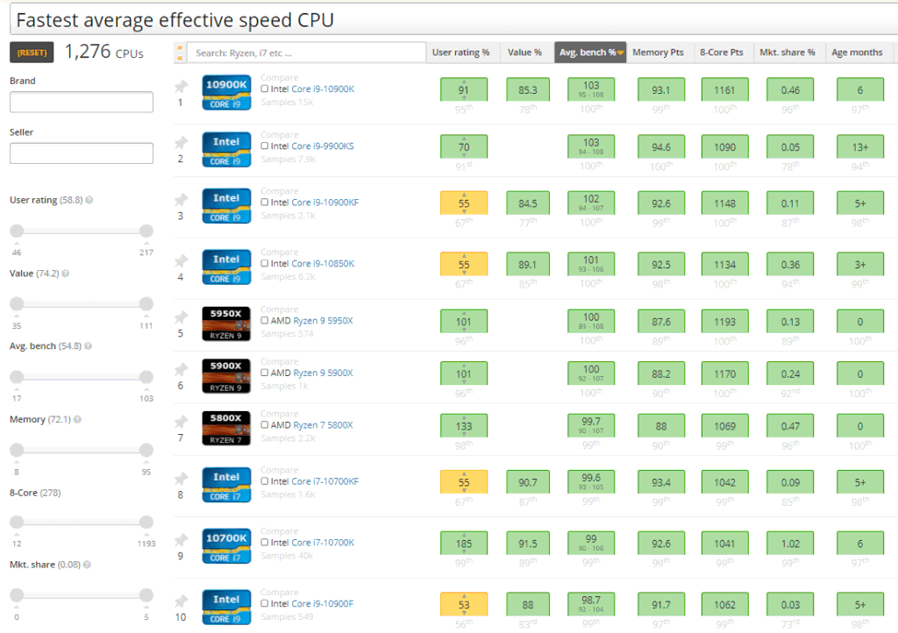
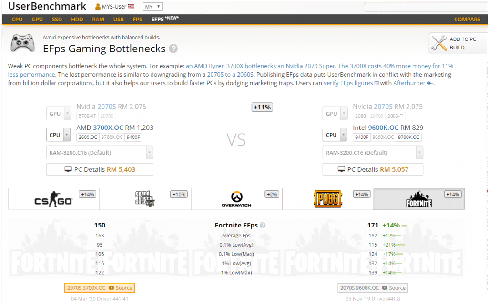
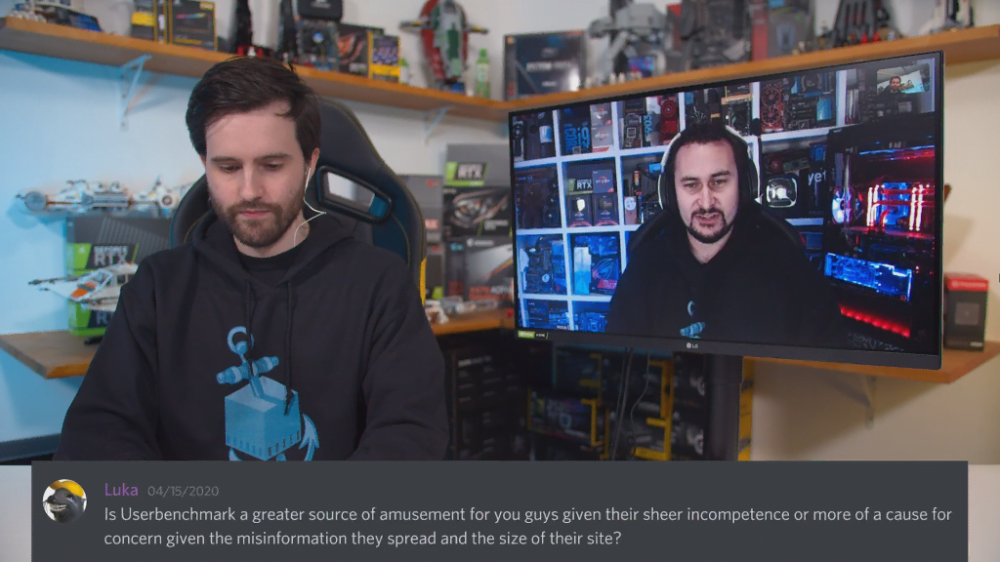
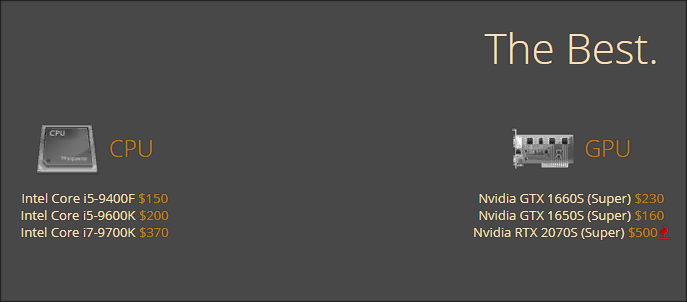
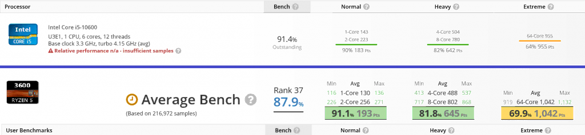
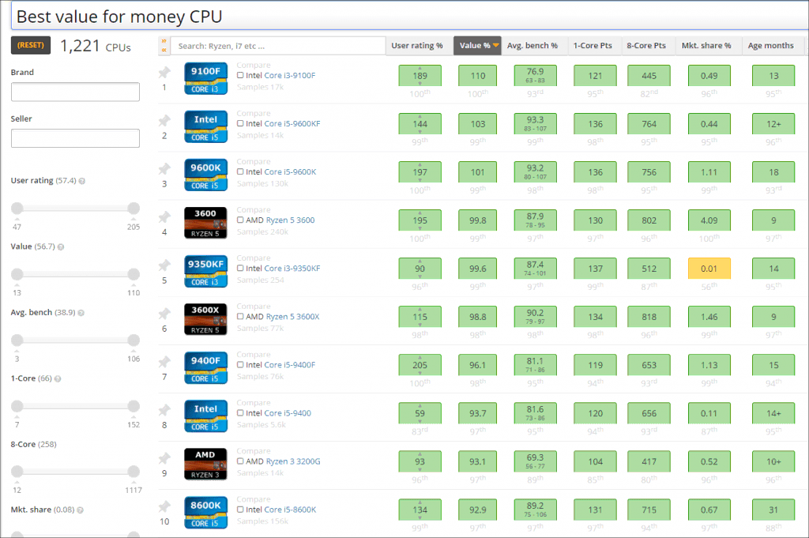
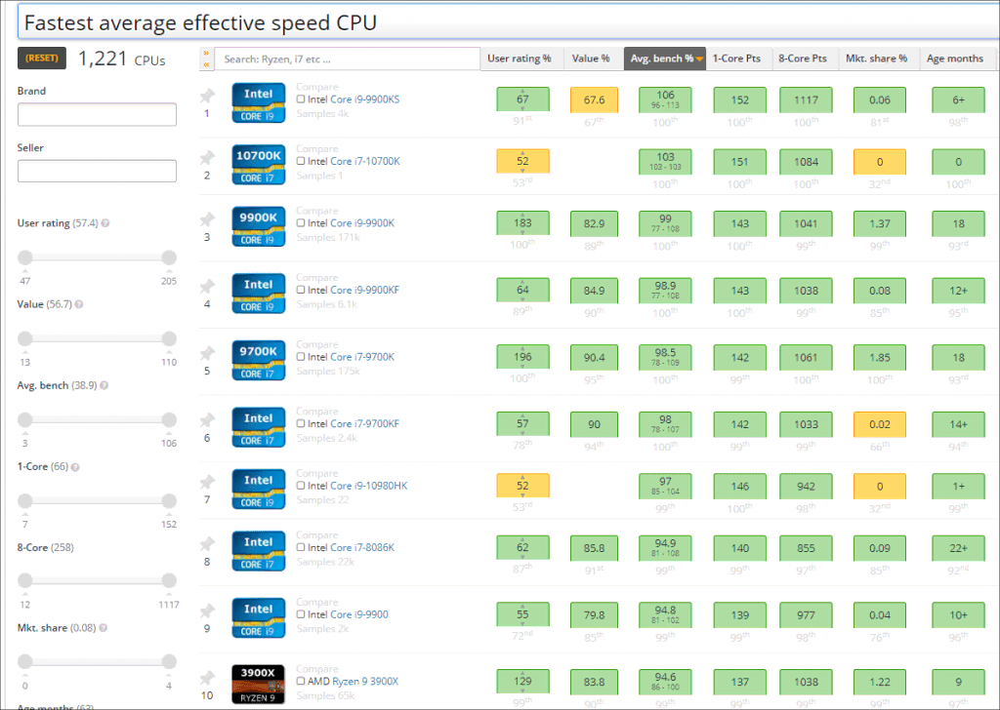
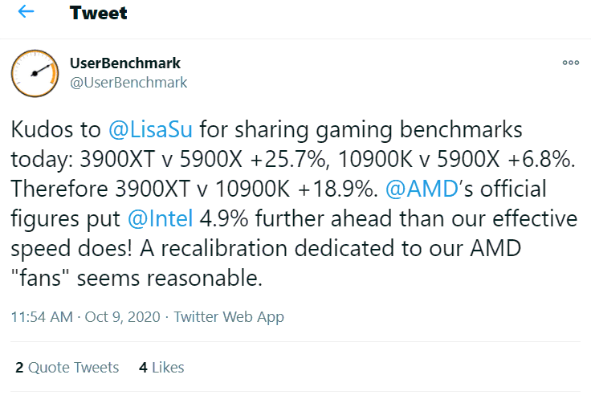

This article was originally written on [OwnSnap](https://ownsnap.com/), where the article is now deleted. You can find the archive link of the original article [here](https://web.archive.org/web/20220408091711/https://ownsnap.com/userbenchmark-biased/).

UserBenchmark is the most controversial website that provides unfair benchmark tool to assess your real-time hardware performance scores including CPU, GPU, SSD, HDD, RAM and USB External storage, and also you may use comparison charts and numbers against other user submitted hardware. Many tech enthusiasts despised UserBenchmark results as unreliable source of hardware review.

According to UserBenchmark publishing director, if you are AMD CPU user, then your PC gaming experience is somewhat bottlenecked by AMD’s Zen architecture. For this inaccurate claims UserBenchmark is under fire since AMD’s Zen 2 processor’s launch while single core performance of Ryzen 3000 CPUs have significantly increased.

Many online famous tech reviewers largely don’t agree with UserBenchmark reviews due to misleading new Core Weighing Algorithm within UserBenchmark assessment tool which favors quad and single core performance. And alas, Ryzen 5000 series launch helped many reviewers to expose UserBenchmark’s desperate attempt to rip off many newbies’ wallets this holiday season.

However, UserBenchmark SEO optimizations have so much power in Google Search Engine, whenever you search any particular CPU or GPU the results will come out from their website on first place first page.

As a result, many social media users (especially Facebook) fall to assume that they have high credibility, thus screenshots and hyperlinks from UserBenchmark posted by debaters would be strong proof about hardware comparison topics. Anyhow, there are some big controversial things just happening to this website’s reputation. Googling for benchmarks and clicking UserBenchmark website results is a bad idea to start your gaming or productivity PC.

Following highlighted reasons from Own Snap team are based on factual data supported by specific stories with a point of origin. Therefore, writing the truth is the main point about UserBenchmark’s credibility. Let’s grab a basket of popcorn and jump into hot discussed reasons on why UserBenchmark is Biased, Deceptive and Misguided Website.

## Misleading Core Weighing Algorithm Controversy
In 2020, many triple A game titles utilize up to 8 physical cores or 8 threads from CPU as seen from recommended and competitive system requirements given by Assassin’s Creed Odyssey, Battlefield V and Call Of Duty: Warzone. If you want butter smooth gaming experience online without stuttering mess then 6 core 12 thread CPU is obligatory to get.

With 4 cores 4 threads you can’t go far especially during screen recording or streaming. Intel and AMD have met consumers’ demands starting from 2017 competitive year by releasing most iconic CPUs such as i7-8700K and Ryzen 5 1600. Almost a year passed since Ryzen 3000 series launch and boy, AMD has become a game changer in PC gaming industry solidifying it’s ground by proving 6 cores 12 threads, 8 cores 16 threads, 12 cores 24 threads and 16 cores 32 threads became the important CPU configurations for nowadays’ PC users due to multitasking ability mixed with gaming, streaming, editing and rendering process.

However, AMD’s success story is not well perceived by UserBenchmark website after they officially released new “core weighing system” integrated into benchmark algorithm that sparked biggest controversy and downfall of their reputation. New core weighing system gives 40% upper hand to single core, 58% superiority to quad core and only 2% goes to multi-core. As a result, Core i3-9350KF quad core CPU becomes a winner with 2% extra performance compared to Core i9-9980XE which is 18 core 36 thread monster processor from Intel according to UserBenchmark comparative results.
 

UserBenchmark’s strong inaccurate statement from Ryzen 7 4800HS APU benchmark page says that “AMD should focus on delivering a platform that offers performance where end users actually need it rather than targeting inexperienced gamers with the same old “moar cores” mantra.” Oh my goodness, they really said that awful comment. Very unprofessional and unethical behavior are written in [About](https://www.userbenchmark.com/page/about) and [CPU FAQ](https://cpu.userbenchmark.com/Faq/What-is-the-effective-CPU-speed-index/55) pages too.

Realistically, in today’s PC building community people need affordable and fast processor that can do both gaming and productivity tasks without any hiccups. Is $170 priced Intel Core i3-9350KF worth your hard earned money compared to much cheaper and overall faster Ryzen 5 3600? Giving 40% to single core and 58% to quad core metrics are such a non-sense in 2020.
 

Shockingly, all games that they tested are single core and quad core oriented titles. They emphasize on much older competitive shooters online based on CPU’s single core utilizing game engines. For instance, CS:GO is created in 2012 with Source 2 engine. 2015’s GTA V takes 4 cores 4 thread to process the rendering via old Rage engine. Same goes to Fortnite, PUBG and Overwatch titles in which Ryzen 3000 CPUs have lower negligible fps performance compared to Intel counterparts.

## Fighting Prominent Tech Enthusiasts
Constant relentless attacks on prominent tech enthusiasts by UserBenchmark were detected in their website and Twitter a very long time ago. Most highlighted personal attack recorded on August 11, 2019 where UserBenchmark has posted a [very mean twit](https://twitter.com/UserBenchmark/status/1160562272261029888) towards Gamers Nexus a.k.a Tech Jesus by saying that “Bad hair day GamersNexus? We have no beef with you.” It was a monstrous mistake done by UserBenchmark team and they’ve never apologized for it. For your knowledge, [Gamers Nexus is the largest YouTube channel](https://www.youtube.com/user/GamersNexus) run by Steve Burke who focuses on in-depth hardware architecture, extreme overclocking and performance comparison using unbiased methods.

Earlier on, Gamers Nexus openly spoke about the [credibility of UserBenchmark new scoring system](https://twitter.com/GamersNexus/status/1154924013677764609) in Twitter by confirming that “We think it’s irrelevant because that website was SEO spam garbage to begin with.” Indeed, SEO (Search Engine Optimization) of UserBenchmark website is the best ever optimization done by it’s developers. Nevertheless, Great Power comes with Great Responsibility and UserBenchmark is obviously abusing it’s SEO Power right now by showing unethical behavior in world arena.

Next UserBenchmark’s fight is more interesting. In [About](https://www.userbenchmark.com/page/about) page of UserBenchmark, you may find a disgusting label attack towards Hardware Unboxed (HUB) team by establishing that “[Incompetent (moar core) smearers](https://www.youtube.com/watch?v=AaWZKPUidUY&t=591s) would [sell ice to Elsa](https://www.youtube.com/watch?v=dhCwP5U9Xnk)” exact hyperlinks are pointing to HUB YouTube channel. Specifically, Tim and Steve from [Hardware Unboxed](https://www.youtube.com/@Hardwareunboxed/videos) are the Number One tech enthusiasts when it comes to GPU/CPU comparison benchmarks, motherboard thermal performance, in-depth gaming monitor and latest laptop reviews. By far, they are the only channel that cares much about their audience’s “Bang For Your Buck” hardware selection.

Legendary Steve from HUB has criticized UserBenchmark after concerning thoughts accumulated over a year of misleading people to the wrong direction by saying that “There is the misinformation and you know sending people in the wrong direction or you know saying that they don’t get the best bang for buck for that commonly used phrase and that is the concern that the whole point of doing what we do is make sure you guys get you know the product that serves you best now and hopefully down the track and so I guess that’s why we decided to talk about them initially but it’s gotten to a point now where they’ve just become I think it’s fair to say just such a Joke no one’s taking them seriously anymore…they still got SEO spam so well and they’ve been trying to do it on YouTube, and they are less successful on YouTube so far and I don’t think they will gain traction here because there is no face to it there is no credibility behind it. I think they’re gonna fail on YouTube so they’re still going to capture people with their website which isn’t great” in [part 3 of their April 2020](https://www.youtube.com/watch?v=H92AgYH3LQI&t=1389s) Q&A video.

Firmly based Joke website title is deservedly goes to UserBenchmark team for misleading people amid waging a war to professional tech enthusiasts. Although, Ryzen 5 3600 6 core 12 thread has the largest market share within the user submitted records of UserBenchmark, the very expensive Core i5-9600K 6 core 6 thread takes the best spot in their CPU department which is NOT a valuable CPU overall in terms of upgrade path, thermal and productivity performance.

## Favoring Intel and Nvidia
In their best products highlights everyone might notice AMD’s absence from author’s picks at the bottom of page for obvious reasons. Admin or Editor of UserBenchmark just simply think AMD doesn’t exist anymore. In GPU section they include [$230 NVIDIA GeForce GTX 1660 Super](https://www.youtube.com/watch?v=qcAwR49zRCg&t=1122s) which is $50 cheaper than $280 Radeon RX 5600 XT but, in reality GTX 1660 Super is 20-30% slower than RX 5600 XT GPU in gaming fps performance therefore valuable graphics card title must be given to AMD Radeon. There is also RX 5700XT a great card for your hard earned money which totally dominates NVIDIA's expensive and underwhelming [RTX 2060 Super GPU by 5-10% in gaming performance for same price point](https://www.youtube.com/watch?v=45Q8TVmzHI8).

People with common sense could easily detect UserBenchmark’s bias behavior towards Intel by looking at so called Best CPUs which are Core i5-9400F, i5-9600K and i7-9700K. Neither Ryzen 5 3600 nor Ryzen 7 3700X is detected in Best Picks list. In fact, Core i5-9400F is an expensive mediocre chip without Hyper-Threading feature if you compare it to Ryzen 5 3600 (now costs only $175 in Newegg).

Another story erupted last month later highlighted by [Notebookcheck](https://www.notebookcheck.net/Intel-Core-i5-10600-sample-manages-higher-bench-result-on-UserBenchmark-than-AMD-Ryzen-5-3600-despite-overall-lower-test-scores.461737.0.html) website, [freshly tested i5-10600](https://www.userbenchmark.com/UserRun/26665212) was awarded with a crown of single core champion after defeating Ryzen 5 3600 despite Comet Lake i5 getting lower overall scores. It translates into serious level of bias reporting by UserBenchmark team.

Despite the largest 4% market share taken by Ryzen 5 3600, UserBenchmark has no shame to put twice slower Core i3-9100F at the top of their Best Value For Money CPU ratings. Man, everyone is living in 2020, not in 2012. Quad core CPUs without Hyper-Threading are worthless for latest gaming titles. Gamers prefer to do live streaming and editing too. How on Earth, the Core i3-9100F is good for millennial competitive gamers?

Then, so called Fastest Average Effective Speed CPU section is just a lame Joke for many PC enthusiasts. Out of top 10 fast CPUs, AMD Ryzen 9 3900X is only placed at number 10. Really sad to see these ratings when Ryzen 9 3950X alone is dominating the entire lineup of Intel’s Skylake-X and Cascade Lake CPUs including 18 core 36 thread monster i9-10980XE in majority benchmark scores according to [Optimum Tech](https://www.youtube.com/watch?v=MwXY2RXmmUQ). Very bad misleading comparison scores shown by UserBenchmark editor. This is why prominent tech enthusiasts have kept despising UserBenchmark scores.

## Banned From Trusted Subreddits
At last, justice was done to UserBenchmark’s toxic behavior in Reddit. General consensus between [r/Intel](https://www.reddit.com/r/intel/comments/g36a2a/userbenchmark_has_been_banned_from_rintel/) and [r/hardware](https://www.reddit.com/r/hardware/comments/g2uf7a/userbenchmark_has_been_banned_from_rhardware/) subreddits has reached into one conclusion, to ban UserBenchmark user from posting and commenting. Another nail was put into their coffin unfortunately by their own doing.

Whole this negativity surrounding UserBenchmark involved benchmark scores already started since [Ryzen](https://web.archive.org/web/20220215093041/https://ownsnap.com/rumored-amd-ryzen-7-6700g-rembrandt-apu-dominates-nvidias-gtx-1050-ti-in-time-spy-benchmarks-sports-with-rdna2-12-cu-igpu/) 3000 series desktop CPUs launch. Moreover, UserBenchmark openly called their critics “an army of shills.” As a consequence, constructive criticism by tech enthusiasts also hasn’t cool them down. Instead they were picking fights with prominent reviewers. Accusing HUB team for conducting smear campaign was a baseless claim. Majority reddit r/hardware subsection users have kept standing for truth that pushed moderators to take severe right action towards UserBenchmark team.

A whopping 97% of redditors upvoted this decision of moderators effectively. Soon all posts and comments made by UserBenchmark will be deleted. Expect the inevitable downfall of this website and software tool. Hopefully, they learn their lesson and will have to behave according to journalistic ethics. Anyway, damage has been done to their own reputation, very hard to claw back precious trust of internet users from now on.

## Zero Focus On Productivity Benchmarks
Whole UserBenchmark website content is dedicated only for gaming benchmarks. Surprisingly, gamers are human beings too. They need to earn money for living, all the time playing video games don’t bring steady income. Therefore, some gamers are video editors, 3D designers, scientists, architects and live streamers. Job comes first then they can play games to relax. Multi-core benchmarks are very important for content creators and multitasking productive employees. In fact, Intel processors are way slower than [Ryzen 9 or Threadripper CPUs](https://www.youtube.com/watch?v=stM2CPF9YAY) as proven by Linus Tech Tips. Since, UserBenchmark doesn’t focus on productivity benchmark tests such as Premiere Pro encoding, V-Ray rendering, Davinci Resolve editing, Matlab, SolidWorks and 3Ds Max designing, you have to look for reviews elsewhere in YouTube or Reddit. All in all, unreliable UserBenchmark is not a place to test your productivity machine. Best known productivity benchmark focused YouTube channels are Gamers Nexus and Optimum Tech respectively.

## Unknown Owner and Team
Last proof of UserBenchmark’s lowest credibility is a mysterious unidentified ownership. Mystically, they don’t even possess specific team to represent them in internet to explain why things went wrong with them. In About page you won’t even find their names or corporate structure. Totally anonymous CPUPro user is the only source of their justification. Even though, they were pro-active in reddit, nobody could identify their headquarters location. The more they keep silent about surrounding controversies the more damage is being done to themselves every day. Somehow, Own Snap team is very concerned about people losing money on UserBenchmark’s hardware recommendations, they just ripping their wallets off during hard times in 2020.

## Unfair Towards AMD CPUs
AMD engineering team has worked extremely hard to satisfy esports gamers playing CS:GO, Fortnite, Overwatch, PUBG or GTA Online. These games usually utilize CPU’s single core capacity to run their engines in order to achieve highest possible average framerate. As a result, last year’s Zen 2 architecture based AMD Ryzen 3000 CPUs have delivered enormous single core performance against Ryzen 2000 series chips by a whopping 15%. Again, this achievement was heavily criticized by UserBenchmark team as an “AMD Bottleneck”and they promoted i5-9600K as a best gaming CPU even though it was lacking in multicore benchmarks in productivity or multitasking. In October 2020, Dr. Lisa Su and her teammates have dropped a Ryzen 5000 bombshell towards the press. Truly, Ryzen 5 5600X has defeated [every](https://ownsnap.com/intel-pentium-silver-n6000-gaming-benchmark-impress-low-budget-retro-gamers/) Intel Core i5 CPUs till 10th Gen, all these benchmarks were witnessed by Hardware Unboxed, Linus Tech Tips and Gamers Nexus review channels. After all, UserBenchmark went nuts and desperately tried to steal the thunder from AMD’s triumphant achievement over Intel. First day right after announcement they quickly jumped up via twitter and posted outrageous negative misleading arrogant statement towards AMD’s CEO Dr. Lisa Su. In [that post](https://twitter.com/UserBenchmark/status/1314413866982539267) they exactly said “Kudos to LisaSu for sharing gaming benchmarks today: 3900XT v 5900X +25.7%, 10900K v 5900X +6.8%. Therefore 3900XT v 10900K +18.9%. AMD’s official figures put Intel 4.9% further ahead than our effective speed does! A recalibration dedicated to our AMD “fans” seems reasonable.”

This statement came out to be a very misleading one since UserBenchmark core weighting algorithm is already biased towards Intel CPUs and their team were desperate to cover up via their misguided statistics pushing for unfair recalibration again to cripple AMD Ryzen 5000 series’ reputation. Many people in forums talking about Userbenchmark Admin being paid by Intel, but those allegiations are unproven by any investigative reviews. However, Admin of Userbenchmark might possibly be a “AMD Hater” since outrageously controversial Core Weighting Algorithm have been changed right after 3 days of Ryzen 3000 launch. Read also [Best GPUs for Crypto Mining](https://web.archive.org/web/20220116152913/https://ownsnap.com/best-gpus-for-mining/).

Obviously, above screenshot image represents what’s going wrong in UserBenchmark Admin’s brain. Indeed, high caliber psychiatrist is absolutely required for UserBenchmark Admin for spreading negativity towards AMD. How in the world 7nm Ryzen 9 5950X is placed at number 5 fastest average CPUs ranking?! Why is obsolete 14nm+++ Core i9-10900K ending up on top as the fastest in average speed?! Why have Linus Tech Tips and Gamers Nexus posted opposite results against UserBenchmark statistics? Who is right or wrong? Only people with fully functioning cognitive reasoning can differentiate between deceptive UserBenchmark Admin and other truthful reviewers who care about their credibility.
