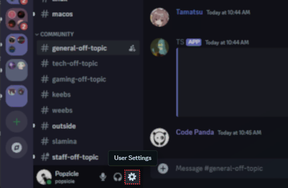
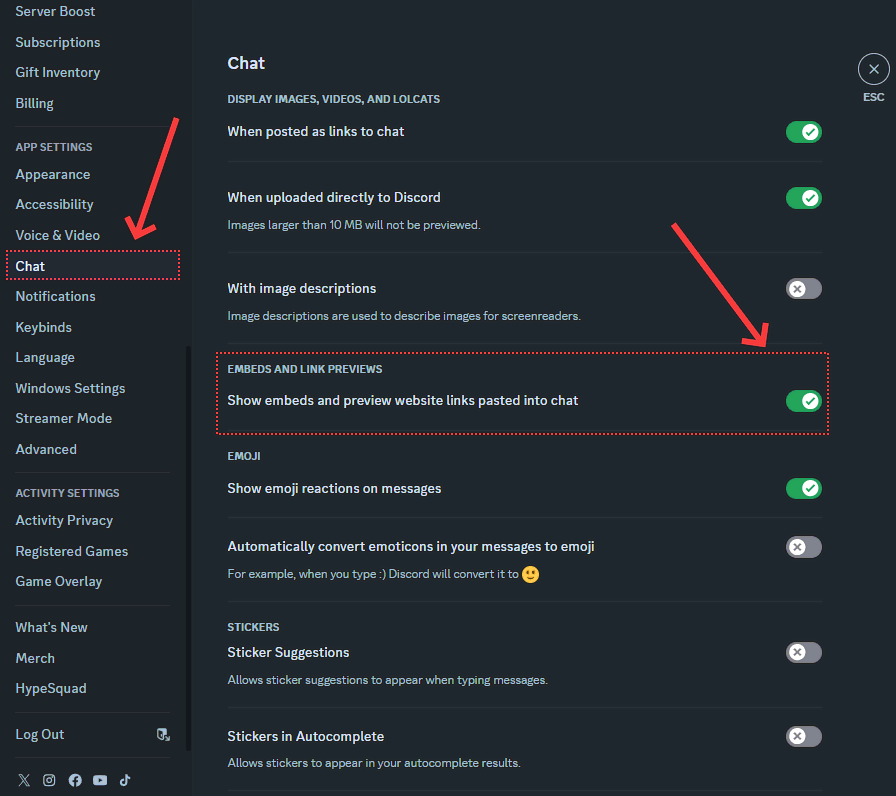

If you have found yourself in this wiki article, it is likely because you do not have Discord Embeds enabled on your Discord Settings.

r/TechSupport requires you to have Embeds enabled to see our rules and other useful features like "factoids" that our volunteers might use to assist you with your technical issues.

1. Click the User Settings cog icon in the bottom left corner

    

2. Select the "Text & Images" Tab. And enable "Embeds and Link Previews"

    
