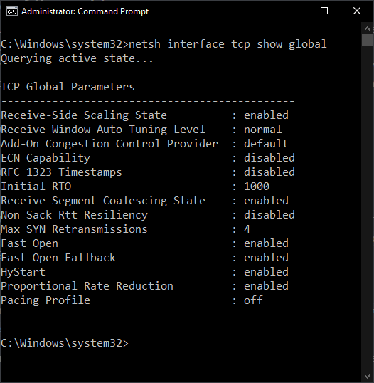
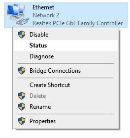
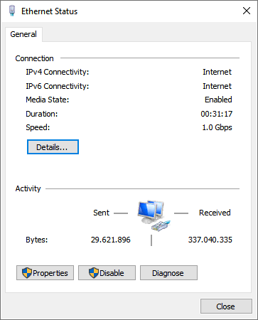

## Scope of the problem
First you need to identify the scope of the problem. Check if only one device is affected by this problem or if multiples devices are affected.  
If only one device is experiencing the problem, the cause is between that device and the last common link with other devices.  
If multiple devices are affected, the cause is probably among the resources they share.

## Software problem
If one device is affected, check if it is a software problem, be it an OS setting or a program.

### Network reset
Various connectivity problems are fixed with the following 3 commands. To run them search "cmd.exe" in the start menu, right click "Command Prompt" and click on "Run as administrator".
```
ipconfig /flushdns
netsh interface ip reset
netsh winsock reset
```
After you have run them, reboot your computer and check.

### TCP Global Parameters
A common problem in Windows is when an application changes the TCP Global Parameters. To check these search "cmd.exe" in the start menu, right click "Command Prompt" and click on "Run as administrator". Once opened, type `netsh interface tcp show global`. Everything should like in the following image:  

  

Usually the "Receive-Side Scaling State" and "Receive Window Auto-Tuning Level" are the changed parameters. If that is the case, run `netsh interface tcp set global rss=enabled` and `netsh interface tcp set global autotuninglevel=normal` in your same Command Prompt.

### Programs interfering
If you know you have VPNs or third-party Antivirus/ Antimalware applications installed, keep in mind that any of those might cause the problem. To stop those from interfering try a speedtest/ check the connection on a [Linux Live Session](/live-sessions/linux-live-session.html). If the problem is not present here, there is a very high chance that a program is the source.

Boot back into Windows and perform a [Cleanboot](/factoids/cleanboot.html). If the problem gets solved by this you will have to keep re-enable services to find which one is the cause. A good way of doing this is through binary search. This procedure implies that you enable half of the disabled services and check.  
If the problem is not present, continue doing this until it shows up.  
If it is present, disable half of the services you just enabled.  
You keep doing this until get to the services that is causing the problem.

## Intermediary devices
After you find what devices are affected and eliminate software from the equation, eliminate intermediary devices. If the device experiencing the problem is connected through WiFi, first connect it with an Ethernet cable if possible. WiFi is less reliable and stable than a wired connection.

If there are powerline adapters involved, bypass those and connect directly to the upstream device (switch, router etc.).

If you there are other devices between you and your main router/ gateway such as switches/ additional routers/ access points eliminate those one by one. This is done by connecting directly to the device upstream from the last.

When you find the first device where the problem is present (or reached the main router/ gateway/ modem) try different cables between that and the computer you are testing on (desktop/ laptop). Alternatively, try different ports on the switch/ router if present.

## Finding the cause
Ideally now you have your computer connected to the first device that the problem is happening on.  
### Speed problem
Press Win + R and type "ncpa.cpl". Press enter/ click "OK" to open "Network Connections".
  
Right click on your Ethernet adapter and "Status".  
  
The "Speed" property is what your computer negotiates at with the upstream device. Most devices nowadays support 1 Gigabit, but for that all 8 connectors and contacts must work on both sides. If only one is faulty, the speed will default to 100 Mbps (only 4 connections need to work for this speed). If both devices you connect support Gigabit and you only see 100 Mbps here, the cable is faulty or slightly loose. There is a slim chance that the port on the computer or the upstream device is at fault, but that is by far less common.  


### Connection not working at all
Search "cmd.exe" in the start menu and click "Command Prompt". Type `ipconfig /all` and check "IPv4 Address" under "Ethernet adapter Ethernet".

If the address is between 169.254.0.1 to 169.254.255.254 then your computer does not get assigned an IP address by the DHCP server (usually the router) thus the connection is faulty.

From a software standpoint, there might be bad drivers installed on the computer. From a hardware standpoint, a number of things can be faulty: the port on either device, the cable, computer's NIC or the router itself.
