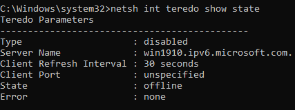
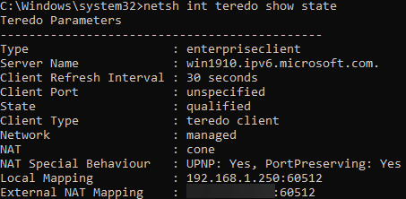

**Note: This guide does not apply to people using [CGNAT](/networking/port-forwards#cgnat-1).**

## What is Teredo?
Teredo is a virtual device that aims to make a "tunnel" between IPv4 and IPv6 networks. It does so by assigning your device an IPv6 address that is bridged to the Microsoft IPv6 server.

It is meant to be used as a **temporary** solution to devices that **don't already have an IPv6 address**.

## Why would you use Teredo?
A few apps (such as a few select XBox games) use IPv6, but a lot of ISPs are yet to upgrade/provide an IPv6 address to consumers. Teredo aims to rectify this, albeit only as a temporary solution.

## How do I know if I have an IPv6 address?
To check if your ISP is providing an IPv6 address already, you can go to [this website](https://test-ipv6.com/). If you get a 0/10 rating, you **don't** have an IPv6 address.

To check if Teredo is enabled, open command prompt as administrator and type in `netsh int teredo show state`

The output of this command if the Teredo service is disabled:         

If enabled:          

## How do I enable Teredo?
 If the previous command gave you the *Disabled* output, open an command prompt as administrator, type in the following commands: 
 * `reg add HKLM\System\CurrentControlSet\Services\Tcpip6\Parameters /v DisabledComponents /t REG_DWORD /d 0x0`
 * `netsh interface teredo set state type=enterpriseclient`
 * `netsh interface teredo set state servername=win1910.ipv6.microsoft.com`
 
Reboot the computer after running these commands, then you can check if Teredo is enabled again by running `netsh int teredo show state` again. This time, you should receive the *Enabled* output.

*Credit to Randy for commands and images*
